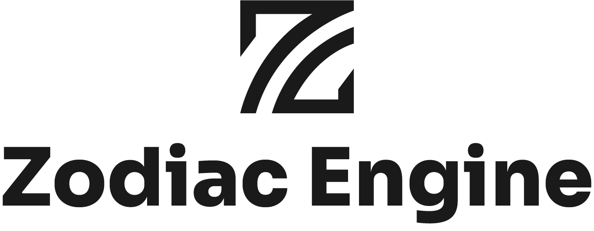

<div align="center">

<picture>
  <source media="(prefers-color-scheme: dark)" srcset="ZEngine/docs/logo/WhiteAssetZE.png">
  <source media="(prefers-color-scheme: light)" srcset="ZEngine/docs/logo/BlackAssetZE.png">
  
</picture>

ZEngine is an open-source 3D rendering engine written in C++ and using Vulkan as graphic API.

[](https://github.com/JeanPhilippeKernel/RendererEngine/actions/workflows/Engine-CI.yml)
[](LICENSE)

[](https://discord.gg/jC3GPVKKsW)

</div>

It can be used for activities such as:
- Gaming
- Scientific computation and visualization

### Supported Platforms

- Windows
- macOS (under active revision)
- Linux (`Debian` or `Ubuntu` recommended, under active revision)

## Projects

ZEngine ships as three components:

| Component | Description |
|---|---|
| **ZEngine** | Core runtime — ECS, Vulkan renderer, physics, audio, VFS |
| **Tetragrama** | Editor built on top of ZEngine for scene authoring and asset management |
| **Panzerfaust** | Project launcher (C#/.NET) — creates, opens, and manages game projects. Hosted at [ZodiacEngineHub](https://github.com/JeanPhilippeKernel/ZodiacEngineHub) |

## Setup

Clone the repository:

```bash
git clone https://github.com/JeanPhilippeKernel/RendererEngine.git
```

All dependencies are fetched automatically by CMake at configure time via `FetchContent` — no manual submodule initialization required.

### Windows

- Install Visual Studio 2022 Community or Professional with "Desktop development with C++".
    - Include MSVC v143 — VS 2022 C++ x64/x86 build tools and Windows 10/11 SDK.
- Install [PowerShell Core](https://github.com/PowerShell/PowerShell/releases)
- Install [Python](https://www.python.org/ftp/python/3.12.4/python-3.12.4-amd64.exe)
- Install [CMake](https://cmake.org/download/) 4.1.2 or later
- Install [LLVM](https://github.com/llvm/llvm-project/releases/download/llvmorg-20.1.7/LLVM-20.1.7-win64.exe)

### macOS

- Install Xcode from the App Store.
- Install Homebrew:
```bash
/usr/bin/ruby -e "$(curl -fsSL https://raw.githubusercontent.com/Homebrew/install/master/install)"
```
- Install CMake, NuGet, PowerShell Core, and ClangFormat:
```bash
brew update
brew install cmake nuget llvm@20
brew install --cask powershell
```

### Linux

- Install build tools, CMake, and LLVM:
```bash
sudo apt update
sudo apt install build-essential cmake ninja-build llvm clang clang-format python3 nuget
```
- Install [PowerShell Core](https://github.com/PowerShell/PowerShell/releases) for your distribution.

## Building the engine

1. Start PowerShell Core and verify CMake is available: `cmake --version`
2. Change directories to the repository root.
3. Run the build script for the desired configuration:
    - Debug:   `.\Scripts\BuildEngine.ps1 -Configurations Debug -RunBuilds $True`
    - Release: `.\Scripts\BuildEngine.ps1 -Configurations Release -RunBuilds $True`

**Notes:**
- `-RunBuilds $False` generates the build directory without compiling.
- Omitting `-Configurations` builds both Debug and Release.

## Roadmap

See our roadmap here: [Roadmap](Roadmap.md)

## Contributing

Contributions are welcome. Please read [Contributing.md](Contributing.md) before opening a pull request.

## Dependencies

All dependencies are fetched automatically via CMake `FetchContent` — no manual submodule initialization required.

**Rendering & windowing**
- [Vulkan-Headers](https://github.com/KhronosGroup/Vulkan-Headers) + [Vulkan-Loader](https://github.com/KhronosGroup/Vulkan-Loader) — Vulkan API
- [VulkanMemoryAllocator](https://github.com/GPUOpen-LibrariesAndSDKs/VulkanMemoryAllocator) — GPU memory management
- [SPIRV-Cross](https://github.com/KhronosGroup/SPIRV-Cross) + [glslang](https://github.com/KhronosGroup/glslang) + [SPIRV-Tools](https://github.com/KhronosGroup/SPIRV-Tools) — shader compilation pipeline
- [GLFW](https://github.com/glfw/glfw) — window creation and input

**UI system**
- [FreeType](https://gitlab.freedesktop.org/freetype/freetype) — font rasterisation for ZUI
- [rapidhash](https://github.com/Nicoshev/rapidhash) — O(1) widget key hashing in ZUI

**Asset loading**
- [Assimp](https://github.com/assimp/assimp) — legacy 3D asset import
- [fastgltf](https://github.com/spnda/fastgltf) — fast glTF 2.0 loader
- [ufbx](https://github.com/ufbx/ufbx) — FBX loader
- [meshoptimizer](https://github.com/zeux/meshoptimizer) — mesh vertex cache, overdraw, and LOD optimisation
- [STB](https://github.com/nothings/stb) — image loading (PNG, JPEG, HDR)
- [miniz](https://github.com/richgel999/miniz) — zip / deflate compression

**Memory**
- [tlsf](https://github.com/mattconte/tlsf) — O(1) dynamic allocator for variable-size engine slabs

**Data formats**
- [nlohmann/json](https://github.com/nlohmann/json) — JSON parsing
- [simdjson](https://github.com/simdjson/simdjson) — high-performance JSON for asset pipeline
- [yaml-cpp](https://github.com/jbeder/yaml-cpp) — YAML configuration

**Logging & utilities**
- [spdlog](https://github.com/gabime/spdlog) — structured logging
- [fmt](https://github.com/fmtlib/fmt) — string formatting
- [stduuid](https://github.com/mariusbancila/stduuid) — UUID generation
- [CLI11](https://github.com/CLIUtils/CLI11) — command-line argument parsing
- [Tracy](https://github.com/wolfpld/tracy) — frame profiler (opt-in via `ZENGINE_TRACY`)

**Testing**
- [GoogleTest](https://github.com/google/googletest) — unit testing

## License

ZEngine is licensed under the [MIT License](LICENSE).
