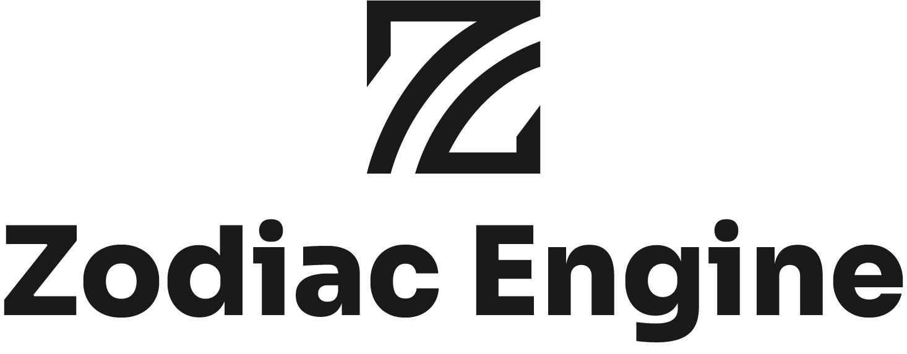

<div align="center">

<picture>
  <source media="(prefers-color-scheme: dark)" srcset="docs/assets/logo-white.png">
  <source media="(prefers-color-scheme: light)" srcset="docs/assets/logo-black.png">
  
</picture>

ZEngine is an open-source, cross-platform 3D engine written in C++20 and built on Vulkan.

[](https://github.com/JeanPhilippeKernel/RendererEngine/actions/workflows/Engine-CI.yml)
[](LICENSE)
[](https://discord.gg/jC3GPVKKsW)

[Documentation](https://jeanphilippekernel.github.io/zodiac-engine-docs/) · [Install with Zodiac Engine Hub](https://github.com/JeanPhilippeKernel/ZodiacEngineHub/releases) · [Release notes](https://github.com/JeanPhilippeKernel/RendererEngine/releases/tag/v1.0.0)

</div>

## Install ZEngine

Use **Zodiac Engine Hub (Panzerfaust)** to install released engine versions and
create or open projects:

1. Download the Hub from its [Releases page](https://github.com/JeanPhilippeKernel/ZodiacEngineHub/releases).
2. Install and open the Hub.
3. Select a ZEngine version in its engine-management view and download/install it.
4. Create or open your project from the Hub.

See the [getting-started guide](https://jeanphilippekernel.github.io/zodiac-engine-docs/getting-started/install-with-zodiac-engine-hub/)
for the complete flow. Read the [changelog](CHANGELOG.md) before upgrading an
existing project to ZEngine 1.0.0 because asset importing now uses VFS paths.

## Components

| Component | Purpose |
|---|---|
| **ZEngine** | Core runtime: ECS, Vulkan renderer, VFS, memory, input, and platform services. |
| **Tetragrama** | Native editor for scene authoring and asset management. |
| **Zodiac Engine Hub / Panzerfaust** | Launcher and project manager that installs and selects engine versions. |

## Develop from source

Source development uses CMake, C++20, and the repository build script. All
third-party dependencies are fetched through CMake `FetchContent`.

```powershell
./Scripts/BuildEngine.ps1 -Configurations Debug -RunBuilds $True
```

The [development guide](https://jeanphilippekernel.github.io/zodiac-engine-docs/development/build-from-source/)
covers prerequisites, supported presets, running the editor, and project
configuration.

## Supported platforms

Windows, macOS (x64 and Apple silicon), and Linux x64 are actively developed
and tested. See [supported platforms](https://jeanphilippekernel.github.io/zodiac-engine-docs/getting-started/supported-platforms/)
for the source-build matrix.

## Contributing

Contributions are welcome. Start with [CONTRIBUTING.md](CONTRIBUTING.md), then
read the [contributor guide](https://jeanphilippekernel.github.io/zodiac-engine-docs/contributing/)
before opening a pull request.

## License

ZEngine is licensed under the [MIT License](LICENSE).
