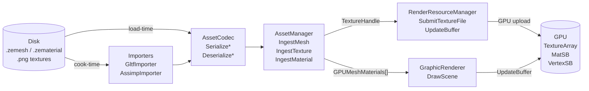
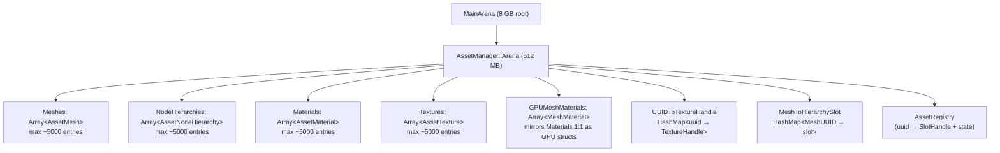
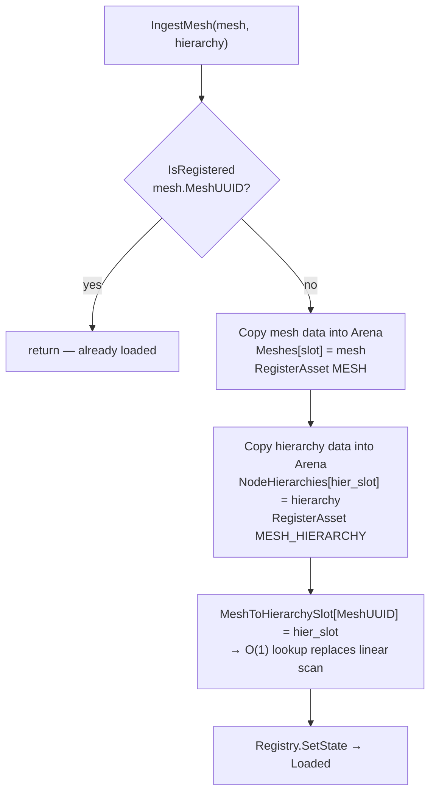
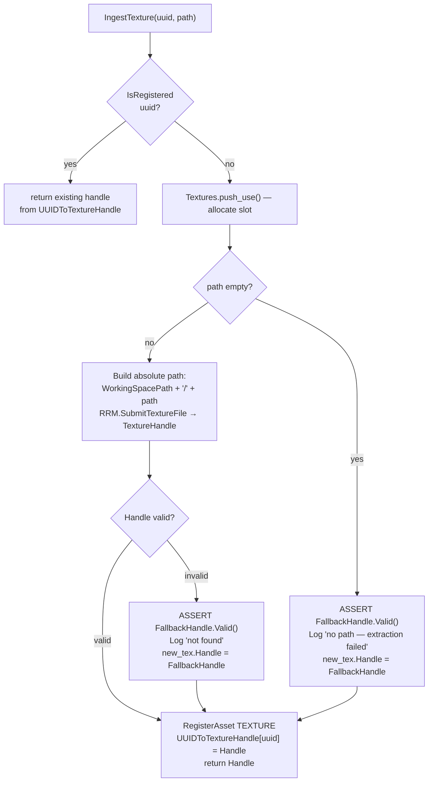
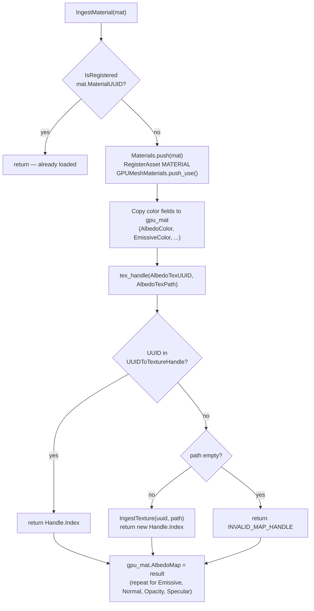
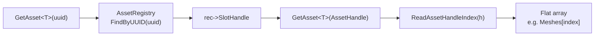
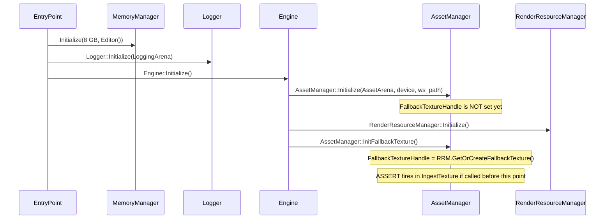

# Asset Manager

**Status:** Implemented  
**Location:** `ZEngine/ZEngine/Managers/AssetManager.h/.cpp`  
**Depends on:** `import-pipeline.md`, `render-resource-manager.md`, `vfs-ticket6-asset-registry.md`  
**Related issues:** #603, #635

---

## Overview

`AssetManager` is the single authority over all CPU-side asset data at runtime. It owns every
`AssetMesh`, `AssetMaterial`, `AssetTexture`, and `AssetNodeHierarchy` that has been cooked
by the import pipeline. It also owns the GPU-side material data mirror (`GPUMeshMaterials`)
that is uploaded to the `MatSB` storage buffer every frame.

**It is not** a streaming system and does not evict assets. All ingested data lives for the
lifetime of the engine session in a fixed arena. A future `StreamingManager` will sit above it.

---

## Position in the Pipeline



---

## Memory Layout

Everything is allocated from a single 512 MB sub-arena carved from the `AssetManager`
budget slot during `Initialize()`. All flat arrays grow inside this arena — no heap.



---

## Data Structures

### CPU-side flat arrays

All arrays are pre-allocated at `Initialize()` with capacity 5000. Access is by slot index,
not by UUID — UUIDs are resolved through `AssetRegistry` to a `SlotHandle`, then the slot
index is extracted from the handle.

| Array | Element type | Index key |
|---|---|---|
| `Meshes` | `AssetMesh` | `ReadAssetHandleIndex(rec->SlotHandle)` |
| `NodeHierarchies` | `AssetNodeHierarchy` | `MeshToHierarchySlot[MeshUUID]` |
| `Materials` | `AssetMaterial` | `ReadAssetHandleIndex(rec->SlotHandle)` |
| `Textures` | `AssetTexture` | `ReadAssetHandleIndex(rec->SlotHandle)` |
| `GPUMeshMaterials` | `MeshMaterial` | same slot as `Materials` |

### `MeshMaterial` (GPU struct)

`MeshMaterial` is uploaded verbatim to `MatSB` (set 0, binding 5) every frame. It mirrors
`AssetMaterial` but replaces texture UUID references with bindless array indices.

```
struct MeshMaterial {            // std140 layout, 96 bytes
    gpuvec4  AmbientColor;
    gpuvec4  EmissiveColor;
    gpuvec4  AlbedoColor;
    gpuvec4  SpecularColor;
    gpuvec4  RoughnessColor;
    gpuvec4  Factors;
    uint64_t EmissiveMap;        // bindless TextureArray index or INVALID_MAP_HANDLE (0xFFFFFFFF)
    uint64_t AlbedoMap;
    uint64_t SpecularMap;
    uint64_t NormalMap;
    uint64_t OpacityMap;
    uint64_t _padding;
};
```

The fragment shader gate: `if (material.AlbedoMap < INVALID_MAP_HANDLE)` — valid textures
have small indices; unset slots hold `0xFFFFFFFF` and are skipped.

### `AssetHandle` encoding

```
31      28 27                              0
┌──────────┬─────────────────────────────────┐
│  type(4) │         slot index (28)          │
└──────────┴─────────────────────────────────┘
```

`CreateHandle(slot, type)` and `ReadAssetHandleIndex(handle)` encode/decode this.

---

## Ingest Pipeline

### Deduplication

Every `Ingest*` method calls `IsRegistered(uuid)` first. If the UUID is already in
`AssetRegistry`, the call is a no-op — the asset is already in the flat arrays.

### `IngestMesh`



### `IngestTexture` (single canonical upload)



> The assert on `FallbackHandle.Valid()` enforces the initialization contract:
> `AssetManager::InitFallbackTexture()` must be called before any ingest can use the fallback.
> A crash here means the engine startup sequence is broken, not a recoverable error.

### `IngestTextures` (batch)

Iterates the array and calls `IngestTexture` per element. The `IngestMutex` is acquired once
per element (inside `IngestTexture`) since the mutex is `std::recursive_mutex`.

### `IngestMaterial`



The `tex_handle` fallback path — calling `IngestTexture` from inside `IngestMaterial` — is
what makes scene reload and dragged-`.zmesh` work: the material knows its own texture paths
and can trigger GPU upload without a prior `IngestTextures` call.

---

## GPU Material Binding — End to End

```mermaid
sequenceDiagram
    participant Import as GltfImporter (background thread)
    participant AM as AssetManager
    participant RRM as RenderResourceManager
    participant GPU as GPU (TextureArray + MatSB)
    participant Render as GraphicRenderer (main thread)
    participant Shader as g_buffer.frag

    Import->>AM: IngestTextures([tex_0..tex_N])
    AM->>RRM: SubmitTextureFile(abs_path) per texture
    RRM-->>AM: TextureHandle{Index=K}
    AM->>AM: UUIDToTextureHandle[uuid] = {Index=K}

    Import->>AM: IngestMaterial(mat)
    AM->>AM: tex_handle(AlbedoTexUUID) → K
    AM->>AM: GPUMeshMaterials[slot].AlbedoMap = K

    Import->>AM: IngestMesh(mesh, hier)
    AM->>AM: Meshes[slot] = mesh

    Note over Render: Next frame — InstancesDirty

    Render->>AM: GetMeshAsset(MeshUUID)
    AM-->>Render: &Meshes[slot]
    Render->>AM: GetAsset&lt;AssetMaterial&gt;(sub.MaterialUUID)
    AM-->>Render: &Materials[mat_slot]
    Render->>Render: alloc.MaterialId = mat_slot

    Render->>RRM: UpdateBuffer(MaterialBuffer, GPUMeshMaterials)
    RRM->>GPU: vmaMemcpy → MatSB[mat_slot].AlbedoMap = K

    Shader->>GPU: FetchMaterial(MaterialIdx) → mat
    Shader->>GPU: texture(TextureArray[mat.AlbedoMap], uv) if AlbedoMap < INVALID
```

---

## Lookup API

`GetAsset<T>(key)` is a template with two key types:



Specializations exist for `AssetMesh`, `AssetMaterial`, `AssetTexture`, `AssetNodeHierarchy`
with both `uuid` and `AssetHandle` key types — 8 specializations total.

---

## Thread Safety

| Method | Thread-safe | Notes |
|---|---|---|
| `IngestMesh` | Yes | Acquires `IngestMutex` (recursive) |
| `IngestTexture` | Yes | Acquires `IngestMutex` |
| `IngestTextures` | Yes | Calls `IngestTexture` per element |
| `IngestMaterial` | Yes | Acquires `IngestMutex`; may call `IngestTexture` (recursive lock) |
| `IsRegistered` | Yes | Read-only registry lookup |
| `GetAsset<T>(uuid)` | Yes | Read-only after ingest completes |
| `GetMeshAsset` | Yes | Read-only |
| `GetMeshNodeHierarchy` | Yes | O(1) via `MeshToHierarchySlot` |
| `InitFallbackTexture` | Main thread only | Called once during engine init |

`IngestMutex` is `std::recursive_mutex` — `IngestMaterial` can safely call `IngestTexture`
without deadlock.

---

## Initialization Order Contract



Any `IngestTexture` call before `InitFallbackTexture` will hit:
```
ZENGINE_VALIDATE_ASSERT(s_Instance->FallbackTextureHandle.Valid(),
    "FallbackTextureHandle not initialized — InitFallbackTexture must be called before ingesting assets")
```

---

## Known Gaps and Future Work

See issue [#635](https://github.com/JeanPhilippeKernel/RendererEngine/issues/635) for the
full memory budget redesign tracking. Key items relevant to AssetManager:

- **No eviction** — all ingested assets live until shutdown. A `StreamingManager` (2 GB budget,
  tracked in #635) will sit above AssetManager and manage which assets are resident.
- **AssetManager carved size** — currently carves 512 MB from its budget slot into
  `s_Instance->Arena`. The remaining budget headroom is used for `ImportCoordinator` and
  `RenderResourceManager` objects placed via `ZPushStructCtor`.
- **Duplicate importer instances** — `AssetImporterUIComponent` allocates its own `GltfImporter`
  (64 MB) and `AssimpImporter` (350 MB) in addition to the engine's importers. Consolidation
  tracked in #635.
