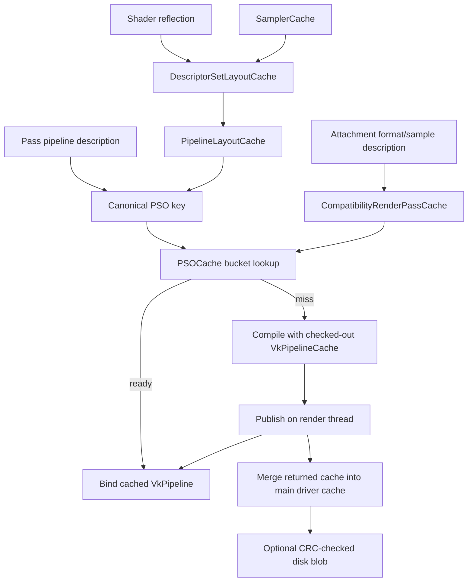
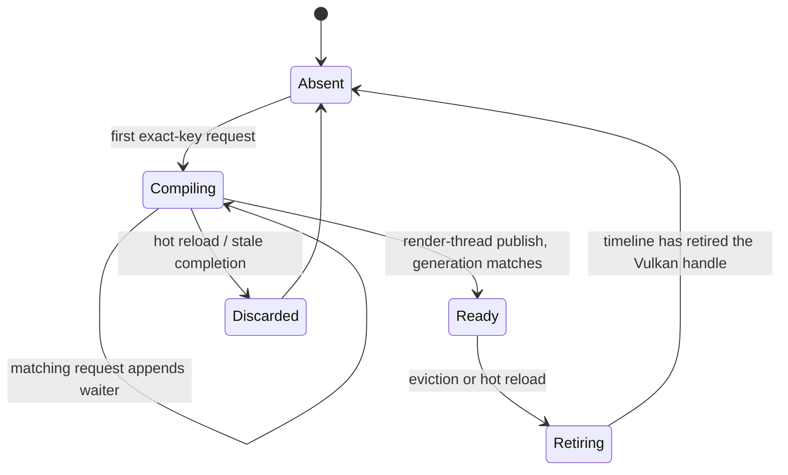

# PSO Cache Architecture

**Status:** Design — clean migration target.

## Goal

ZEngine currently creates descriptor-set layouts, pipeline layouts, and graphics/compute pipelines per pass. This design makes those objects device-owned, deduplicated, safely retired, and persistently warmed.

The cache is an acceleration only: cold, missing, corrupt, evicted, or disabled cache data must render identically to fresh Vulkan pipeline creation.

## Ownership

Shader reflection owns per-shader descriptor sets/pools and reflection metadata. PSOCache owns cached samplers, set layouts, pipeline layouts, compatibility render passes, pipelines, driver pipeline-cache objects, and their destruction. Passes borrow pipeline/layout handles and never destroy cached objects. The render graph owns physical resources, clear/load/store behavior, and scheduling.

Set-layout reuse is integrated in Shader::CreateDescriptorSetLayouts before descriptor-set allocation. Shader::Dispose releases only per-shader pools/sets/modules; it must not destroy cache-owned layouts. Pipeline Dispose methods forget borrowed cached handles.

On hot reload, the invalidation request increments the shader generation and then retires the per-shader descriptor pool and sets for the replaced module via the same DeferFree path used for pipelines. The new module reflection allocates a fresh pool and set. This must occur before any new Compiling entry referencing the new generation is inserted, so the order within a single render-thread invalidation pass is: increment generation, retire old pool/sets, retire stale pipeline entries.

All cache mutation, pass publication, hot-reload invalidation, and VulkanDevice::DeferFree calls occur on the render thread. Workers compile immutable pinned jobs and only publish completion records.

## Legacy bridge and dynamic-rendering target

Phase 1 has two render-pass roles.

- An execution render pass is the per-GraphicPass Attachment used by vkCmdBeginRenderPass. Load/store/layout semantics remain pass-specific.
- A compatibility render pass is cache-owned and used only by VkGraphicsPipelineCreateInfo::renderPass. Its key contains attachment count, formats, per-attachment samples, and view mask. It is never executed.

**Invariant:** vkCmdBeginRenderPass never receives a compatibility-cache handle.

Dynamic rendering is Phase 2. It requires feature query/enablement and validation on every supported runtime. It replaces command-buffer begin/end calls, framebuffer ownership, secondary inheritance including ZUI, and attachment setup together. Then legacy render-pass classes disappear: the PSO supplies VkPipelineRenderingCreateInfo and render execution supplies VkRenderingInfo.

## Canonical keys and collision-safe storage

Keys are fixed-size, zero-initialized engine structures. Use engine-restricted enums and conversion functions that assert on unsupported Vulkan values; never pack raw Vulkan extension enums into narrow fields.

A graphics key contains every non-dynamic creation input: immutable shader content identity and generation, specialization values, pipeline-layout identity, vertex input, topology, rasterization, multisampling, full depth/stencil state, blend/write masks, dynamic-state mask, and rendering/compatibility attachment state. A compute key includes shader identity, specialization, layout, and configured compute creation flags.

**Shader generation** is a plain per-module `uint32_t`, owned and mutated only by the render thread. It starts at 0 and increments whenever hot reload replaces the module. Here “atomic” means one ordered engine operation, not a C++ hardware atomic: increment the generation, defer retirement of the old descriptor pool/sets, then invalidate stale PSO entries and jobs. The generation is stored in both the PSO key (as part of shader identity) and each cache entry. A Compiling entry copies the module generation at insertion; publication rejects a result whose stored generation no longer matches and routes its handle to DeferredDestroyPipeline. Workers only consume the copied generation in an immutable compile job.

**Dynamic-state mask** encodes which pipeline states are declared dynamic via `VkDynamicState`. ZEngine currently declares `VK_DYNAMIC_STATE_VIEWPORT` and `VK_DYNAMIC_STATE_SCISSOR`; these two bits are always set and excluded from the key by equivalence. If additional dynamic states are added (depth bias, line width, blend constants), the mask must be widened and included in the key so pipelines compiled with different dynamic-state configurations are not aliased.

Do not duplicate rasterization and attachment sample count without an equality assertion. Before MSAA resolves are supported, enforce a common attachment sample count; afterward retain samples per attachment.

A hash selects a bucket; it is never identity. Every cache uses fixed collision buckets and full-key equality. On a hash match, compare complete keys. A different key appends to the bucket; a full bucket is a validated capacity failure, never an overwrite. Apply this to graphics/compute PSOs, samplers, descriptor-set layouts, pipeline layouts, and compatibility render passes. Hash-table load factor affects probing cost, not hash-collision probability.

ZEngine Array and HashSet require init(arena, capacity). Cache entries use fixed inline waiter arrays, reverse-index lists, and buckets unless an arena container is explicitly initialized. Do not rely on STL iterator APIs or on UnorderedHashMap::insert returning a reference.

## Layout caches

Sampler keys include every supported sampler-create input. Descriptor-layout keys include create flags plus sorted bindings: binding, count, descriptor kind, full stage mask, binding flags, and ordered immutable-sampler key identities. Pipeline-layout keys contain ordered cached set-layout identities and every push-constant range. Pipeline-layout identity is part of both PSO keys.

## State machine and asynchronous compilation

Graphics and compute entries are distinct types:

Absent → Compiling(generation N) → Ready(generation N) → Retiring
                    └──────────────→ Discarded

The first exact-key request inserts Compiling; matching requests append bounded waiters and do not enqueue a duplicate. A job pins shader module/content generation, pipeline layout, compatibility render pass, and optional derivative parent. Publication accepts a result only if its matching entry remains Compiling for that generation; otherwise it timeline-retires the result.

Workers exclusively check out bounded-pool VkPipelineCache objects. A worker returns its cache only in a completion record. The render thread merges only returned caches, publishes Ready, and invokes waiters after locks are released. Frame hits append to a bounded render-thread access list; FlushAccessedFrames holds the unique lock to update LastUsedFrame.

Every bounded job/completion/waiter/bucket/reverse-index queue defines full/empty state, overflow behavior, producer/consumer count, cancellation, and shutdown. Overflow is synchronous fallback for critical work or a safe skipped non-critical request.

Pipeline derivatives are optional. Their parent is an ordered shader-pair key with full-key comparison, and is pinned through child compilation.

## Lifetime, eviction, and hot reload

ZEngine already has PIPELINE, PIPELINE_LAYOUT, and DESCRIPTORSETLAYOUT device resource types and a header-only DeferredFreeQueue. Cached pipeline retirement uses an existing typed DeferredFreeEntry with EntryKind VkHandle, TimelineValue set to RenderTimelineNextValue, and Data.Vk set to the pipeline handle plus DeviceResourceType::PIPELINE. It is enqueued only through VulkanDevice::DeferFree on the render thread.

Audit existing drain cases and enable sampler destruction if cached samplers require it. Eviction removes only ready, unpinned entries, cleans exact-key reverse indices, then timeline-retires them.

Hot reload posts a render-thread invalidation request. It invalidates graphics and compute entries plus queued/completed jobs using the replaced generation. Old descriptor pools and sets are **deferred**, never freed immediately: already-recorded or in-flight command buffers may still reference them. The next frame may use a valid old pipeline, placeholder, or skip; it never uses a destroyed handle.

Shutdown order: stop/join workers; drain/discard completions; retire/destroy pipelines; destroy layouts, compatibility render passes, samplers, and driver caches; then destroy the device.

## Disk cache and warmup

Disk blobs are optional. Store magic/version, Vulkan pipeline-cache UUID, vendor/device identity, driver version, engine version, platform, blob size, and CRC32. Validate before creating a Vulkan cache; failure creates an empty valid cache.

Use `ZodiacEngine/cache/` as the development default through a configured writable VFS cache mount. Do not assume that a working directory, installed application, CI workspace, or future application bundle is writable. Add the development path to `.gitignore`; if the mount or directory cannot be created, disable disk persistence for that run and continue with an in-memory cache. Stale-temp cleanup, short-write/close failure, and replacement failure are non-fatal. Blob allocation is bounded arena/heap memory, never alloca.

Warmup serializes a resolvable recipe, not hashes alone: shader variant descriptors, specialization data, canonical pipeline state, and layout/attachment descriptions. At boot resolve exact content and skip stale recipes.

## Migration order

1. Establish cache ownership and audit typed deferred-free behavior.
2. Add restricted enums, complete zeroed keys, collision buckets, and tests.
3. Move set-layout creation into shader reflection; separate shared layouts from per-shader pools/sets.
4. Add sampler, descriptor-layout, pipeline-layout, and compatibility-render-pass caches.
5. Route synchronous graphics and compute Bake paths through PSOCache, retaining execution render passes.
6. Add disk persistence, telemetry, and warmup recipes.
7. Add render-thread hot reload, timeline retirement, and bounded eviction.
8. Add the asynchronous state machine only after job/lifetime tests pass.
9. Migrate graph and graphics execution to dynamic rendering; remove the legacy bridge.

## Required validation

- Identical keys deduplicate; forced same-hash/different-key entries coexist.
- Supported key layouts contain no implicit padding; unsupported conversions assert.
- Cached layouts outlive shader/pass disposal while per-shader pools retire safely.
- Compatibility render passes are never executed.
- Cold, warm, corrupt, and absent disk caches render identically.
- Hot reload, eviction, and stale async completion never expose a destroyed pipeline.
- Duplicate async requests enqueue one job and notify every waiter.
- Worker-cache merge never races a worker using that cache.
- Resize with unchanged formats/sample state creates no PSO miss.

## Reference architecture



The compatibility render pass is an input to pipeline creation only. The pass's existing
Attachment remains the execution render pass in Phase 1.

## Reference pseudocode

### Collision-safe synchronous lookup

```cpp
VkPipeline PSOCache::GetOrCreateGraphics(const GraphicsPSOKey& key,
                                         VkPipelineLayout layout,
                                         VkRenderPass compat_pass)
{
    const uint64_t hash = Hash(key);
    std::unique_lock lock(GraphicsMutex);
    GraphicsBucket* bucket = Graphics.find(hash);
    if (GraphicsEntry* hit = FindExact(bucket, key))
    {
        // Appends hash to a bounded render-thread-only access list.
        // FlushAccessedFrames() updates LastUsedFrame in one batched pass per frame.
        // This path already holds the unique lock; deferral is for batching efficiency,
        // not because writing LastUsedFrame here would be lock-unsafe.
        RecordFrameAccess(hash, hit->Generation);
        return hit->Pipeline;
    }

    GraphicsEntry& entry = AppendBucketEntry(bucket, key); // asserts only on bucket-capacity breach
    entry.State = PSOState::Compiling;
    const uint32_t generation = entry.Generation;
    lock.unlock();

    VkPipeline pipeline = CompileGraphics(key, layout, compat_pass);

    lock.lock();
    // Never retain `entry` across the unlocked compile: hot reload may discard or compact
    // its bucket. Re-find by complete identity and generation after reacquiring the lock.
    GraphicsEntry* current = FindExact(Graphics.find(hash), key);
    if (current && current->State == PSOState::Compiling && current->Generation == generation)
    {
        current->Pipeline = pipeline;
        current->State = PSOState::Ready;
        return pipeline;
    }
    // Entry was invalidated by hot reload while CompileGraphics ran.
    // Retire the result and return null; the caller must treat null as "skip draw call".
    lock.unlock();
    DeferredDestroyPipeline(pipeline);
    return VK_NULL_HANDLE;
}
```

### Asynchronous state transition



```cpp
void PSOCache::PublishCompleted(const CompletedJob& done)
{
    // Called only by the render thread after the worker has relinquished done.DriverCache.
    // Merge happens before the lock so the driver's micro-code is available to any
    // subsequent compile on the same frame. Both operations are render-thread-only,
    // so sequential ordering is guaranteed — no atomicity between them is required.
    MergeIntoMainDriverCache(done.DriverCache);
    ReturnDriverCacheToPool(done.DriverCache); // required for both ready and stale results

    std::unique_lock lock(GraphicsMutex);
    GraphicsEntry* entry = FindExact(Graphics.find(done.Hash), done.Key);
    if (!entry || entry->State != PSOState::Compiling || entry->Generation != done.Generation)
    {
        lock.unlock();
        DeferredDestroyPipeline(done.Pipeline);
        return;
    }
    entry->Pipeline = done.Pipeline;
    entry->State = PSOState::Ready;
    PSOReadyCallback waiters[kMaxWaiters];
    uint32_t waiter_count = TakeWaiters(*entry, waiters);
    lock.unlock();
    for (uint32_t i = 0; i < waiter_count; ++i)
        waiters[i].Invoke(done.Pipeline);
}
```

### Timeline retirement

```cpp
void PSOCache::DeferredDestroyPipeline(VkPipeline pipeline)
{
    DeferredFreeEntry e{};
    e.EntryKind = DeferredFreeEntry::Kind::VkHandle;
    e.TimelineValue = Device->SwapchainPtr->RenderTimelineNextValue;
    e.Data.Vk = {reinterpret_cast<void*>(pipeline),
                 Rendering::DeviceResourceType::PIPELINE, nullptr};
    Device->DeferFree(e); // render thread only
}
```
