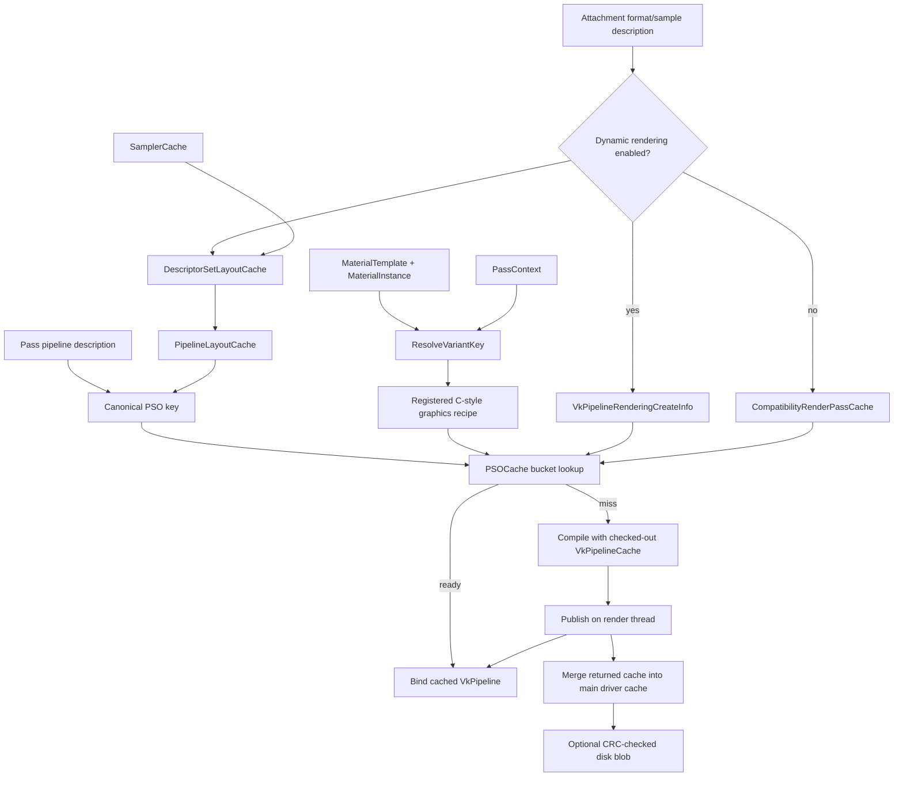
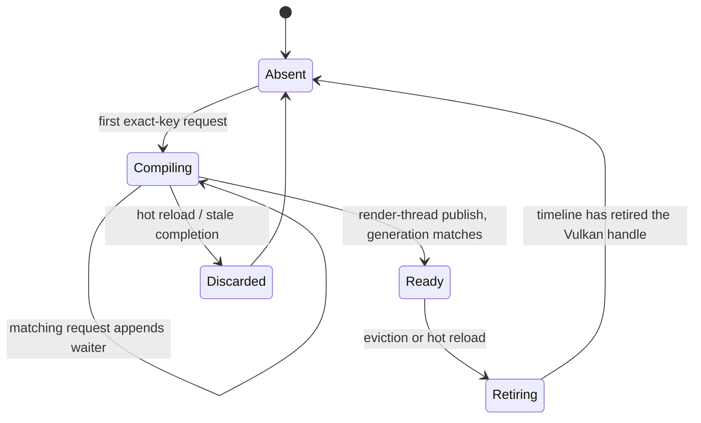

# PSO Cache Architecture

**Status:** Implemented migration target; live Vulkan hardware validation remains.

## Goal

ZEngine creates descriptor-set layouts, pipeline layouts, and graphics/compute pipelines through a device-owned cache. The cache deduplicates those objects, retires them safely, and can persistently warm driver pipeline state.

The cache is an acceleration only: cold, missing, corrupt, evicted, or disabled cache data must render identically to fresh Vulkan pipeline creation.

## Ownership

Shader reflection owns per-shader descriptor sets/pools and reflection metadata. PSOCache owns cached samplers, set layouts, pipeline layouts, compatibility render passes, pipelines, driver pipeline-cache objects, and their destruction. Passes borrow pipeline/layout handles and never destroy cached objects. The render graph owns physical resources, clear/load/store behavior, and scheduling.

Set-layout reuse is integrated in Shader::CreateDescriptorSetLayouts before descriptor-set allocation. Shader::Dispose releases only per-shader pools/sets/modules; it must not destroy cache-owned layouts. Pipeline Dispose methods forget borrowed cached handles.

On hot reload, the invalidation request increments the shader generation and then retires the per-shader descriptor pool and sets for the replaced module via the same DeferFree path used for pipelines. The new module reflection allocates a fresh pool and set. This must occur before any new Compiling entry referencing the new generation is inserted, so the order within a single render-thread invalidation pass is: increment generation, retire old pool/sets, retire stale pipeline entries.

All cache mutation, pass publication, hot-reload invalidation, and VulkanDevice::DeferFree calls occur on the render thread. Workers compile immutable pinned jobs and only publish completion records.

## Dynamic-rendering backend and legacy fallback

Dynamic rendering is the preferred backend whenever the selected Vulkan 1.3 device
advertises and enables the dynamic-rendering feature. It is a command-recording
operation: `CommandBuffer::BeginDynamicRendering(const
VkRenderingInfo&)` and `CommandBuffer::EndDynamicRendering()` own the calls. The
device owns only feature negotiation and private loaded `vkCmdBeginRendering` /
`vkCmdEndRendering` entry points. `CommandBuffer::BeginRenderPass()` /
`EndRenderPass()` are compatibility facades for existing pass callbacks; on a dynamic
device they assemble `VkRenderingInfo` and call the command-buffer APIs.

The dynamic graphics PSO chains `VkPipelineRenderingCreateInfo` and has no execution
`VkRenderPass` or `VkFramebuffer`. Its key includes the canonical color-format tuple,
depth format, stencil format, sample count, and view mask used by that rendering
instance. Secondary command buffers chain `VkCommandBufferInheritanceRenderingInfo`
with the same compatibility tuple.

The legacy backend remains a required capability fallback for a selected device that
cannot enable dynamic rendering. Only on that backend are there two render-pass roles:

- An execution render pass is the per-`GraphicPass` `Attachment` passed to
  `vkCmdBeginRenderPass`. Load/store/layout semantics remain pass-specific.
- A compatibility render pass is cache-owned and used only by legacy
  `VkGraphicsPipelineCreateInfo::renderPass`. Its key contains attachment count,
  formats, per-attachment samples, and view mask. It is never executed.

**Invariant:** `vkCmdBeginRenderPass` never receives a compatibility-cache handle.
The dynamic path never calls `vkCmdBeginRenderPass`.

Both backends require validation on macOS/MoltenVK, Windows, and Linux. A missing
dynamic-rendering feature selects the legacy backend; it does not make the device
unsupported solely for that reason.

## Callback and allocation ABI

Cache visitors, predicates, completion notifications, and worker jobs use C-style
function pointers with an explicit caller-owned `void*` context. For example,
`using PSOPipelineReadyFn = void (*)(void* context, VkPipeline pipeline);`. Do not
add forwarding-reference callback templates or `std::function` to these paths: their
type erasure can allocate and obscures the lifetime of a cross-thread callback. The
context must remain valid until cancellation or invocation on the render thread.

## Canonical keys and collision-safe storage

Keys are fixed-size, zero-initialized engine structures. Use engine-restricted enums and conversion functions that assert on unsupported Vulkan values; never pack raw Vulkan extension enums into narrow fields.

A graphics key contains every non-dynamic creation input: immutable shader content identity and generation, specialization values, pipeline-layout identity, vertex input, topology, rasterization, multisampling, full depth/stencil state, blend/write masks, dynamic-state mask, and rendering/compatibility attachment state. A compute key includes shader identity, specialization, layout, and configured compute creation flags. Each stage canonicalizes specialization input by constant ID (not caller byte offsets), with up to eight values of up to 64 bytes; exceeding that explicit fixed-capacity ABI is a validated request failure.

**Shader generation** is a plain per-module `uint32_t`, owned and mutated only by the render thread. It starts at 0 and increments whenever hot reload replaces the module. Here “atomic” means one ordered engine operation, not a C++ hardware atomic: increment the generation, defer retirement of the old descriptor pool/sets, then invalidate stale PSO entries and jobs. The generation is stored in both the PSO key (as part of shader identity) and each cache entry. A Compiling entry copies the module generation at insertion; publication rejects a result whose stored generation no longer matches and routes its handle to DeferredDestroyPipeline. Workers only consume the copied generation in an immutable compile job.

**Dynamic-state mask** encodes which pipeline states are declared dynamic via `VkDynamicState`. ZEngine currently declares `VK_DYNAMIC_STATE_VIEWPORT` and `VK_DYNAMIC_STATE_SCISSOR`; these two bits are always set and excluded from the key by equivalence. If additional dynamic states are added (depth bias, line width, blend constants), the mask must be widened and included in the key so pipelines compiled with different dynamic-state configurations are not aliased.

Do not duplicate rasterization and attachment sample count without an equality assertion. Before MSAA resolves are supported, enforce a common attachment sample count; afterward retain samples per attachment.

A hash selects a bucket; it is never identity. Every cache uses fixed collision buckets and full-key equality. On a hash match, compare complete keys. A different key appends to the bucket; a full bucket is a validated capacity failure, never an overwrite. Apply this to graphics/compute PSOs, samplers, descriptor-set layouts, pipeline layouts, and compatibility render passes. Hash-table load factor affects probing cost, not hash-collision probability.

ZEngine Array and HashSet require init(arena, capacity). Cache entries use fixed inline waiter arrays, reverse-index lists, and buckets unless an arena container is explicitly initialized. Do not rely on STL iterator APIs or on UnorderedHashMap::insert returning a reference.

## Layout caches

Sampler keys include every supported sampler-create input. Descriptor-layout keys include create flags plus sorted bindings: binding, count, descriptor kind, full stage mask, binding flags, and an ordered immutable-sampler-list identity. The list cache compares every source handle in full before assigning that identity, so a list hash is never treated as identity. Pipeline-layout keys contain ordered cached set-layout identities and every push-constant range. Pipeline-layout identity is part of both PSO keys.

## State machine and asynchronous compilation

Graphics and compute entries are distinct types:

Absent → Compiling(generation N) → Ready(generation N) → Retiring
                    └──────────────→ Discarded

The first exact-key request inserts Compiling; matching requests append bounded waiters and do not enqueue a duplicate. A job pins shader module/content generation, pipeline layout, compatibility render pass, and optional derivative parent. Publication accepts a result only if its matching entry remains Compiling for that generation; otherwise it timeline-retires the result.

Workers exclusively check out bounded-pool `VkPipelineCache` objects. A worker returns
its cache only in a completion record. The render thread merges only returned caches,
publishes Ready, and invokes waiters after cache-entry mutation is complete. Because
the cache is render-thread-owned, each ready hit updates `LastUsedFrame` directly;
there is no access-list flush or cache mutex.

Every bounded job/completion/waiter/bucket/reverse-index queue defines full/empty state, overflow behavior, producer/consumer count, cancellation, and shutdown. Overflow is synchronous fallback for critical work or a safe skipped non-critical request.

Pipeline derivatives are optional. Their parent is an ordered shader-pair key with full-key comparison, and is pinned through child compilation.

## Lifetime, eviction, and hot reload

ZEngine already has PIPELINE, PIPELINE_LAYOUT, and DESCRIPTORSETLAYOUT device resource types and a header-only DeferredFreeQueue. Cached pipeline retirement uses an existing typed DeferredFreeEntry with EntryKind VkHandle, TimelineValue set to RenderTimelineNextValue, and Data.Vk set to the pipeline handle plus DeviceResourceType::PIPELINE. It is enqueued only through VulkanDevice::DeferFree on the render thread.

Audit existing drain cases and enable sampler destruction if cached samplers require it. Eviction removes only ready, unpinned entries, cleans exact-key reverse indices, then timeline-retires them.

Hot reload posts a render-thread invalidation request. It invalidates graphics and compute entries plus queued/completed jobs using the replaced generation. Old descriptor pools and sets are **deferred**, never freed immediately: already-recorded or in-flight command buffers may still reference them. The next frame may use a valid old pipeline, placeholder, or skip; it never uses a destroyed handle.

Shutdown order: stop/join workers; drain/discard completions; retire/destroy pipelines; destroy layouts, compatibility render passes, samplers, and driver caches; then destroy the device.

## Disk cache and warmup

Disk blobs are optional. Store magic/version, Vulkan pipeline-cache UUID, vendor/device identity, driver version, engine version, platform, blob size, and CRC32. Validate before creating a Vulkan cache; failure creates an empty valid cache.

When a `GameApplication` supplies both a non-empty `WorkingSpacePath` and a VFS
backend advertising `Write`, `Engine` mounts the dedicated native directory
`<WorkingSpacePath>/ZodiacEngine/cache` at `/ZodiacEngine/cache`, ahead of the
engine-assets mount. This is the development default and is ignored by Git. An
application without an explicitly writable workspace has disk persistence disabled;
it does not fall back to the current directory, an installed bundle, or a CI
workspace. Mount/directory creation failure also leaves a valid in-memory cache.
Stale temporary files, short write/close failure, and replacement failure are
non-fatal. Blob allocation is bounded arena/heap memory, never `alloca`.

Warmup serializes a resolvable recipe, not hashes alone: shader variant descriptors, specialization data, canonical pipeline state, and layout/attachment descriptions. At boot resolve exact content and skip stale recipes.

## Material variants and scene prewarming

`MaterialSystem` is the author-side layer above `PSOCache`. A `MaterialTemplate`
defines a shader base name, its supported feature mask, and its parameter-block size;
a `MaterialInstance` selects active flags and either owns an inline parameter payload or
refers to an external UBO/SSBO material-record index. Inline data is bounded by
`min(128, maxPushConstantsSize)`. A larger template must use the external path rather
than issuing an invalid push-constant write. The external instance retains its four-byte
record index in its inline payload and records that smaller push-constant size separately
from the total external material-data size.

`ResolveVariantKey()` uses a stable FNV-1a hash of the shader base name, intersects the
instance flags with the template-supported flags, and retains only `AlphaTest` and
`DoubleSided` for depth-prepass and shadow contexts. Alpha test remains necessary for
the depth-only fragment discard; double-sidedness remains rasterization state.

At scene load, `PrewarmForMaterials()` deduplicates the exact
`(MaterialTemplate, ShaderVariantKey)` requests in deterministic input order, then
applies its bounded `PrewarmBudget` (currently 256 requests, matching the bounded async
PSO job queue). A variant key alone cannot construct a Vulkan
graphics PSO because layout, vertex input, fixed state, and rendering compatibility are
pass-owned. Each `PassContext` therefore registers a C-style recipe provider:

```cpp
using MaterialGraphicsPrewarmRecipeFn = bool (*)(
    void* context, const MaterialTemplate&, const ShaderVariantKey&,
    VkGraphicsPipelineCreateInfo* out_create_info,
    uint32_t* out_shader_generation);
```

The provider returns a fully valid, temporary `VkGraphicsPipelineCreateInfo` for its
context. `MaterialSystem` immediately calls
`PSOCache::RequestGraphicsPipelineAsync`; the cache canonicalizes the structure before
the provider returns, so no worker retains caller-owned pointers. Completion remains a
`PSOPipelineReadyFn` plus caller-owned `void*` context, consistent with the cache ABI.

For draw recording, `DrawSorter` produces separate engine-array-backed lists. Opaque
draws sort by PSO key hash, material index, then front-to-back view depth. Conventional
alpha-blended draws sort strictly back-to-front with submission order as the only
tie-breaker; they never reorder by PSO or material state.

## Implemented migration coverage

The migration is complete in the production paths. The following mapping records the implementation locations rather than leaving the original migration checklist as future work.

| Completed area | Primary implementation |
|---|---|
| Cache ownership and typed deferred retirement | `PSOCache`, `VulkanDevice::DeferFree`, and `DeferredFreeQueue` |
| Canonical fixed-capacity keys and collision buckets | `PSOCache.h/.cpp` and `tests/Rendering/PSOCacheTest.cpp` |
| Shared descriptor-set layouts with per-shader pools/sets | `Shader::CreateDescriptorSetLayouts` and `Shader::Dispose` |
| Sampler, layout, and compatibility-render-pass caches | `PSOCache::GetOrCreate*` |
| Synchronous graphics/compute creation | `PSOCache::GetOrCreateGraphicsPipeline` and `GetOrCreateComputePipeline` |
| Disk persistence, telemetry, and warmup recipes | `Load/SaveDriverPipelineCache`, `Load/SaveWarmupRecipes`, and `PSOCacheTelemetry` |
| Hot reload, timeline retirement, and eviction | `InvalidateShaderModules` and `EvictUnusedPipelines` |
| Bounded asynchronous state machine | `RequestGraphicsPipelineAsync` and `FlushAsyncPipelineJobs` |
| Dynamic-rendering command-buffer path with legacy fallback | `CommandBuffer`, `PSOCache`, and render-graph graphics execution |

## Required validation

- Identical keys deduplicate; forced same-hash/different-key entries coexist.
- Supported key layouts contain no implicit padding; unsupported conversions assert.
- Cached layouts outlive shader/pass disposal while per-shader pools retire safely.
- Compatibility render passes are never executed.
- Cold, warm, corrupt, and absent disk caches render identically.
- Hot reload, eviction, and stale async completion never expose a destroyed pipeline.
- Duplicate async requests enqueue one job and notify every waiter.
- Worker-cache merge never races a worker using that cache.
- Resize with unchanged formats/sample state creates no PSO miss.

## Reference architecture



The compatibility render pass is an input to **legacy** pipeline creation only. On the
dynamic backend, `VkPipelineRenderingCreateInfo` is the rendering-compatibility input
and `VkRenderingInfo` is supplied at command recording.

## Reference pseudocode

### Collision-safe synchronous lookup

```cpp
VkPipeline PSOCache::GetOrCreateGraphicsPipeline(
    const VkGraphicsPipelineCreateInfo& create_info,
    uint32_t shader_generation)
{
    const PSOGraphicsPipelineKey key = MakeGraphicsPipelineKey(create_info, shader_generation);
    const uint64_t hash = Hash(key);
    bool created = false;
    GraphicsEntry* entry = Graphics.FindOrInsert(hash, key, &created);
    assert(entry != nullptr); // collision-bucket capacity failure
    if (!created && entry->State == PSOPipelineState::Ready)
    {
        entry->LastUsedFrame = CurrentFrameMarker();
        return entry->Pipeline;
    }

    // All state changes run on the render thread. A synchronous Vulkan call cannot
    // interleave a hot-reload invalidation pass, so entry remains a valid slot here.
    if (!created && entry->AsyncJobIndex != UINT32_MAX)
        CancelAsyncPipelineJob(entry->AsyncJobIndex);
    entry->State = PSOPipelineState::Compiling;
    entry->Generation = shader_generation;
    entry->AsyncJobIndex = UINT32_MAX;
    ZENGINE_VALIDATE_ASSERT(
        vkCreateGraphicsPipelines(Device, DriverPipelineCache, 1,
                                   &create_info, nullptr, &entry->Pipeline) == VK_SUCCESS,
        "Failed to create cached graphics pipeline");
    entry->State = PSOPipelineState::Ready;
    entry->LastUsedFrame = CurrentFrameMarker();
    return entry->Pipeline;
}
```

### Asynchronous state transition



```cpp
void PSOCache::PublishAsyncCompletion(const AsyncPipelineCompletion& done)
{
    // Called only by the render thread after the worker has relinquished its cache.
    // Merge and return happen before publication on both ready and stale paths.
    AsyncPipelineJob& job = AsyncJobs[done.JobIndex];
    vkMergePipelineCaches(Device, DriverPipelineCache, 1,
                           &WorkerPipelineCaches[done.WorkerCacheIndex]);
    ReturnWorkerPipelineCache(done.WorkerCacheIndex);

    GraphicsEntry* entry = Graphics.Find(job.Hash, job.GraphicsKey);
    if (job.State != AsyncPipelineJobState::Running || done.Result != VK_SUCCESS ||
        !entry || entry->State != PSOPipelineState::Compiling ||
        entry->Generation != job.Generation || entry->AsyncJobIndex != job.Index)
    {
        DeferredDestroyPipeline(done.Pipeline);
        job = {};
        return;
    }
    entry->Pipeline = done.Pipeline;
    entry->State = PSOPipelineState::Ready;
    entry->AsyncJobIndex = UINT32_MAX;
    QueuePipelineWaiters(*entry, done.Pipeline);
    job = {};
    // FlushAsyncPipelineJobs dispatches the queued callbacks after all completion
    // records have finished mutating cache entries.
}
```

### Timeline retirement

```cpp
void PSOCache::DeferredDestroyPipeline(VkPipeline pipeline)
{
    DeferredFreeEntry e{};
    e.EntryKind = DeferredFreeEntry::Kind::VkHandle;
    e.TimelineValue = Device->SwapchainPtr->RenderTimelineNextValue;
    e.Data.Vk = {reinterpret_cast<void*>(pipeline),
                 Rendering::DeviceResourceType::PIPELINE, nullptr};
    Device->DeferFree(e); // render thread only
}
```
