# Render Graph Redesign

**Relates to:** `sky-rendering.md`, `per-frame-upload-heap.md`, `pso-cache-architecture.md`
**Status:** Implemented architecture and maintenance reference
**Scope:** Per-frame declarative resources, versioned dependency culling, subresource-aware Synchronization2 barriers, transient reuse, capability-resolved multi-queue scheduling, dynamic rendering, and parallel command recording.

**PSO integration:** `pso-cache-architecture.md` provides the device-owned pipeline cache used by pass compilation and material prewarming. A graph pass borrows a cached pipeline handle; pass disposal never destroys the cache-owned Vulkan pipeline.

Reference implementations: Frostbite Framegraph (O'Donnell, GDC 2017), UE5 RDG (`FRDGBuilder`).

---

## 1. Motivation

Before this redesign, the graph was serial and graphics-only. The following failures drove the implemented architecture:

| Problem | Root cause |
|---|---|
| Compute passes never execute | Framebuffer-null guard in `Execute()` applies to all pass types |
| Compute, transfer, and graphics work could not overlap | No graph-owned queue assignment, submissions, or dependency waits |
| Compile-time barriers are dead code | `BuildBarriers()` walks declaration order, not sorted order; `Execute()` ignores its output |
| Runtime pass enable/disable is broken | `SetPassEnabled()` flips a boolean but never recompiles — disabled-at-compile passes stay null |
| Transient memory over-allocated | Exact format+size match only; no lifetime-overlap aliasing |
| No GPU debug visibility | Pass names never emitted as GPU labels |
| No storage image or buffer declarations | `WriteStorageImage`, `WriteBuffer` don't exist in the builder API |

---

## 2. Pass Callback and Queue Model

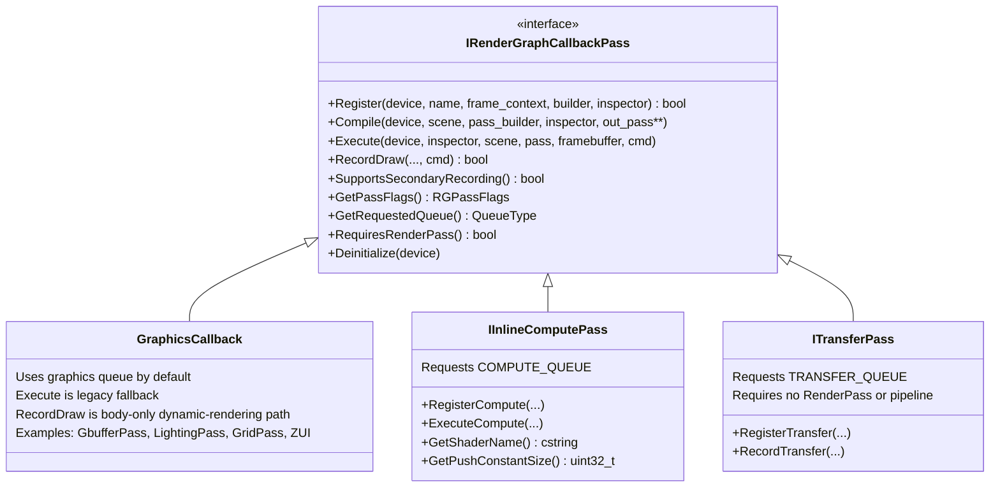

```cpp
enum class RGPassFlags : uint8_t
{
    None      = 0,
    NeverCull = 1 << 0, // intentional external side effect only
};

constexpr bool HasRGPassFlag(RGPassFlags flags, RGPassFlags flag)
{
    return (static_cast<uint8_t>(flags) & static_cast<uint8_t>(flag)) != 0;
}

struct IRenderGraphCallbackPass
{
    // All callback kinds expose this metadata; culling and scheduling never downcast.
    virtual RGPassFlags GetPassFlags() const { return RGPassFlags::None; }
    virtual Rendering::QueueType GetRequestedQueue() const
    {
        return Rendering::QueueType::GRAPHIC_QUEUE;
    }
    virtual bool RequiresRenderPass() const { return true; }
};
```

### 2.1 Graphics callbacks

There is no `IGraphicsPass` base class. Ordinary callbacks inherit
`IRenderGraphCallbackPass` and request `GRAPHIC_QUEUE` by default. A graphics callback
that supports graph-managed rendering implements `RecordDraw()` and returns true from
`SupportsSecondaryRecording()`. The graph owns the dynamic-rendering scope and may
record that body on an assigned secondary buffer. `Execute()` remains the legacy
render-pass fallback and the path for callbacks that do not support secondary recording.

### 2.2 IInlineComputePass

`IInlineComputePass` is the graph's compute callback base. It requests
`COMPUTE_QUEUE`; `BuildQueueSchedule()` resolves that request to a distinct compute
queue when the selected device exposes one, otherwise to the graphics queue. It never
requires a framebuffer.

```cpp
struct IInlineComputePass : public IRenderGraphCallbackPass
{
    bool             Register(...) final;
    void             Compile(...) final;
    void             Execute(...) final;

    virtual void     RegisterCompute(...) = 0;
    virtual void     ExecuteCompute(...) = 0;
    virtual cstring  GetShaderName() const = 0;
    virtual uint32_t GetPushConstantSize() const { return 0; }
    Rendering::QueueType GetRequestedQueue() const override
    {
        return Rendering::QueueType::COMPUTE_QUEUE;
    }
};
```

### 2.3 ITransferPass and queue resolution

`ITransferPass` declares transfer reads and writes in `RegisterTransfer()` and records
copy, clear, or query-result work in `RecordTransfer()`. It requests
`TRANSFER_QUEUE` and has `RequiresRenderPass() == false`.

Every active pass remains in the versioned DAG regardless of its requested role. The
schedule resolves `RGPass::RequestedQueue` into `RGPass::Queue` by using a distinct
compute or transfer queue only when `VulkanDevice` exposes one. Cross-queue producer /
consumer edges produce graph-owned timeline waits and release/acquire ownership barriers
when their queue families differ. A single universal queue is therefore a correct,
fully supported fallback rather than a special asynchronous-pass path.

---

## 3. Resource Declaration API

`RenderGraphResourceBuilder` methods already return `RGResourceHandle`. Storage-image and
swapchain declarations are additive; buffer declarations additionally require the physical
buffer and barrier work described below.

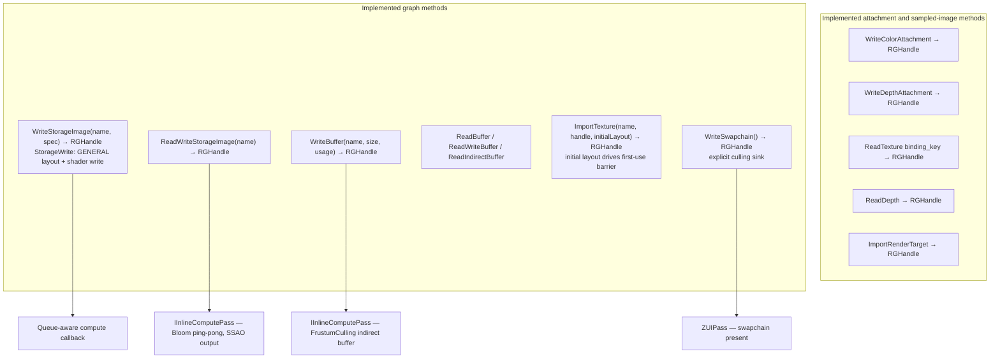

**`StorageWrite` is paired with an access-table row.** `kAccessTable` in
`RenderGraph.cpp` is a C array indexed by `RGAccess` ordinal. Any future access enum
must add its table row at the matching ordinal; otherwise later enum values silently map
to the wrong synchronization state.

```cpp
// The matching enum/table entries remain adjacent to Count_.
..., ShaderReadWrite, TransferRead, TransferWrite, Present, ..., StorageWrite, Count_
```

The corresponding `kAccessTable` row uses shader-stage scope,
`VK_ACCESS_2_SHADER_WRITE_BIT`, and `VK_IMAGE_LAYOUT_GENERAL`. It differs from
`ShaderReadWrite`, which retains both shader read and write access.

**Frame-local handles.** `GetTextureHandle(RGResourceHandle)` is available on
`RenderGraphResourceInspector`. `Register()` reconstructs the virtual graph every
frame, so resource handles belong to that frame only. A callback may pass a handle
through its current frame data but must not retain it across the next `Register()` call:

```cpp
class LightingPass : public IRenderGraphCallbackPass {
    RGHandle m_albedo;
    bool Register(...) { m_albedo = builder->ReadTexture(GBufferAlbedoAOName, "GBufferAlbedoAO"); return true; }
    void Execute(...) { auto tex = inspector->GetTextureHandle(m_albedo); }  // O(1) — no string hash
};
```

Persistent callback state may cache only immutable data such as shaders, PSO
descriptions, and material configuration. `RecordDraw()` consumes the same frame-local
resource data registered for the active frame.

**Viewport extent is frame context, not swapchain state.** `RenderGraphFrameContext`
supplies `RenderWidth` and `RenderHeight` to every callback registration. Graph-owned
attachments must declare those dimensions rather than reading the swapchain extent
directly: an editor viewport can have a different size from its presentation surface.
`RenderGraph::Resize()` persists the new extent, waits for all device queues before
replacing image/view/descriptors that reference the old allocation, and the next
registration uses that same extent. Zero-size (minimized or not-yet-laid-out) requests
are ignored. This preserves named transient aliases and prevents updating a descriptor
while an in-flight command buffer still uses its prior image.

---

## 4. Pass Culling

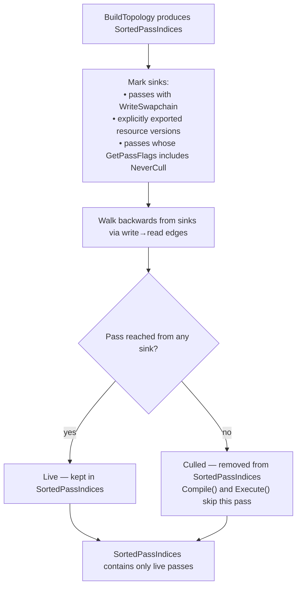

Replaces the runtime `if (!pass.Enabled) continue` check as the primary gate. A temporarily disabled pass produces no GPU work; its resources are not allocated; its barriers are not recorded.

---

## 5. Compile-Time Barrier Derivation

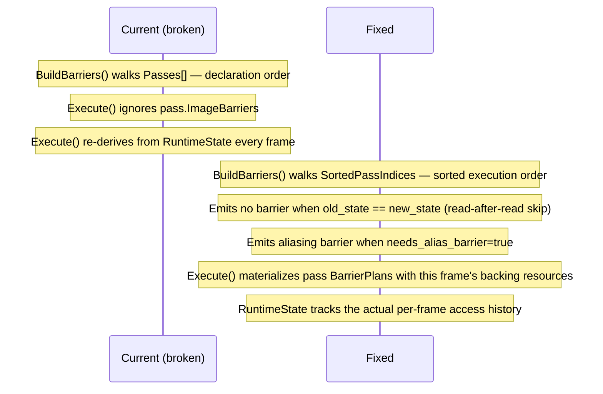

**Compile phase order — transients must be allocated BEFORE barriers.**

`BuildBarriers()` produces logical `RGImageBarrierPlan` and `RGBufferBarrierPlan`
records, not raw Vulkan barriers. It still runs after transient allocation because
allocation establishes the physical resource and alias hand-offs that those plans
describe. `Execute()` later materializes each plan with the active frame's Vulkan
handle and prior runtime state. This avoids baking an invalid transient or
swapchain handle into a reusable compile plan.

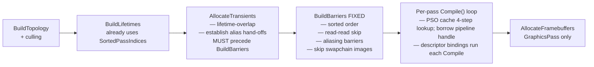

**Swapchain image exception.** Pre-compiled `VkImageMemoryBarrier` entries embed a raw `VkImage` handle. Swapchain images are distinct objects per slot (index 0, 1, 2) that change on every `vkAcquireNextImageKHR`. Baking a specific swapchain `VkImage` at compile time would reference the wrong image on subsequent frames, triggering VUID-vkCmdPipelineBarrier-image-parameter.

Fix: represent it as `RGResourceKind::Swapchain`, assigned by `WriteSwapchain()`. `BuildBarriers()` retains its logical access for topology, but emits no image barrier for that resource. The backing image changes after each acquire, so `CommandBuffer` performs the per-frame `PRESENT_SRC_KHR` → `COLOR_ATTACHMENT_OPTIMAL` transition immediately before rendering and returns it to `PRESENT_SRC_KHR` immediately after. `WriteSwapchain()` remains the graph's explicit sink; `RenderPassBuilder::UseSwapchainAsRenderTarget()` remains backend configuration for the compatibility render-pass facade.

**Persistent import contract.** Precompiled barriers are valid only if an imported
resource begins every frame in the layout/access/queue-family state declared by its
import. A resource touched outside the graph must be re-imported with its actual state
(or the external owner must transition it back to the declared final state). This is a
per-frame ownership rule, not merely a parameter captured at graph compile time.

---

## 6. Per-Frame Registration and Compilation

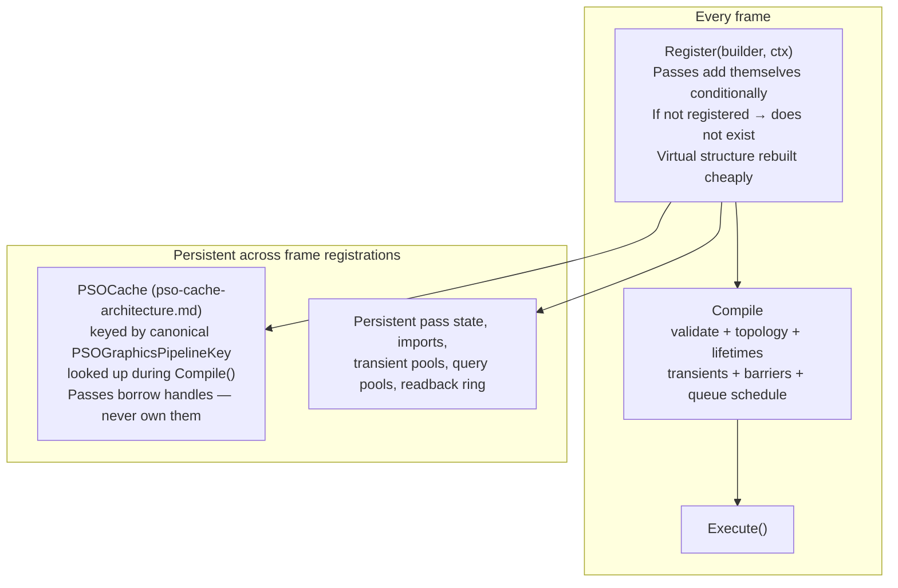

```cpp
// Conditional registration — omitted work has no virtual pass or allocation.
bool OptionalPass::Register(..., RenderGraphResourceBuilder* builder, ...) {
    if (!m_enabled)
        return false;
    m_output = builder->WriteStorageImage("optional_output", specification);
    return true;
}
```

`RenderGraph::Register()` clears only the frame arena, recreates virtual passes and
resources, and invokes every persistent callback's `Register()` method. Returning false
omits that pass for the frame, so culling, allocation, barriers, and submission planning
cannot accidentally retain disabled work. `Compile()` then validates declarations,
constructs the live topology, allocates/reuses physical resources, compiles or refreshes
pass state, and builds queue batches. Persistent callbacks, imported resources,
transient pools, query pools, readback storage, and cached PSOs survive registration.

This replaces the old `SetPassEnabled()` / deferred-recompile model. A mode change is
visible on the next frame registration and does not leave a pass with stale framebuffer
or pipeline state.

---

## 7. Transient Reuse and True Memory Aliasing

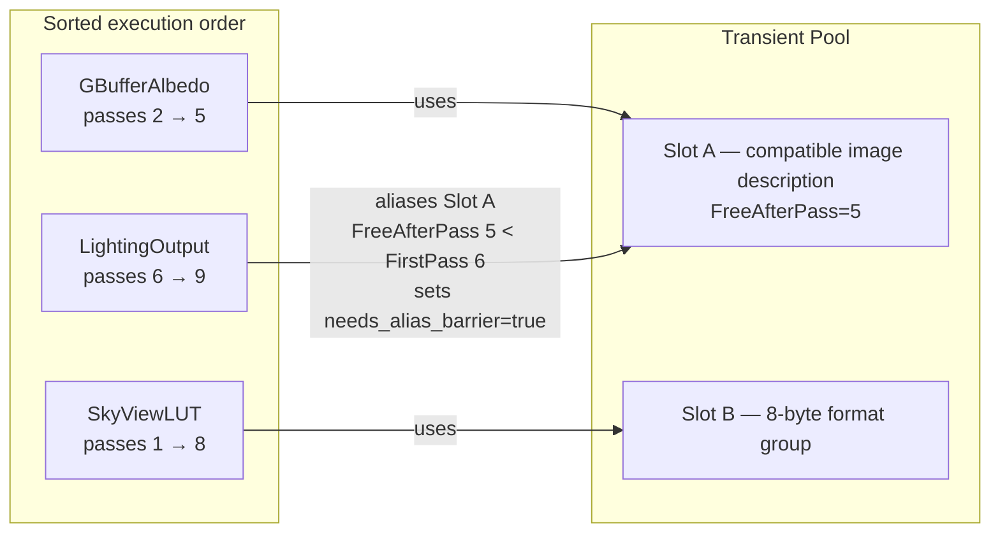

The transient pool first reuses a physical resource only when its complete image or
buffer description is compatible and its logical lifetime has ended. It also supports
true aliasing: distinct `VkImage`/`VkBuffer` objects can be backed by a compatible
existing allocation through the GPU allocator. The graph emits an alias hand-off memory
barrier and begins the destination image from `UNDEFINED`, discarding the prior alias's
contents. It never aliases imported, exported, or overlapping resources.

---

## 8. Render Pass Clear Values

Remove unconditional `cb->ClearColor(0.11, 0.11, 0.11)` and `cb->ClearDepth(1.0, 0)` from `Execute()`. Per-pass clear values in `TextureSpecification`:

```cpp
float    ClearColor[4]  = {0.f, 0.f, 0.f, 0.f};
float    ClearDepth     = 1.0f;
uint32_t ClearStencil   = 0;
```

`CommandBuffer::BeginRenderPass()` derives each attachment's `VkClearValue` from its
backing texture specification. Swapchain clears use Vulkan's zero-initialized clear
value unless a swapchain-specific clear policy is added later.

---

## 9. GPU Debug Markers

`vkCmdBeginDebugUtilsLabelEXT` / `vkCmdEndDebugUtilsLabelEXT` are extension functions — must be loaded via `vkGetDeviceProcAddr`. Not core Vulkan. Guarded by null-pointer check (absent when validation layers not loaded).

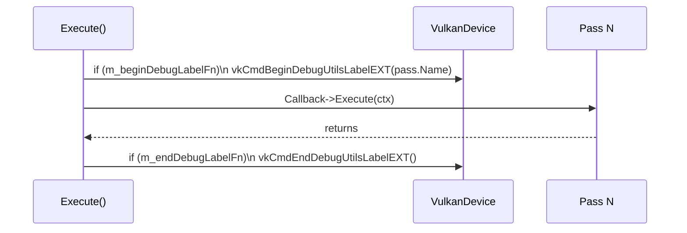

Add to `VulkanDevice`: `PFN_vkCmdBeginDebugUtilsLabelEXT m_beginDebugLabelFn` and `PFN_vkCmdEndDebugUtilsLabelEXT m_endDebugLabelFn`, loaded via `vkGetDeviceProcAddr` after `vkCreateDevice`.

---

## 10. Graph-Managed Queue Work

```mermaid
sequenceDiagram
    participant R as RenderGraph
    participant C as Compute batch
    participant G as Graphics batch
    participant T as Transfer batch

    R->>R: Register() + Compile()
    R->>R: Resolve requested queue roles
    R->>C: record and submit when a distinct compute queue exists
    C-->>G: timeline signal; acquire on cross-family edge
    R->>T: record and submit when a distinct transfer queue exists
    T-->>G: timeline signal; acquire on cross-family edge
    R->>G: record graphics batch and submit/present
```

All work is registered as a normal graph pass and declares the resources it produces and
consumes. There is no out-of-graph async-compute adapter and no special `Present()`
wait path. On a single-queue device, requested compute and transfer work is recorded
into graphics batches in dependency order; no queue-family transfer or semaphore wait
is needed.

---

## 11. Fixed Execute() Loop

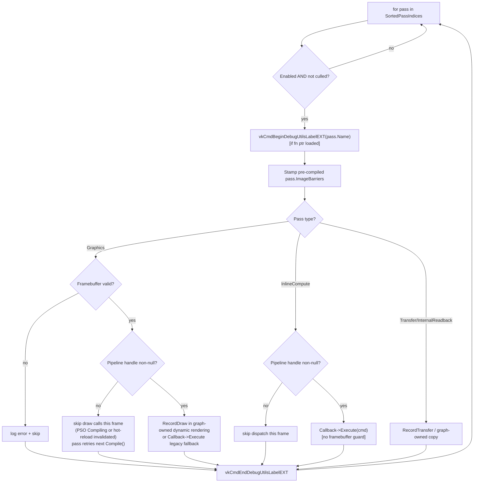

Every exit—successful recording, missing framebuffer, a null pipeline, or invalid
internal work—ends the pass label before the next pass begins. This preserves a valid
GPU-debug label hierarchy in RenderDoc and is required by Vulkan's begin/end pairing.

---

## 12. Full Architecture Overview

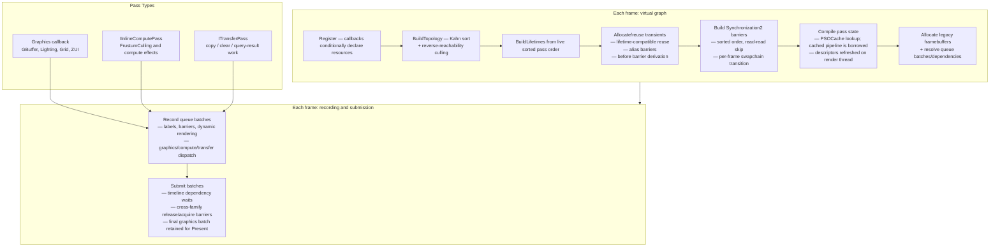

---

## 13. Multi-Threaded Command Recording

### 13.1 Existing Infrastructure

The engine uses worker-affine scheduling, dedicated secondary-buffer ownership, and a
body-only graphics-callback contract:

| Existing API | What it provides |
|---|---|
| `CommandBuffer::BeginSecondary(GraphicPass*, VkFramebuffer)` | Secondary cmd buffer for a graphics pass |
| `CommandBuffer::ExecuteSecondaryCommandBuffer(CommandBuffer*)` | Allocation-free primary playback of one secondary |
| `CommandBufferManager::GetCommandBuffer(queue, frame, thread_index, buffer_index)` | Per-thread per-frame command buffer pool |
| `GraphicRenderer::DrawScene(frame_index, thread_index, cb, camera)` | `thread_index` passed but unused |
| `VulkanDevice::WorkerThreadCount` | Thread count available |

### 13.2 Topology Levels

After the topological sort produces `SortedPassIndices`, passes can be grouped into **dependency levels** — passes within the same level have no direct dependencies between them and can be recorded in parallel:

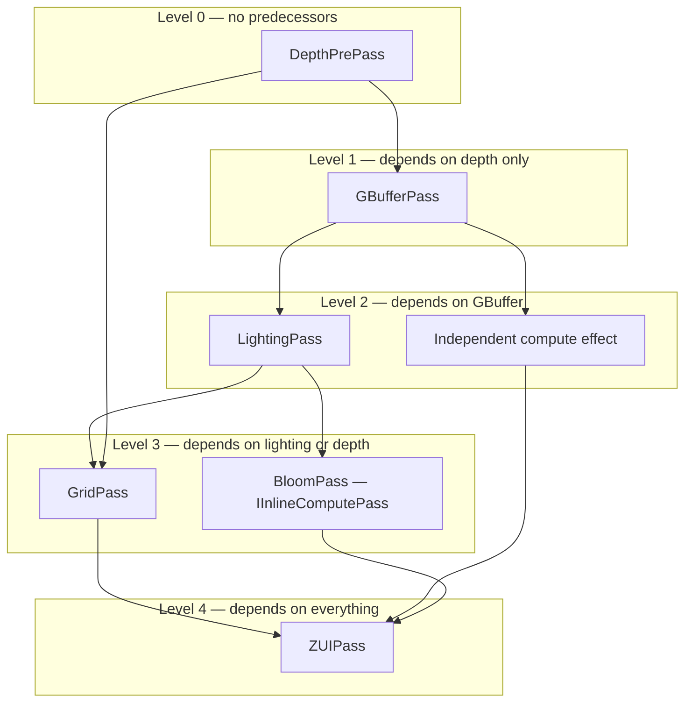

Every active graphics, compute, transfer, readback, and query pass participates in
topology levels. Passes in the same level are independent by declared resource edges;
the queue schedule subsequently resolves each pass to a graphics, compute, or transfer
batch according to device capabilities.

**Level computation** (runs after `BuildTopology()` for each registered frame):

```cpp
// Assign each pass the maximum depth of any of its predecessors + 1
Array<uint32_t> pass_level;
pass_level.init(arena, Passes.size(), Passes.size());
for (uint32_t i = 0; i < Passes.size(); ++i)
    pass_level[i] = 0;
for (uint32_t i : SortedPassIndices) {
    for (auto& dep : predecessors_of(i))
        pass_level[i] = max(pass_level[i], pass_level[dep] + 1);
}
// Group into TopologyLevels[level] = [pass indices with that level value]
```

### 13.3 Execute() with Parallel Recording

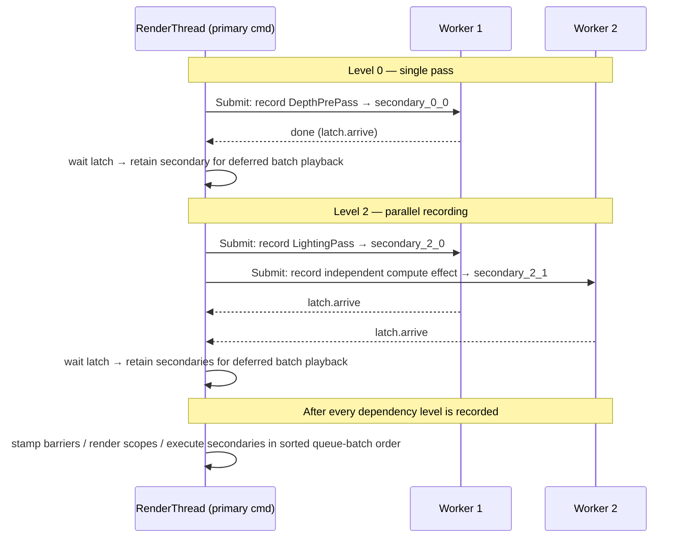

Recording waits once per dependency level, but primary playback is deliberately
deferred until all levels are recorded. A contiguous queue batch may span several
levels; playing a partial batch at a level boundary can omit the timeline signal a
different queue needs. The existing sorted batch plan remains authoritative for
barriers, queue-family ownership transfers, timeline waits, and submissions.

**Barrier placement — primary command buffer only:**

Every resource hazard creates a topology edge, so a producer and consumer cannot be
in the same dependency level. Therefore an `IntraLevelBarriers` category is neither
needed nor sound. Keep one pre-pass barrier list on `RGPass`; the render thread stamps
it in the primary immediately before executing that pass's secondary command buffer.

This is required for graphics passes: a graphics secondary is recorded with
`VK_COMMAND_BUFFER_USAGE_RENDER_PASS_CONTINUE_BIT` and executes inside an active
primary render-pass instance. Ordinary pipeline barriers do not belong in that scope.

### 13.4 Secondary Command Buffer Ownership

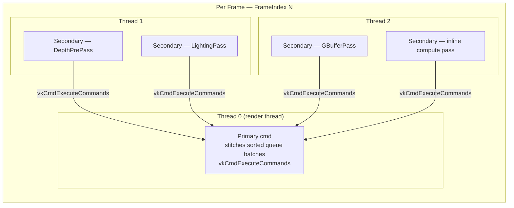

`CommandBufferManager::GetCommandBuffer()` is not used for graph worker recording.
`AcquireWorkerSecondary()` provides a dedicated, explicitly-secondary per-frame worker
pool whose capacity grows to the number of passes assigned to that worker. It never
wraps a fixed slot index, which would overwrite a secondary still needed by primary
playback.

Tasks also need worker affinity. `ThreadPool::Submit()` chooses a queue dynamically
and falls back to inline execution if all queues are full, so an item index is not a
safe command-buffer identity. Submit one batch task to each worker with explicit
`SubmitToWorker(worker_index, ...)`, partition the level's pass indices among those
tasks, and let each worker acquire its secondaries with a monotonically increasing
per-(worker, queue) ordinal.

The worker queues are bounded `MPSCQueue`s, not SPSC queues: each has one consumer,
but a worker can submit additional work while the render thread is also a producer.
Render-graph recording itself uses the render thread as its sole producer and never
accepts the generic inline fallback. If a target queue is full, the graph waits for the
accepted level tasks and records that target worker's partition serially on the render
thread before playback; this is a safe backpressure degradation, not an inline
`SubmitToWorker` execution.

### 13.5 Graphics Pass vs Compute Pass Threading

**Graphics passes** require `VK_SUBPASS_CONTENTS_SECONDARY_COMMAND_BUFFERS` for the
legacy render-pass path, or `VK_RENDERING_CONTENTS_SECONDARY_COMMAND_BUFFERS_BIT` for
dynamic rendering. Callbacks that implement `RecordDraw(...)` are body-only and can be
recorded into such a secondary. The graph owns rendering scope and primary playback in
sorted execution order. On a dynamic-rendering device it records:

```cpp
StampPrePassBarriers(primary, pass);
primary->BeginDynamicRendering(rendering_info);
primary->ExecuteSecondaryCommandBuffer(pass.secondary);
primary->EndDynamicRendering();
```

This also means a graphics and inline-compute pass may be recorded in parallel but
must be stitched serially: execute a compute secondary outside any render-pass scope.

**Inline compute passes** have no render pass. Their secondary command buffers are
begun with the dedicated command-buffer wrapper:

```cpp
void CommandBuffer::BeginSecondaryCompute();
```

It has no render-pass inheritance and uses one-time-submit usage.

### 13.6 Worker-Affine Batches and CountedLatch

Multi-threaded recording uses a per-batch latch and an explicit render-thread-to-worker
submission API. This is not a generic `ParallelFor`: command-buffer ownership is
deterministic.

**CountedLatch / WaitAll**

C++20 `std::latch` (already available — engine requires C++20) provides exactly the semantics needed. No custom implementation is required; one latch counts the submitted worker-batch tasks.

`WaitAll` is not a pool method — it's the call-site `fence.wait()`. A global `ThreadPool::WaitAll()` would block all other submitted work; per-batch latches are the correct design.

**Worker-affine batches**

`SubmitToWorker(uint32_t worker_idx, void* ctx, TaskFn fn)` pushes directly to the
chosen worker's bounded MPSC queue, returns false when full, and never invokes the task
inline. `RenderGraph::Execute()` creates at most one C-style task per active worker for
each level; each task records its assigned passes serially and counts down the latch.
The worker index passed at submission time is the authoritative pool-ownership identity;
no `thread_local` lookup is required.

```cpp
std::latch fence(active_worker_count);
for (uint32_t worker = 0; worker < active_worker_count; ++worker)
    SubmitToWorker(worker, MakeBatchContext(level, worker, &fence), RecordWorkerPartition);
fence.wait();
```

| Facility | Implementation | Files |
|---|---|---|
| Counted latch | `std::latch` at the recording call site | `RenderGraph.cpp` |
| Batch completion | `fence.wait()` at the call site | `RenderGraph.cpp` |
| Worker-affine submission | C-style `TaskFn` plus `void*` context | `ThreadPool.h`, `RenderGraph.cpp` |

The callback ABI intentionally uses a C-style function pointer and `void*`; it does not
use `std::function` or forwarding callbacks that may allocate.

---

### 13.7 What Cannot Be Parallelized

- Passes with explicit dependency edges (cannot be in the same level by construction)
- Queue-batch submission and queue-family ownership barriers — ordered on the render thread
- The primary command buffer work (barrier stitching, `vkCmdExecuteCommands`) — always on the render thread
- Resize and recompile operations — already guarded as single-frame operations

### 13.8 Implementation Sketch

**RenderGraph fields used by recording:**
```cpp
// Add to RenderGraph
Core::Containers::Array<RGPassDependency> PassDependencies;
Core::Containers::Array<RGTopologyLevel> TopologyLevels;
// RGPass retains its pre-pass RGImageBarrierPlan/RGBufferBarrierPlan arrays.
// The primary stamps them immediately before this pass executes.
```

**Implementation using worker-affine batches from §13.6:**

```cpp
void RenderGraph::Execute(CommandBuffer* primary) {
    uint8_t frame_idx = Device->SwapchainPtr->CurrentFrame->Index;

    for (uint32_t level_idx = 0; level_idx < TopologyLevels.size(); ++level_idx) {
        auto& level = TopologyLevels[level_idx];

        // Parallel: one affine batch per worker. Each worker acquires only its own
        // dedicated secondary buffers and records its assigned pass bodies serially.
        std::latch completion(active_worker_count);
        for (uint32_t worker = 0; worker < active_worker_count; ++worker)
            SubmitToWorker(worker, MakeBatchContext(level, worker, &completion),
                           RecordWorkerPartition);
        completion.wait();
    }

    // Primary: preserve the existing sorted queue-batch order. Barriers are
    // stamped here; graphics opens/closes the render scope around one secondary,
    // while inline compute executes its secondary outside a rendering instance.
    PlaybackSortedQueueBatches(primary);
}
```

**Key notes:**
- Frame index: `Device->SwapchainPtr->CurrentFrame->Index` — not a `RenderGraph` member
- Thread pool: worker-affine batches from §13.6, synchronized with `std::latch` — **no spin-wait**
- Secondary ownership: `AcquireWorkerSecondary(pass.Queue, ...)` returns an explicitly-secondary buffer owned by the assigned worker; capacity grows instead of wrapping a fixed slot.
- Barriers: each pass's `RGImageBarrierPlan` / `RGBufferBarrierPlan` arrays are always stamped by the primary.
- `BeginSecondaryCompute()`: new `CommandBuffer` overload for compute secondaries (§13.5)
- Swapchain resources: excluded from precompiled `ImageBarriers`; transitioned dynamically per frame (§5)

---

## 14. Implemented Production Features

| Feature | Why it matters | Approach |
|---|---|---|
| **Per-frame rebuild** | Eliminates persistent enabled/disabled graph state | Conditional `Register()` reconstructs virtual state in `FrameArena` |
| **Split barriers** | Allows producer/consumer overlap across queues | Release/acquire barrier pairs plus timeline waits |
| **Queue-aware compute/transfer** | Uses independent GPU queues when available | Deterministic requested-role resolution with graphics fallback; no heuristic cost model |
| **Subresource granularity** | Avoids unnecessary whole-image transitions | Exact aspect/mip/layer state cells |
| **Dynamic rendering** | Avoids render-pass-object coupling on supported devices | `CommandBuffer::BeginDynamicRendering` / `EndDynamicRendering`; legacy render passes remain a device fallback |
| **Parallel secondary recording** | Reduces CPU recording time | Worker-affine body recording; primary owns barriers and render-pass scopes (§13) |
| **Versioned writes** | Removes declaration-order multi-writer heuristic | Every write creates a new resource version |
| **Transfer queue integration** | Streaming uploads have no graph-declared consumer dependency | `ITransferPass` + ticket-based `ImportStreamingTexture` |
| **Bindless as graph resource** | Graph/bindless dependency gap causes missing barriers | `ReadBindless` declaration + frame-begin graph-owned descriptor batch |
| **Conditional rendering** | GPU-driven visibility requires no CPU readback stall | `UseConditional` wrapping via `VK_EXT_conditional_rendering` |
| **Readback and query pools** | Auto-exposure, occlusion results need deferred CPU delivery | `RGReadbackRing` + callback delivery after the exact copy submission timeline completes |
| **Material permutation system** | PSO cache needs an author-side variant resolution layer | `MaterialTemplate`, `MaterialInstance`, `ResolveVariantKey`, `DrawSorter` |

The following section records the concrete contracts for these implemented features.

---

## 15. Implemented Production-Graph Architecture

### 15.1 Per-Frame Builder and Versioned Resources

The implemented steady-state architecture constructs a lightweight virtual
graph in a frame arena, compiles it, records it, and releases only the virtual metadata.
Physical images, buffers, descriptor layouts, PSOs, and allocator pages remain cached.

Every write produces a new version. A read consumes an explicit version, so a graph no
longer guesses which of several writers a reader intended to observe. `RGResourceHandle`
uses `Version` as the authoritative producer/consumer identity.

```cpp
RGResourceHandle gbuffer = builder->WriteColorAttachment("gbuffer", gbuffer_spec);
builder->ReadTexture(gbuffer, "gbuffer_input");                // reads version 1

RGResourceHandle lit = builder->WriteColorAttachment("lit", hdr_spec);
lit = builder->ReadWriteStorageImage("lit", "lighting_output"); // version 2
builder->ReadTexture(lit, "tonemap_input");                    // reads version 2
```

The compiler emits edges from the producer of the consumed version to its reader, and
from a prior version to the pass that creates the next version. A read of an unproduced,
non-imported version is a compile error. Passes with side effects must declare an
explicit sink (`WriteSwapchain`, `Export`, readback, query resolve, or `NeverCull`);
`NeverCull` is reserved for intentional external effects and is reported by validation.

### 15.2 Unified Images, Buffers, and Subresources

Resources use an explicit kind with image and buffer fields. Only the field matching
the kind is valid:

```cpp
struct RGSubresourceRange {
    VkImageAspectFlags AspectMask;
    uint32_t BaseMipLevel, LevelCount;
    uint32_t BaseArrayLayer, LayerCount;
};

struct RGPassResource {
    RGResourceHandle Handle;       // exact produced/imported version
    RGAccess         Access;       // ColorWrite, ShaderRead, TransferRead, ...
    cstring          BindingKey;   // optional descriptor binding name
    RGSubresourceRange Range;      // images; whole-range sentinel for buffers
};

struct RGResource {
    RGResourceKind Kind;
    Textures::TextureHandle TextureHandle;  // valid only for image kinds
    const Core::Memory::BufferView* Buffer; // valid only for buffer kinds
};
```

`RenderGraph::Compile()` resolves every declared image range into exact
aspect/mip/layer cells and tracks one state record per touched cell; buffers retain one
whole-resource state. It emits `VkImageMemoryBarrier2` or `VkBufferMemoryBarrier2`
plans accordingly. Storage, indirect, transfer, and attachment uses receive their own
synchronization scopes. `ReadBindless()` additionally accepts an exact shader-stage
mask; ordinary sampled reads currently use the default shader-read state.

### 15.3 Synchronization2, Queue Ownership, and Scheduling

All new graph barriers use `vkCmdPipelineBarrier2` with `VkDependencyInfo`; legacy
`vkCmdPipelineBarrier` remains only as a compatibility wrapper during migration. The
graph has one queue assignment per pass: graphics, async compute, or transfer. It
builds a queue submission plan from version edges.

The callback interface exposes queue intent directly:

```cpp
virtual Rendering::QueueType GetRequestedQueue() const
{
    return Rendering::QueueType::GRAPHIC_QUEUE;
}
```

`IInlineComputePass` and `ITransferPass` override it to request `COMPUTE_QUEUE` and
`TRANSFER_QUEUE`. `BuildQueueSchedule()` stores the requested value in
`RGPass::RequestedQueue`, then resolves `RGPass::Queue` against
`VulkanDevice::HasSeparateComputeQueue` and `HasSeparateTransferQueue`. The pass and
all of its produced versions remain in the DAG whether it resolves to a dedicated queue
or the graphics fallback.

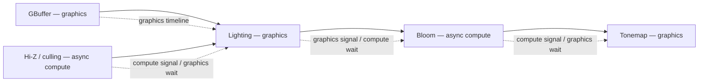

For a cross-queue resource edge, compilation emits:

1. A release barrier after the producer's last use.
2. A timeline semaphore signal in that queue submission.
3. A wait at the first consumer stage in the receiving submission.
4. An acquire barrier before the consumer's first use.

If queue families differ, the release/acquire pair carries the source and destination
family indices. If they are the same family, both indices are `VK_QUEUE_FAMILY_IGNORED`.
Queue-role resolution is deliberately deterministic: it does not use an estimated-cost
or critical-path heuristic. This makes scheduling reproducible and correctly supports
single-queue, shared-family multi-queue, and separate-family devices. The debug test
mode can force graph work to the graphics queue.

#### 15.3.1 Cross-Platform Queue Topology and Capability Resolution

The engine targets Windows, macOS, and Linux. The graph is Vulkan/WSI-neutral: platform
surface creation is selected by the window layer (Win32, Metal/MoltenVK portability,
XCB, or Wayland), while queue selection is made solely from the physical device's queue
families, queue counts, present support for the active surface, and enabled device
features. No platform or vendor is assigned a hard-coded queue-family index.

At device creation, `VulkanDevice` persists queue-capability state from
`vkGetPhysicalDeviceQueueFamilyProperties`, surface-support queries, and enabled
features. It records graphics, optional compute, and optional transfer family/index
pairs, along with distinct-`VkQueue` flags separately from distinct-family flags. A
second queue from the graphics family is used when its `queueCount` permits it;
cross-queue synchronization still applies, but queue-family ownership transfer does
not. The graph receives those capabilities; passes declare their preferred queue class,
never a queue-family number.

The normal selection policy requires the graphics family to support the active surface.
The current backend rejects a physical device without such a family rather than
assuming graphics capability implies presentation support. Supporting a separate
present family later requires explicit graphics→present release and present→graphics
acquire ownership transfers for swapchain images, with matching submission waits.

| Runtime topology | Scheduling policy | Synchronization policy |
|---|---|---|
| One graphics-capable queue | Graphics, compute, and transfer record/submit in topological order on that queue. | No inter-queue semaphore or ownership transfer; ordinary in-queue barriers only. |
| Graphics plus a separate transfer queue | Requested transfer passes use the transfer queue; all other work keeps its requested role or graphics fallback. | Timeline wait for each cross-queue dependency; release/acquire ownership barriers only when families differ. |
| Graphics plus a separate compute queue | Requested compute passes use the compute queue; graphics and transfer keep their resolved roles. | Different queues in the same family still use timeline waits, but family indices are `VK_QUEUE_FAMILY_IGNORED`. Distinct families additionally use release/acquire ownership barriers. |
| Graphics, compute, and transfer queues | The scheduler constructs deterministic queue batches from the version DAG and resolved queue roles. | One signal/wait edge per cross-queue dependency, coalesced per submission; ownership transfers only across families. |

Two queues are considered separate only when the driver exposes distinct queue handles
(`queueCount` is sufficient for both allocations) or distinct families. A compute or
transfer family that aliases the graphics `VkQueue` is treated as one queue, even if it
advertises the relevant capability bits. The scheduler must always retain a legal
graphics-queue fallback for every pass.

The engine baseline is Vulkan 1.3 with timeline semaphores and Synchronization2
enabled. Device selection rejects hardware without that baseline because queue
scheduling, asynchronous uploads, deferred retirement, and presentation all share the
same timeline model; there is no incomplete binary-semaphore compatibility path.
Dynamic rendering remains optional at runtime: a device that does not expose the Vulkan
1.3 dynamic-rendering feature uses the legacy render-pass facade. Conditional rendering
also remains optional. The platform window backend supplies the appropriate surface
extension at instance creation. When required by a macOS Vulkan implementation,
instance creation enables `VK_KHR_portability_enumeration` and its enumeration flag,
while device creation enables the advertised `VK_KHR_portability_subset`; these are
capability constraints, not a separate render-graph design.

### 15.4 Transient Allocator, Aliasing, and Memory Budgeting

The graph selects non-overlapping, layout- and usage-compatible transient lifetimes.
It asks `GpuAllocator`/VMA to create a distinct `VkImage` or `VkBuffer` backed by the
selected root allocation. VMA is the final compatibility gate; if alias creation fails,
the graph allocates a separate physical resource. Every graph-owned image that may
become a root or alias is created with `VK_IMAGE_CREATE_ALIAS_BIT`.

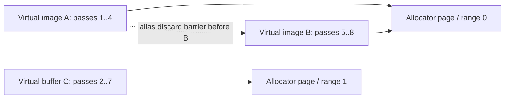

Imported resources never enter the transient pools. The graph records virtual and
physical byte totals, alias savings, and allocator heap pressure. Its fallback is
deterministic: allocate a separate compatible resource rather than reuse a live
allocation.

### 15.5 Rendering Backends, Load/Store Semantics, and PSOs

The graph declaration owns attachment load/store operations, clears, subresource views,
and render area. A pass never performs implicit global clears. The default Vulkan backend
uses dynamic rendering; its `PSOGraphicsPipelineKey` includes the canonical attachment
format tuple, depth/stencil format, sample count, view mask, and pipeline layout hash.
This keeps PSO-cache identity aligned with rendering compatibility.

The current attachment declaration is single-sampled and does not yet expose a resolve
attachment. The PSO cache preserves complete multisample state when it is supplied, but
the built-in graphics pipeline currently uses `VK_SAMPLE_COUNT_1_BIT`. MSAA needs an
explicit attachment sample-count field, multisampled image allocation, and a declared
resolve target before it can be presented as an implemented graph feature.

Dynamic rendering belongs to `CommandBuffer`, because it records work into a specific
`VkCommandBuffer`: `BeginDynamicRendering(const VkRenderingInfo&)` and
`EndDynamicRendering()` replace the corresponding begin/end operation of a legacy
render pass. `VulkanDevice` only discovers/enables the feature and owns the private
loaded Vulkan command pointers. `CommandBuffer::BeginRenderPass()` / `EndRenderPass()`
remain a compatibility facade for existing callbacks: they use dynamic rendering on a
capable device and issue `vkCmdBeginRenderPass` / `vkCmdEndRenderPass` only on the
legacy fallback. A dynamic graphics PSO chains `VkPipelineRenderingCreateInfo`; the
matching primary rendering instance supplies `VkRenderingInfo` and a secondary chains
`VkCommandBufferInheritanceRenderingInfo` with the same formats and view mask.

For a graph graphics pass on a dynamic-rendering device, the body-only
`RecordDraw()` contract is mandatory: `SupportsSecondaryRecording()` must return true.
The graph owns the rendering scope and creates the exact declared attachment views,
including mip and array-layer ranges. Falling back to an `Execute()` implementation
that calls `BeginRenderPass()` would recreate full-resource views and is rejected at
graph compilation rather than silently rendering the wrong subresource.

The legacy render-pass path is a compatibility fallback, not a pass-fusion backend.
Secondaries under dynamic rendering use the appropriate rendering inheritance info;
under the legacy path they use render-pass continuation inheritance.

All graph-owned asynchronous or deferred callbacks use a C-style function pointer and
an explicit `void*` context. Do not introduce forwarding-reference callback APIs or
`std::function` here: their type erasure can allocate and makes callback lifetime
implicit. The caller owns the context until graph cancellation or render-thread
delivery.

### 15.6 Validation, Observability, and Determinism

`RenderGraph::Compile()` validates resource declarations and callback contracts before
recording: handles must be valid, a read version needs one producer or an import, no
enabled version has multiple producers, query writers must be graphics passes, and
dynamic-rendering graphics callbacks must provide the body-only contract.
`WriteDebugDump()` emits DOT or JSON containing active/culled passes, resolved queues,
barrier counts, dependencies, queue batches, resource versions, transient statistics,
and available pass timings.

Each graph batch opens a `RenderGraph / <queue> queue` GPU label and nests pass labels
inside it. RenderDoc shows those command-buffer labels under its frame/submission tree.
Timestamps bracket passes, including their graph-generated barriers; they report a
duration only and never define a cross-queue frame timeline. The focused unit suite
constructs synthetic single-queue, shared-family, and separate-family schedules so
synchronization and aliasing bookkeeping remain reproducible.

### 15.7 Transfer Queue and Streaming Integration

Texture streaming and buffer uploads remain producer-side RRM work, but their first
consumer is graph-managed. The RRM submits deferred uploads after `Present` and
publishes a `StreamingUploadTicket` after a successful producer submission. During the
next frame, `RenderGraph::Register()` snapshots outstanding tickets, and the graph owns
the consumer-side wait and acquire barrier. RRM retains the copy commands and the
producer-side release barrier.

**Two integration points:**

**Streaming import** — the common case. The RRM publishes one ticket per submitted
upload from the prior frame. The ticket is available while the copy may still be
in-flight; the graph makes it visible by placing its timeline wait and acquire barrier
in the first consuming queue batch. RRM does not record a competing consumer acquire.

```cpp
struct StreamingUploadTicket {
    Rendering::Textures::TextureHandle Texture;
    Rendering::Primitives::Semaphore*  CompletionTimeline;
    uint64_t                           CompletionValue;
    VkImageLayout                      PostReleaseLayout;
    uint32_t                           ProducerQueueFamily;
};

RGResourceHandle ImportStreamingTexture(cstring name, const StreamingUploadTicket& ticket);
// RRM's transfer submission transitions TRANSFER_DST_OPTIMAL → PostReleaseLayout and
// releases ownership. The graph imports that post-release state, waits on Completion,
// then emits the graphics acquire before the first reader. It does not transition from
// TRANSFER_DST_OPTIMAL or emit a second release/acquire pair.
```

If producer and consumer queues belong to different queue families, the graph's acquire
barrier carries the ticket's producer family and the consuming family. If they share a
family, those indices are `VK_QUEUE_FAMILY_IGNORED`; the timeline wait is still required
when producer and consumer are separate queue submissions. A texture without a pending
ticket is imported in its declared steady-state layout (normally
`SHADER_READ_ONLY_OPTIMAL`) with no upload wait.

**Explicit transfer pass** — for in-graph copies (mipmap generation, buffer
initialization, readback copies). These are ordinary passes with explicit resource
declarations. They are **cullable** when their outputs have no live consumers — making
every transfer pass non-cullable defeats graph culling and is wrong for internal copies.
A transfer pass that exists only for side effects (e.g., exporting data to the CPU)
must declare a readback sink or `Export` resource to prevent culling:

```cpp
struct ITransferPass : IRenderGraphCallbackPass
{
    Rendering::QueueType GetRequestedQueue() const final
    {
        return Rendering::QueueType::TRANSFER_QUEUE;
    }
    bool RequiresRenderPass() const final { return false; }
    virtual void RegisterTransfer(...) = 0;
    virtual void RecordTransfer(...) = 0;
};
```

The graph places transfer passes in the resolved transfer queue batch at their
topological position. Their produced resources use `RGAccess::TransferWrite`, and
consumers declare the matching read. Compilation emits release/acquire pairs across
queue families and resolves the pass to graphics when no distinct transfer queue exists.

---

### 15.8 Bindless Array as First-Class Graph Resource

The graph owns the frame's bindless descriptor-update batch and can declare an exact
image version read through the global texture array. This creates the writer-to-reader
edge and the image-layout barrier that an opaque descriptor-array access cannot infer.

**Two separable problems:**

**1. Image layout.** A texture written by a graph pass (e.g., a LUT, a render target
used as a source) must be in `SHADER_READ_ONLY_OPTIMAL` before any pass reads it via
the bindless array.

```cpp
// Builder declaration — takes the graph image version (RGResourceHandle), not a physical
// TextureHandle, so the compiler can derive the writer → bindless-reader dependency edge.
// slot is the bindless array index assigned by the texture's registration.
// Creates a version edge: the pass producing `image` must complete before this pass.
// Graph emits the layout transition (e.g., COLOR_ATTACHMENT_WRITE → SHADER_READ).
// No change to descriptor binding; the pass still reads via set 1 + slot index.
void ReadBindless(RGResourceHandle image, uint32_t slot, RGShaderStages stages);
```

**2. Descriptor update.** `vkUpdateDescriptorSets` for newly-added bindless entries
must happen before any draw that reads those slots, but does not require a pipeline
barrier — it is host-side descriptor state, separate from GPU image-layout barriers.
The frame graph is the sole owner of this descriptor-update batch: it drains
`TextureHandleToUpdates` after the frame-slot fence has completed and before any command
buffer records a bindless reader. `DeviceSwapchain::Present()` must no longer drain or
write this queue once graph ownership is enabled.

```
BeginFrame(frame_slot) order:
  1. Wait/reset the frame-slot fence; the slot's descriptors are no longer in flight.
  2. Drain TextureHandleToUpdates and call vkUpdateDescriptorSets once for the batch.
  3. Build/compile/record the graph. Its recorded GPU barriers establish image layouts.
```

History textures already resident from a prior frame are imported with
`SHADER_READ_ONLY_OPTIMAL` as their initial layout — no transition, no descriptor
update. Only newly registered bindless entries require the host update; graph resource
uses independently determine whether an image barrier is needed.

---

### 15.9 GPU-Side Conditional Rendering

CPU-side conditional registration eliminates passes before graph compilation. GPU-side conditional rendering skips GPU commands at execution
time based on a buffer value written by a prior GPU pass, without a CPU readback stall.

Use cases: occlusion culling (skip draws whose occlusion query = 0), GPU-driven
visibility (meshlet/cluster culling output gates per-object rendering).

**Extension:** `VK_EXT_conditional_rendering` — optional device feature, queried at
device init. A pass that requires conditional rendering must provide an explicitly
declared fallback implementation (for example, an indirect-count or unconditional
variant) or graph compilation rejects that feature path. The graph must not silently
omit the wrapper, because that changes the pass's GPU work.

```cpp
struct ConditionalSpec {
    VkDeviceSize  Offset     = 0;
    // Vulkan default (Invert=false): execute commands when value is NON-ZERO.
    // VK_CONDITIONAL_RENDERING_INVERTED_BIT_EXT (Invert=true): execute when value is ZERO.
    // Typical GPU occlusion culling: write 1 if visible, 0 if occluded → Invert=false.
    bool          Invert     = false;
    RGConditionalFallback Fallback = RGConditionalFallback::Reject;
};

// The exact graph-buffer version establishes SHADER_WRITE → CONDITIONAL_RENDERING_READ.
// The graph resolves its physical VkBuffer only while recording.
void UseConditional(RGResourceHandle condition, const ConditionalSpec& spec);
```

The condition buffer version is written by a compute pass with `WriteBuffer`.
`UseConditional()` consumes that exact `RGResourceHandle` version and registers the
conditional-rendering read; callers do not separately declare an ambiguous string-based
`ReadBuffer`. The graph derives the barrier
(`SHADER_WRITE → CONDITIONAL_RENDERING_READ_EXT`) and wraps execution:

```cpp
// The graph wraps the matching command-buffer work in the primary command buffer.
if (pass.Conditional.Enabled)
    command_buffer->BeginConditionalRendering(condition_buffer, offset, invert);
pass.Callback->Execute(...);
if (pass.Conditional.Enabled)
    command_buffer->EndConditionalRendering();
```

---

### 15.10 Readback, Feedback, and Query Pools

**A. Buffer readback — auto-exposure, histogram, statistics**

A render pass writes results to a GPU buffer; the CPU reads them to drive
per-frame parameters (exposure, LOD bias, effect intensity). The read is deferred until
the submission timeline containing its copy completes, avoiding a GPU–CPU sync stall;
`FRAMES_IN_FLIGHT` is only an initial ring-capacity hint, not the completion criterion.

```cpp
using RGReadbackFn = void(*)(const void* data, size_t size, void* context);

// Declares a readback sink attached to a GPU buffer.
// gpu_buffer identifies one exact logical buffer version. The graph copies it to
// a graph-owned mapped staging allocation and invokes callback on the render thread
// after the accepted copy submission's exact timeline value completes.
RGReadbackHandle DeclareReadback(cstring name, RGResourceHandle gpu_buffer,
                                  RGReadbackFn callback, void* context);
```

The graph adds a transfer pass at the end of the frame that copies `gpu_buffer` into a
host-visible staging allocation. The ring uses VMA `HOST_ACCESS_RANDOM` + mapped
allocations and leases each allocation until the exact graphics or transfer timeline
value that contains its copy has completed; it is not reused merely because a fixed
number of frames elapsed. `RGReadbackRing::Poll()` runs on the render thread and calls
the allocator's `InvalidateAllocation()` wrapper before delivery, so non-coherent
memory is visible to the CPU. The staging ring is graph-owned; callers must consume the
`const void*` during the callback and must not retain it.

**B. Occlusion query pools**

Occlusion queries use `vkCmdBeginQuery`/`vkCmdEndQuery` around draw calls. Results
must be read back without a CPU stall. The correct non-blocking path uses
`vkCmdCopyQueryPoolResults` to copy results into a staging buffer, then the same
`RGReadbackRing` mechanism delivers them to the CPU via callback.
`vkGetQueryPoolResults` is not used: with `VK_QUERY_RESULT_WAIT_BIT` it blocks the
render thread; without it it can return `VK_NOT_READY`. Neither form is the deferred
GPU-copy/readback model.

```cpp
RGQueryHandle DeclareOcclusionQueryPool(cstring name, uint32_t query_count);

// Pass declares it writes to the pool (draws inside begin/end query).
// Each actual DeviceSwapchain::FrameContext owns a distinct VkQueryPool. The graph
// resets the selected pool once on the graphics primary before its first writer,
// after that context's prior fence has completed.
void WriteQueryPool(RGQueryHandle pool, uint32_t first_query, uint32_t count);

// Retrieve the current frame context's pool only while recording the callback.
VkQueryPool pool = inspector->GetQueryPool(occlusion_pool);
command_buffer->BeginQuery(pool, query_index);
// draw commands
command_buffer->EndQuery(pool, query_index);

// After all passes writing to the pool, the graph emits:
//   vkCmdCopyQueryPoolResults(cmd, pool, 0, query_count, staging,
//       0, sizeof(uint64_t),
//       VK_QUERY_RESULT_64_BIT | VK_QUERY_RESULT_WAIT_BIT)
// The wait occurs on the GPU and never stalls the render thread. RGReadbackRing
// invalidates non-coherent memory before callback delivery.
RGReadbackHandle DeclareQueryReadback(
    RGQueryHandle pool, RGReadbackFn callback, void* context);
```

`WriteQueryPool` is mandatory for every pass that records queries. Query pools are not
image/buffer graph resources, so the compiler creates explicit edges from every declared
writer to the synthetic, never-cullable transfer result-copy pass. Those edges preserve
liveness, graphics-to-transfer timeline waits, and the single-queue fallback. Query
writers remain on the graphics primary: the secondary-recording path does not enable
occlusion-query inheritance. If a declared writer is skipped at execution time, the
result copy is cancelled rather than issuing a `VK_QUERY_RESULT_WAIT_BIT` copy for an
unissued query.

**C. Timestamp queries — GPU profiling**

Timestamp queries are core Vulkan — no extension is needed. `vkCmdWriteTimestamp2`
is part of Synchronization2 (`VK_KHR_synchronization2`, promoted to Vulkan 1.3).
Before enabling graph timing:

- Check `VkQueueFamilyProperties::timestampValidBits > 0` for each resolved queue
  role that will be timed.
- Check `VkPhysicalDeviceLimits::timestampPeriod > 0`; it converts ticks to
  nanoseconds.
- Check `timestampComputeAndGraphics` before emitting timestamps on compute or transfer
  queue roles. A device that cannot timestamp both retains graphics timings only.
- Check and enable `VkPhysicalDeviceVulkan12Features::hostQueryReset`. The current
  implementation deliberately disables graph timing when this feature is absent rather
  than inserting a reset command whose ordering would complicate independent queues.

`RenderGraph` owns one fixed-capacity timestamp `VkQueryPool` for each actual
`FrameContext`, not merely each `FrameContext::Index` value. At the start of a reused
frame context, `AcquireNextImage()` has already waited its prior fence. The graph reads
its completed 64-bit results with `vkGetQueryPoolResults`, handles wrap according to
that queue family's `timestampValidBits`, publishes `RGPassTiming` records, then calls
`vkResetQueryPool` before recording new queries. It therefore does not use
`VK_QUERY_RESULT_WAIT_BIT`, command-buffer query resets, staging allocations, or the
readback ring for per-pass profiling.

Each timeable active pass receives a begin/end pair in the command buffer for its
resolved batch queue. A fixed query budget bounds recording and emits one warning if a
graph exceeds it; rendering continues without timings for the excess passes. Timestamp
values from distinct queues can use independent clock domains, so the observability API
reports individual pass durations only; it must not subtract values from different
queues to derive total frame time. General query/readback declarations remain separate
and use the `RGReadbackRing` path above.

**Hardware acceptance gate.** A Debug build requests `VK_LAYER_KHRONOS_validation` and,
when that layer exposes `VK_EXT_validation_features`, enables
`VK_VALIDATION_FEATURE_ENABLE_SYNCHRONIZATION_VALIDATION_EXT`. Startup warns when the
extension is unavailable; that configuration cannot satisfy this gate. Run with both
validation modes active on each of the following before declaring the graph release-ready:

| Device topology | Required capture/assertion |
|---|---|
| One universal graphics queue | Zero validation errors; graph timings resolve after frame-context reuse. |
| Distinct queue handles in one family | Queue batches and timestamps remain valid without ownership transfers. |
| Separate graphics, compute, and/or transfer families | Timeline waits and release/acquire barriers order every dependency; alias hand-offs have a memory dependency. |
| Windows, Linux, and macOS/MoltenVK | Resize during graph execution; inspect labels and named root/alias resources in RenderDoc or the platform capture tool. |

Treat a validation message about aliasing, image layout, query-pool reset/result access,
queue ownership, or resource destruction as a release blocker. The local unit suite
can validate topology and bookkeeping, but cannot replace this hardware gate.

---

### 15.11 Material System and Shader Permutation Management

The PSO cache stores and retrieves compiled pipelines keyed by `PSOGraphicsPipelineKey`. The
material system is the layer above it: it defines what permutations exist, resolves
which one to use for a given draw, and manages pre-warming.

**Material template** — defines the shader base and the set of supported permutations:

```cpp
enum class MaterialPermutation : uint64_t {
    None          = 0,
    AlphaTest     = 1ULL << 0,
    AlphaBlend    = 1ULL << 1,
    DoubleSided   = 1ULL << 2,
    Clearcoat     = 1ULL << 3,
    SubsurfaceSSS = 1ULL << 4,
    WithNormalMap = 1ULL << 5,
    WithEmissive  = 1ULL << 6,
    // … up to bit 63
};

using MaterialPermutationMask = uint64_t;

struct MaterialTemplate {
    cstring                  ShaderBaseName;         // "pbr_opaque", "pbr_transparent"
    MaterialPermutationMask  SupportedPermutations;  // bitmask of valid flags
    uint32_t                 PushConstantSize;       // size of per-draw parameter block
};
```

**Material instance** — baked combination of active flags and parameter values:

```cpp
struct MaterialInstance {
    const MaterialTemplate*  Template;
    MaterialPermutationMask  ActivePermutations;
    // Vulkan guarantees only 128 bytes of push constants (maxPushConstantsSize minimum).
    // Cap inline params at min(128, Device->Limits.maxPushConstantsSize).
    // Material data larger than the device limit spills to a per-material UBO or SSBO
    // bound via the pipeline layout; the push constant carries only an index into it.
    MaterialParameterStorage ParameterStorage;
    uint32_t                 InlineParameterByteCount;
    uint32_t                 ExternalParameterIndex;
    uint8_t                  Parameters[128];
};
```

**Pass context** — the render pass the material is drawn into changes which shader
variant is needed (a shadow pass needs only depth, not full PBR):

```cpp
enum class PassContext : uint8_t {
    Lit,          // full PBR lighting
    DepthPrePass, // depth-only, no fragment shader
    ShadowDepth,  // depth-only, shadow map projection
    Wireframe,    // override polygon mode
    COUNT,
};
```

**Variant resolution** — the material system maps template + permutations + context
→ `ShaderVariantKey`, which the pass-specific graphics recipe resolves to concrete
PSO shader-stage modules:

```cpp
ShaderVariantKey MaterialSystem::ResolveVariantKey(
    const MaterialInstance& mat, PassContext ctx)
{
    ShaderVariantKey k = {};
    k.BaseShaderHash     = HashMaterialShaderBaseName(mat.Template->ShaderBaseName);
    k.PermutationMask = mat.ActivePermutations & mat.Template->SupportedPermutations;
    // Depth passes retain AlphaTest for discard and DoubleSided for rasterization.
    // Other lighting-only fragment permutations are removed:
    if (ctx == PassContext::ShadowDepth || ctx == PassContext::DepthPrePass)
        k.PermutationMask &= ToMaterialPermutationMask(MaterialPermutation::AlphaTest)
                           | ToMaterialPermutationMask(MaterialPermutation::DoubleSided);
    k.Context = ctx;
    return k;
}
```

**Permutation pre-warming** — called at scene load time to pre-compile variants, with
a budget to prevent permutation explosion from dominating startup time:

```cpp
struct PrewarmBudget {
    uint32_t     MaxPermutations = 256;  // hard-capped at the implementation maximum
    bool         Critical        = false; // use synchronous fallback only when required
};

using MaterialGraphicsPrewarmRecipeFn = bool (*)(
    void* context, const MaterialTemplate&, const ShaderVariantKey&,
    VkGraphicsPipelineCreateInfo* out_create_info,
    uint32_t* out_shader_generation);

void MaterialSystem::PrewarmForMaterials(
    ArrayView<const MaterialInstance> materials,
    ArrayView<const PassContext> contexts,
    PSOCache& cache, const PrewarmBudget& budget,
    void* callback_context, PSOPipelineReadyFn callback)
{
    // Enumerate unique (material template × active permutations × pass context) tuples.
    // De-duplicate: the same variant key from multiple instances is one PSO request.
    // Stop when budget.MaxPermutations is reached; remaining variants compile on demand.
    // Each PassContext owns a registered C-style recipe callback. It supplies a complete,
    // immediately valid graphics creation record and shader generation for the resolved
    // variant; the cache canonicalizes that record before this callback returns.
    // → cache.RequestGraphicsPipelineAsync(create_info, generation,
    //                                      callback_context, callback, budget.Critical)
}
```

A material variant key alone is insufficient to create a Vulkan graphics pipeline: vertex
input, layout, fixed state, and dynamic-rendering/legacy attachment compatibility are
pass-owned inputs. The material system therefore never fabricates a partial
`VkGraphicsPipelineCreateInfo`. A pass registers a C-style
`MaterialGraphicsPrewarmRecipeFn`, which builds the complete record while its referenced
state is live. `PSOCache::RequestGraphicsPipelineAsync` converts it to its immutable
canonical key before returning, so neither the cache nor a worker retains caller pointers.

`MaterialInstance::InitializeInline` accepts only payloads no larger than
`min(128, maxPushConstantsSize)`. `InitializeExternal` is required when the template's
parameter block exceeds that limit; it stores the caller's UBO/SSBO material-record index.
The four-byte index is retained in the inline payload, and `InlineParameterByteCount`
records that only this index—not the complete external block—may be pushed. The caller
owns uploading that external material record and declares its buffer use in the render
graph.

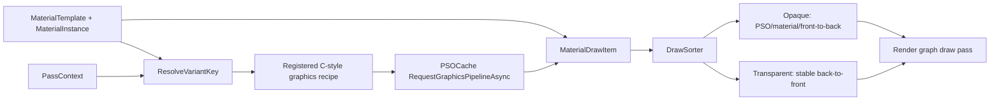

**Draw sorting** — opaque and transparent objects require separate sort strategies.
A single universal sort breaks transparency:

```
Opaque bucket:
  1. PSO key hash            — minimise vkCmdBindPipeline
  2. Material instance index — minimise push-constant writes
  3. Depth front-to-back     — early-z efficiency

Transparent bucket (conventional alpha blending):
  1. Strict depth back-to-front — correct blending is mandatory
  2. Stable submission order as the tie-breaker
  PSO/material reordering is forbidden because it can change blend results.
  State sorting is permitted only for an explicitly order-independent transparency path.
```

`DrawSorter` uses an engine-array-backed stable merge sort: opaque draws use PSO key,
material index, then front-to-back view depth, while conventional transparent draws use
only back-to-front depth and submission order. The two buckets are recorded in separate
draw calls (opaque first, then transparent) and may be submitted to different passes. The
render graph is unaware of draw sorting — it provides the pass; the material system
provides sorted draw lists per bucket, passed to the body-only `RecordDraw()` contract.

---

## 16. Implemented File Map

The compiler and Vulkan execution paths are intentionally integrated rather than split
into speculative `RenderGraphCompiler`, `RGTransientAllocator`, or
`RenderGraphVulkanBackend` files. This keeps the frame-local compilation state close to
the persistent pools and the command-buffer execution code that consumes it.

| Area | Source of truth |
|---|---|
| Frame registration, validation, topology, versioning, lifetimes, barriers, queue batches, debug dumps, timestamps | `ZEngine/Rendering/Renderers/RenderGraph.h/.cpp`, `RenderGraphTopology.h` |
| Compute and transfer callback contracts | `ZEngine/Rendering/Renderers/Base/IInlineComputePass.h/.cpp`, `Base/ITransferPass.h/.cpp` |
| Dynamic rendering, Sync2, queue discovery, queue submission, secondary recording | `ZEngine/Hardwares/VulkanDevice.h/.cpp`, `CommandBufferManager.h/.cpp` |
| Transient and aliasing allocations | `ZEngine/Core/Memory/GpuAllocator.h/.cpp`, `VulkanDevice.h/.cpp`, `RenderGraph.h/.cpp` |
| Streaming tickets and bindless descriptor ownership | `ZEngine/Hardwares/AsyncUploadQueue.h/.cpp`, `ZEngine/Rendering/RenderResourceManager.h/.cpp`, `RenderGraph.cpp` |
| Readback and query delivery | `ZEngine/Rendering/Renderers/Readback/RGReadbackRing.h/.cpp`, `RenderGraph.h/.cpp` |
| PSO caching and material prewarming | `ZEngine/Rendering/Renderers/Pipelines/PSOCache.h/.cpp`, `ZEngine/Rendering/Materials/` |
| Focused validation | `tests/Rendering/RenderGraphTest.cpp`, `PSOCacheTest.cpp`, `MaterialSystemTest.cpp` |

---

## 17. Completion and Release Gates

The redesign milestones are implemented. The remaining work before a release is
hardware validation, not an alternate callback hierarchy or a second graph compiler.

| Completed area | Implementation evidence |
|---|---|
| Per-frame versioned graph, culling, and validation | `RenderGraph::Register`, `Compile`, and `BuildTopology` |
| Synchronization and resource lifetime | Sync2 image/buffer barriers, subresource tracking, transient alias hand-offs |
| Portable queue execution | Requested roles, single-queue fallback, shared-family waits, and separate-family release/acquire transfers |
| Graphics execution | Dynamic rendering through `CommandBuffer`, with legacy render-pass fallback; current built-in attachments are single-sampled |
| Parallel recording | Worker-affine C-style tasks, latches, and dedicated secondary buffers |
| GPU-driven and CPU-feedback paths | Streaming tickets, bindless declarations, conditional rendering, readback ring, query pools, timestamps |
| Pipeline and material layer | PSO cache, material variants, bounded prewarming, and deterministic opaque/transparent sorting |

Before shipping, run the focused unit suite and validation-layer captures for the queue,
readback, and query paths on Windows, Linux, and macOS/MoltenVK. The unit suite proves
declarations and scheduling; real queue topologies prove the driver-facing Vulkan paths.
