# Render Graph Redesign

**Relates to:** `sky-rendering.md`, `per-frame-upload-heap.md`, `pso-cache-architecture.md`
**Status:** Design
**Scope:** Typed pass hierarchy, declarative resources, dependency culling, subresource-aware Synchronization2 barriers, transient allocation/aliasing, multi-queue scheduling, runtime recompilation, and parallel command recording.

**Prerequisite:** `pso-cache-architecture.md` must land before or concurrently with Option B (§6.3) and multi-threaded recording (§13). `Compile()` on every `IRenderGraphCallbackPass` uses the PSO cache 4-step lookup rather than calling `vkCreateGraphicsPipelines` directly. Passes borrow pipeline handles; `Pipeline::Dispose` forgets the borrowed handle without destroying it.

Reference implementations: Frostbite Framegraph (O'Donnell, GDC 2017), UE5 RDG (`FRDGBuilder`).

---

## 1. Motivation

The current render graph was designed for serial, graphics-only execution. The addition of `SkyAtmospherePass` exposed fundamental structural problems:

| Problem | Root cause |
|---|---|
| Compute passes never execute | Framebuffer-null guard in `Execute()` applies to all pass types |
| Sky LUT work bypasses the graph entirely | No async compute path in the graph; pass owns its own command pool, semaphores, lifecycle |
| Compile-time barriers are dead code | `BuildBarriers()` walks declaration order, not sorted order; `Execute()` ignores its output |
| Runtime pass enable/disable is broken | `SetPassEnabled()` flips a boolean but never recompiles — disabled-at-compile passes stay null |
| Transient memory over-allocated | Exact format+size match only; no lifetime-overlap aliasing |
| No GPU debug visibility | Pass names never emitted as GPU labels |
| No storage image or buffer declarations | `WriteStorageImage`, `WriteBuffer` don't exist in the builder API |

---

## 2. Pass Type Hierarchy

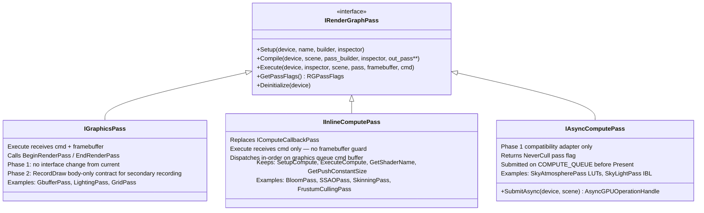

```cpp
enum class RGPassFlags : uint8_t
{
    None                = 0,
    NeverCull           = 1 << 0, // intentional external side effect only
    ExternalSideEffects = 1 << 1,
};

constexpr bool HasPassFlag(RGPassFlags flags, RGPassFlags flag)
{
    return (static_cast<uint8_t>(flags) & static_cast<uint8_t>(flag)) != 0;
}

struct IRenderGraphPass
{
    // All callback kinds expose this metadata; culling never downcasts to a pass subtype.
    virtual RGPassFlags GetPassFlags() const { return RGPassFlags::None; }
};
```

### 2.1 IGraphicsPass

No interface change in Phase 1. Existing passes (GbufferPass, LightingPass, GridPass, SkySpherePass, ZUIPass) keep `Execute()` with command buffer + framebuffer. Phase 2 adds the body-only `RecordDraw()` contract described in §13.

### 2.2 IInlineComputePass

Replaces `IComputeCallbackPass`. Identical virtual methods (`SetupCompute`, `ExecuteCompute`, `GetShaderName`, `GetPushConstantSize`). The only change: `RenderGraph::Execute()` removes the framebuffer-null guard for this pass type.

```cpp
struct IInlineComputePass : public IRenderGraphPass
{
    void             Setup(...)   final;
    void             Compile(...) final;
    void             Execute(...) final;  // ← graph no longer gates on framebuffer

    virtual void     SetupCompute(...)   = 0;
    virtual void     ExecuteCompute(...) = 0;
    virtual cstring  GetShaderName() const = 0;
    virtual uint32_t GetPushConstantSize() const { return 0; }
};
```

Passes migrated: `BloomPass`, `SSAOPass`, `SkinningPass`, `FrustumCullingPass` — base class rename only.

### 2.3 IAsyncComputePass

New pass type for work that runs on the COMPUTE_QUEUE. The graph calls `SubmitAsync()` before `Present()`; the returned `AsyncGPUOperationHandle` is enqueued into `AsyncGPUOperations`; Present's `submit_1` waits on it automatically.

```cpp
struct IAsyncComputePass : public IRenderGraphPass
{
    virtual Hardwares::AsyncGPUOperationHandle
                        SubmitAsync(Hardwares::VulkanDevice*, Scenes::SceneDataPtr) = 0;
    RGPassFlags         GetPassFlags() const override { return RGPassFlags::NeverCull; }
};
```

`IAsyncComputePass` is a Phase 1 compatibility adapter. It returns
`RGPassFlags::NeverCull` because its consumer semaphore wait is outside the Phase 1
graph's visibility. It is not the Phase 3 model for async compute.

`Hardwares::AsyncGPUOperationHandle` already exists and is the type drained by
`DeviceSwapchain::Present()`; do not introduce a duplicate graph-local handle.
An async pass must also declare its produced resources and their consuming graphics
passes must declare reads. The graph owns the release/acquire transition when compute
and graphics use different queue families; a timeline semaphore wait alone does not
perform queue-family ownership transfer. The imported/produced resource contract must
specify its initial layout, final layout, and owning queue family.

Passes migrated: `SkyAtmospherePass` LUTs → `IAsyncComputePass` + separate `SkyCombinePass : IGraphicsPass`.

In Phase 3, migrate this adapter to an ordinary graph compute pass with
`RGQueuePreference::AsyncCompute`. It remains in the versioned dependency DAG, so its
outputs participate in culling, lifetime analysis, barriers, queue submission planning,
and graphics-queue fallback. `IAsyncComputePass` can then be removed.

---

## 3. Resource Declaration API

`RenderGraphResourceBuilder` methods already return `RGResourceHandle`. Storage-image and
swapchain declarations are additive; buffer declarations additionally require the physical
buffer and barrier work described below.

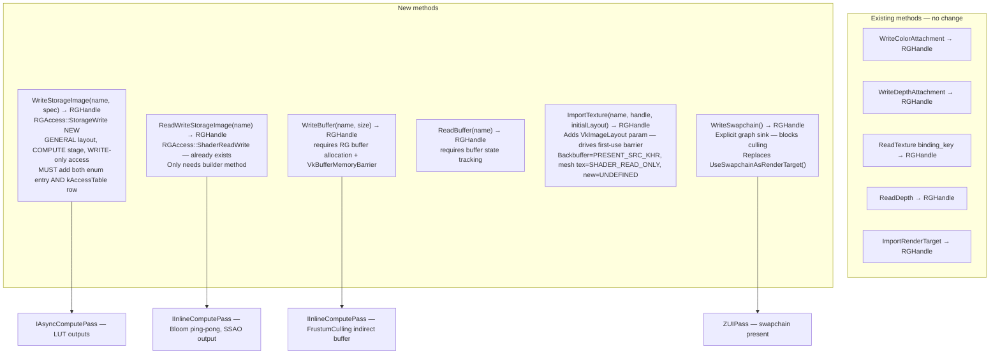

**`StorageWrite` requires both enum entry AND table row, inserted immediately before `Count_`.** `kAccessTable` in `RenderGraph.cpp` is a C array indexed by `RGAccess` ordinal. Inserting `StorageWrite` anywhere other than before `Count_` shifts every subsequent entry's ordinal, silently mapping existing `ShaderRead`, `ShaderReadWrite`, `TransferRead`, `TransferWrite`, `Present` accesses to wrong barriers at runtime with no compiler warning.

```cpp
// Correct position — insert before Count_
..., ShaderReadWrite, TransferRead, TransferWrite, Present, StorageWrite /*NEW*/, Count_
```

Corresponding `kAccessTable` row at the same position: `VK_PIPELINE_STAGE_COMPUTE_SHADER_BIT`, `VK_ACCESS_SHADER_WRITE_BIT`, `VK_IMAGE_LAYOUT_GENERAL`. Differs from `ShaderReadWrite` (read+write bits) — write-only.

**Cached handles per pass (Phase 1 only).** `GetTextureHandle(RGResourceHandle)` already exists on `RenderGraphResourceInspector`. With the persistent Phase 1 graph, passes may capture builder return values at `Setup()` and use them at `Execute()`:

```cpp
class LightingPass : public IGraphicsPass {
    RGHandle m_albedo;
    void Setup(...)   { m_albedo = builder->ReadTexture(GBufferAlbedoAOName, "GBufferAlbedoAO"); }
    void Execute(...) { auto tex = inspector->GetTextureHandle(m_albedo); }  // O(1) — no string hash
};
```

Under Option B/Phase 3, an `RGResourceHandle` belongs to one frame-arena graph and
must not be retained in a persistent callback object. `Register()` writes handles into
per-frame pass data/context, and `RecordDraw()` consumes that same frame data. Persistent
pass state may cache only immutable data such as shaders, PSO descriptions, and material
configuration.

---

## 4. Pass Culling

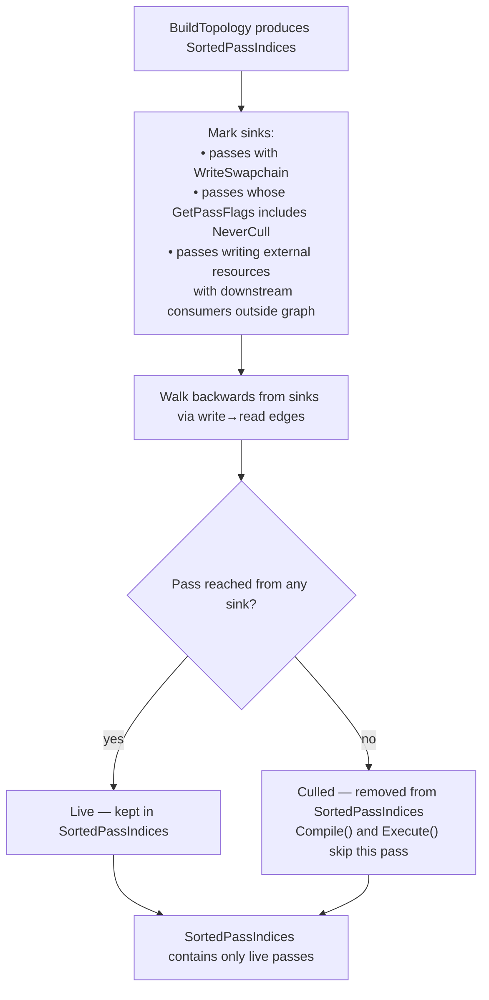

Replaces the runtime `if (!pass.Enabled) continue` check as the primary gate. A temporarily disabled pass produces no GPU work; its resources are not allocated; its barriers are not recorded.

---

## 5. Compile-Time Barrier Derivation

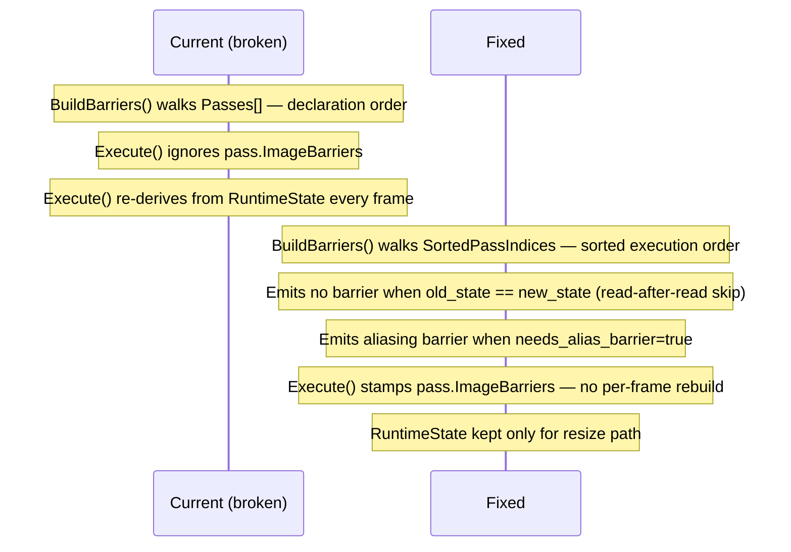

**Compile phase order — transients must be allocated BEFORE barriers.**

`BuildBarriers()` calls `GetVkImage(Device, res.TextureHandle)` for every resource. Transient resources have no `VkImage` until `AllocateTransientResources()` runs. Running `BuildBarriers` before allocation produces `VkImage == VK_NULL_HANDLE` for every transient — silently dropping all GBuffer and intermediate attachment barriers, causing validation errors and rendering corruption. The current code's order is correct; the fix only changes *which pass array* `BuildBarriers` iterates.

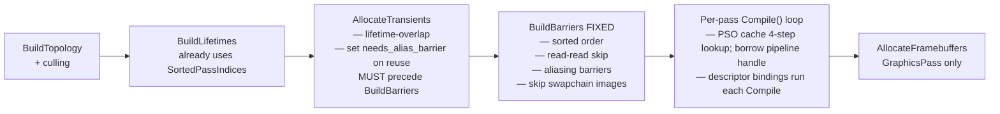

**Swapchain image exception.** Pre-compiled `VkImageMemoryBarrier` entries embed a raw `VkImage` handle. Swapchain images are distinct objects per slot (index 0, 1, 2) that change on every `vkAcquireNextImageKHR`. Baking a specific swapchain `VkImage` at compile time would reference the wrong image on subsequent frames, triggering VUID-vkCmdPipelineBarrier-image-parameter.

Fix: add a `bool RGResource::IsSwapchain = false` field, set to `true` inside `WriteSwapchain()` when the resource is registered. During `BuildBarriers()`, skip any resource where `res.IsSwapchain == true`. `Execute()` retains the per-frame rebuild path **only for swapchain resources** (checks `res.IsSwapchain` at runtime), stamping pre-compiled barriers for all others. `IsSwapchainResource(handle)` does not exist in the current codebase — this flag is a new addition alongside `WriteSwapchain()`.

**Persistent import contract.** Precompiled barriers are valid only if an imported
resource begins every frame in the layout/access/queue-family state declared by its
import. A resource touched outside the graph must be re-imported with its actual state
(or the external owner must transition it back to the declared final state). This is a
per-frame ownership rule, not merely a parameter captured at graph compile time.

---

## 6. Runtime Recompilation (Issue #779)

### 6.1 The Problem

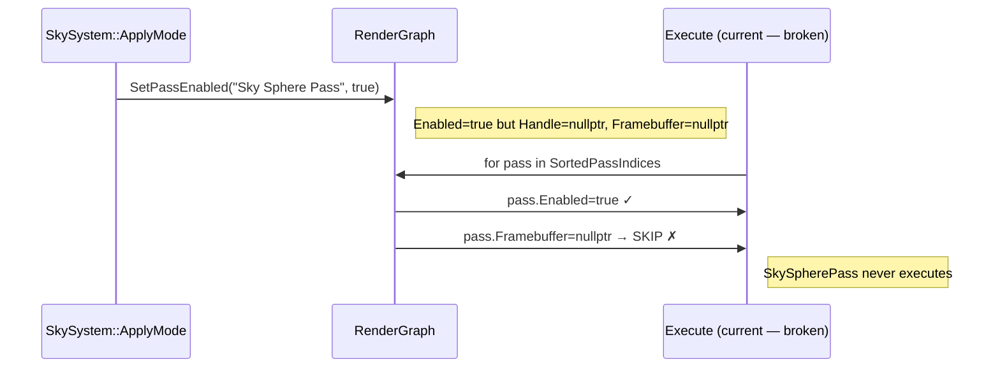

`SetPassEnabled()` flips `Enabled` but never recompiles. A pass that was disabled at compile time has no pipeline and no framebuffer — enabling it at runtime does nothing.

### 6.2 Option A — Deferred Structural Recompile (Phase 1)

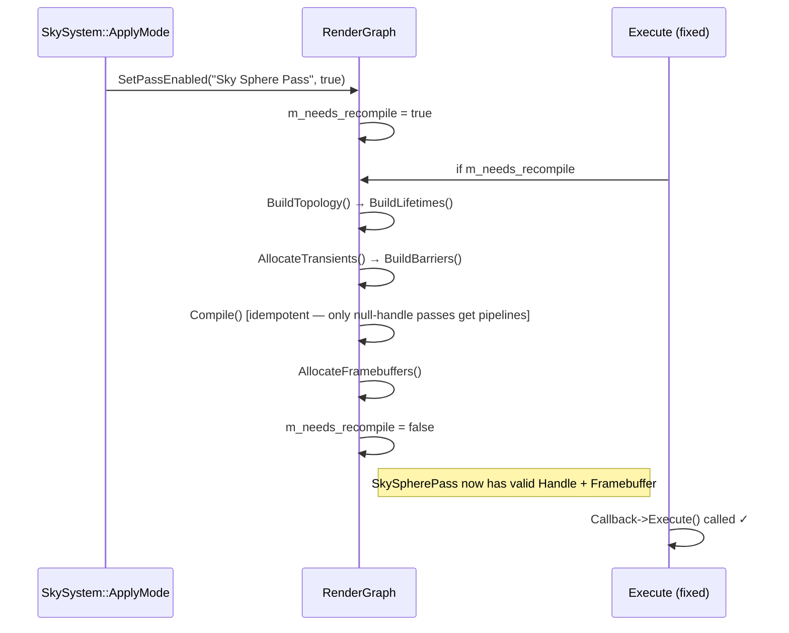

**Cost:** topology sort + barrier computation + `vkCreateFramebuffer` calls + per-pass `vkUpdateDescriptorSets` rewrite. No GPU pipeline rebuild — `Compile()` is a PSO cache lookup (see `pso-cache-architecture.md`); on a warm cache this is a hash lookup with no Vulkan call, making Option A recompile essentially free for pipeline state. Descriptor binding calls (`SetDynamicUniform`, `UseTextureArray`, `SetSampler`) run unconditionally on every `Compile()` call; they issue `vkUpdateDescriptorSets` each time — idempotent but not free. If a pass's PSO is `Compiling` (async) or was hot-reload-invalidated, `GetOrCreateGraphics` returns `VK_NULL_HANDLE`; the pass's `Execute()` must skip draw calls for that frame (see §11).

**Implementation:** add `bool m_needs_recompile` to `RenderGraph`; `SetPassEnabled()` sets it; `Execute()` checks at top.

### 6.3 Option B — Per-Frame Lightweight Rebuild (Phase 2)

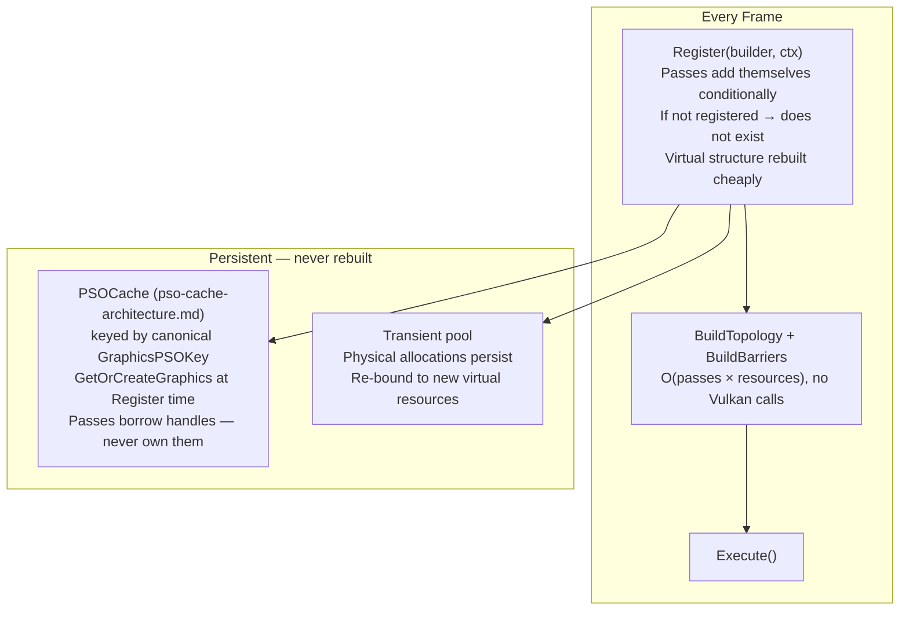

```cpp
// Conditional registration — no disabled-pass concept
void SkyAtmospherePass::Register(builder, ctx) {
    if (ctx.sky_mode != SkyMode::Atmosphere) return;   // simply not registered
    m_skyview = builder->WriteStorageImage("sky_view_lut", spec);
}
```

No `SetPassEnabled()`, no enabled/disabled flags. Mode switch = different passes call `Register()`.

| | Option A | Option B |
|---|---|---|
| Fixes Issue #779 immediately | ✓ | requires interface migration |
| Existing passes unchanged | ✓ | requires `Register()` addition |
| GPU memory — only active backends | With PSO cache: warm but evictable | ✓ |
| Conditional per-frame resource decls | ✗ | ✓ |
| Industry-standard model | partial | ✓ |
| PSO cache required | optional (speeds up Compile()) | hard prerequisite |

**Recommendation:** implement Option A first (2 files changed, fixes Issue #779 and all compute stubs). PSO cache must land before Option B — passes cannot be stateless without a cache to look up their pipeline handle each frame. File Option B as follow-up after PSO cache and the rest of the redesign land.

---

## 7. Transient Reuse and True Memory Aliasing

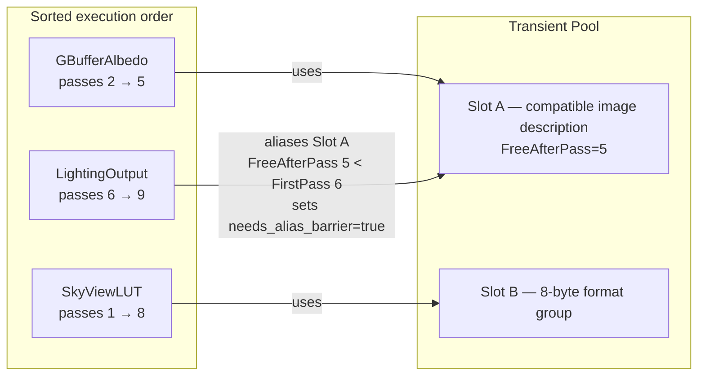

The current pool returns the same `TextureHandle`. That is **compatible image reuse**,
not Vulkan memory aliasing. Phase 1 may reuse an image only when its full image
description is compatible with the new virtual resource (format, extent, mip count,
layers, samples, tiling, usage, and view requirements); pixel byte size and an
allocation-size comparison are not sufficient. The reused image must not be live:
`slot.FreeAfterPass < resource.FirstPassIndex`.

**True memory aliasing is Phase 2.** It requires distinct `VkImage` objects bound to
compatible regions of one allocator allocation, `VK_IMAGE_CREATE_ALIAS_BIT` where
required, memory-requirement validation, and an aliasing/discard barrier before the
new image's first use. It cannot be implemented by returning a larger or different
format `TextureHandle` from `TryAlias()`. Keep `needs_alias_barrier` for that Phase 2
path; its first use transitions from `UNDEFINED` because previous contents are
discarded.

---

## 8. Render Pass Clear Values

Remove unconditional `cb->ClearColor(0.11, 0.11, 0.11)` and `cb->ClearDepth(1.0, 0)` from `Execute()`. Per-pass clear values in `TextureSpecification`:

```cpp
float    ClearColor[4]  = {0.f, 0.f, 0.f, 0.f};
float    ClearDepth     = 1.0f;
uint32_t ClearStencil   = 0;
```

`GraphicPass::Initialize()` already constructs `VkClearValue` entries — read these fields instead of hardcoding.

---

## 9. GPU Debug Markers

`vkCmdBeginDebugUtilsLabelEXT` / `vkCmdEndDebugUtilsLabelEXT` are extension functions — must be loaded via `vkGetDeviceProcAddr`. Not core Vulkan. Guarded by null-pointer check (absent when validation layers not loaded).

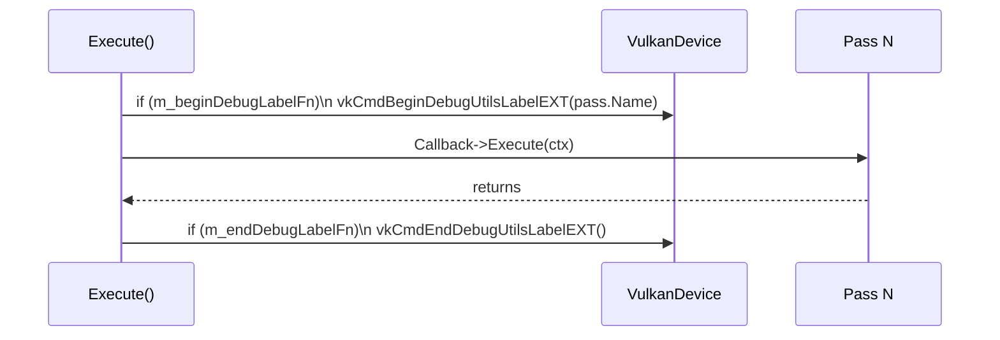

Add to `VulkanDevice`: `PFN_vkCmdBeginDebugUtilsLabelEXT m_beginDebugLabelFn` and `PFN_vkCmdEndDebugUtilsLabelEXT m_endDebugLabelFn`, loaded via `vkGetDeviceProcAddr` after `vkCreateDevice`.

---

## 10. Graph-Managed Async Compute (SkyAtmospherePass Migration)

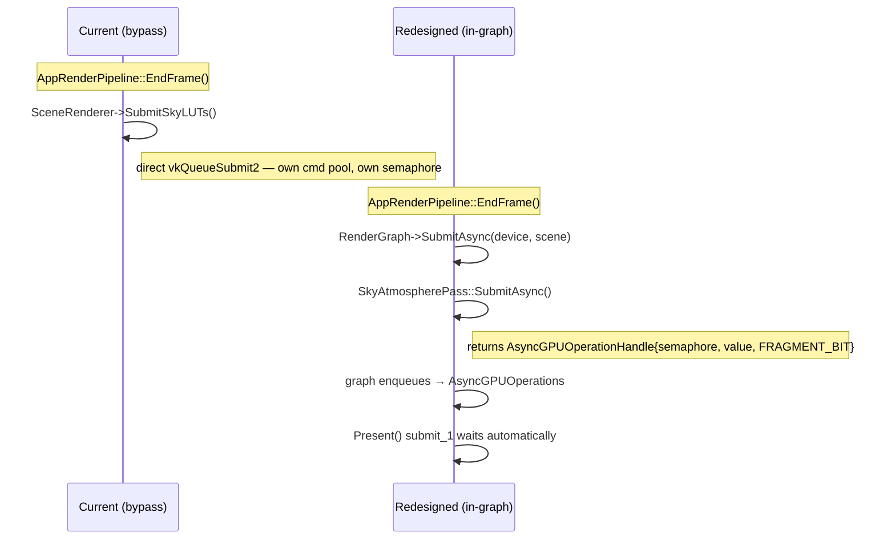

Sky combine draw extracted into `SkyCombinePass : IGraphicsPass` that reads `m_skyview_lut` via `ReadTexture()`.

---

## 11. Fixed Execute() Loop

```mermaid
flowchart TD
    A[for pass in SortedPassIndices] --> B{Enabled AND not culled?}
    B -- no --> A
    B -- yes --> C["vkCmdBeginDebugUtilsLabelEXT(pass.Name)\n[if fn ptr loaded]"]
    C --> D[Stamp pre-compiled pass.ImageBarriers]
    D --> E{Pass type?}
    E -- Graphics --> F{Framebuffer valid?}
    F -- no --> G[log error + skip]
    F -- yes --> FP{Pipeline handle non-null?}
    FP -- no --> GP["skip draw calls this frame\n(PSO Compiling or hot-reload invalidated)\npass retries next Compile()"]
    FP -- yes --> H["Callback->Execute(cmd + framebuffer)"]
    E -- InlineCompute --> FP2{Pipeline handle non-null?}
    FP2 -- no --> GP2[skip dispatch this frame]
    FP2 -- yes --> I["Callback->Execute(cmd)\n[no framebuffer guard]"]
    E -- AsyncCompute --> J[skip — SubmitAsync() submitted GPU work]
    H & I & J & G & GP & GP2 --> K[vkCmdEndDebugUtilsLabelEXT]
    K --> A
```

---

## 12. Full Architecture Overview

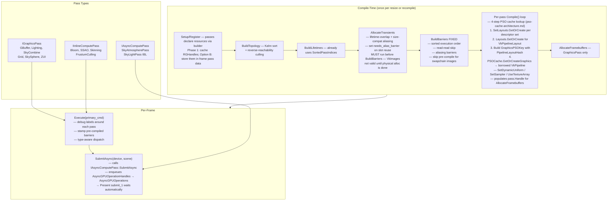

---

## 13. Multi-Threaded Command Recording (Phase 2)

### 13.1 Existing Infrastructure

The engine has useful building blocks, but Phase 2 also needs worker-affine scheduling,
dedicated secondary-buffer ownership, and a body-only graphics-pass contract:

| Existing API | What it provides |
|---|---|
| `CommandBuffer::BeginSecondary(GraphicPass*, VkFramebuffer)` | Secondary cmd buffer for a graphics pass |
| `CommandBuffer::ExecuteSecondaryCommandBuffers(ArrayView<CommandBuffer>)` | Primary records secondaries |
| `CommandBufferManager::GetCommandBuffer(queue, frame, thread_index, buffer_index)` | Per-thread per-frame command buffer pool |
| `GraphicRenderer::DrawScene(frame_index, thread_index, cb, camera)` | `thread_index` passed but unused |
| `VulkanDevice::WorkerThreadCount` | Thread count available |

### 13.2 Topology Levels

After the topological sort produces `SortedPassIndices`, passes can be grouped into **dependency levels** — passes within the same level have no direct dependencies between them and can be recorded in parallel:

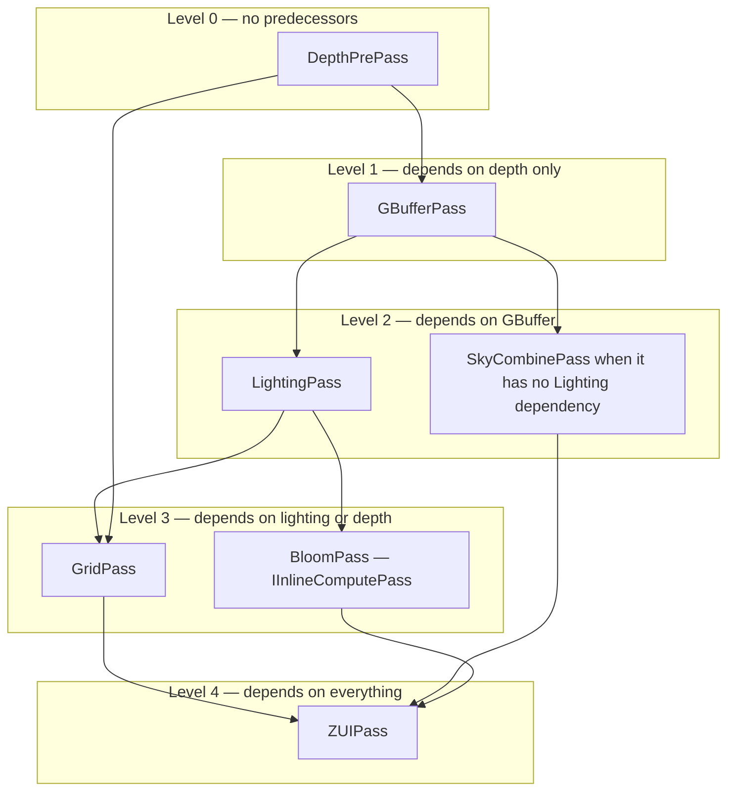

Note: `IAsyncComputePass` instances (e.g. `SkyAtmospherePass` LUTs) are **never** in a topology level — they are submitted on the COMPUTE_QUEUE by `SubmitAsync()` and bypass the graphics command buffer entirely.

Passes in the same level are independent. `IAsyncComputePass` is excluded from these
levels entirely; a graphics `SkyCombinePass` can share a level only when its declared
resource accesses have no dependency on the other pass.

**Level computation** (runs once, after `BuildTopology()`):

```cpp
// Assign each pass the maximum depth of any of its predecessors + 1
Array<uint32_t> pass_level;
pass_level.init(arena, Passes.size(), Passes.size());
for (uint32_t i = 0; i < Passes.size(); ++i)
    pass_level[i] = 0;
for (uint32_t i : SortedPassIndices) {
    for (auto& dep : predecessors_of(i))
        pass_level[i] = max(pass_level[i], pass_level[dep] + 1);
}
// Group into TopologyLevels[level] = [pass indices with that level value]
```

### 13.3 Execute() with Parallel Recording

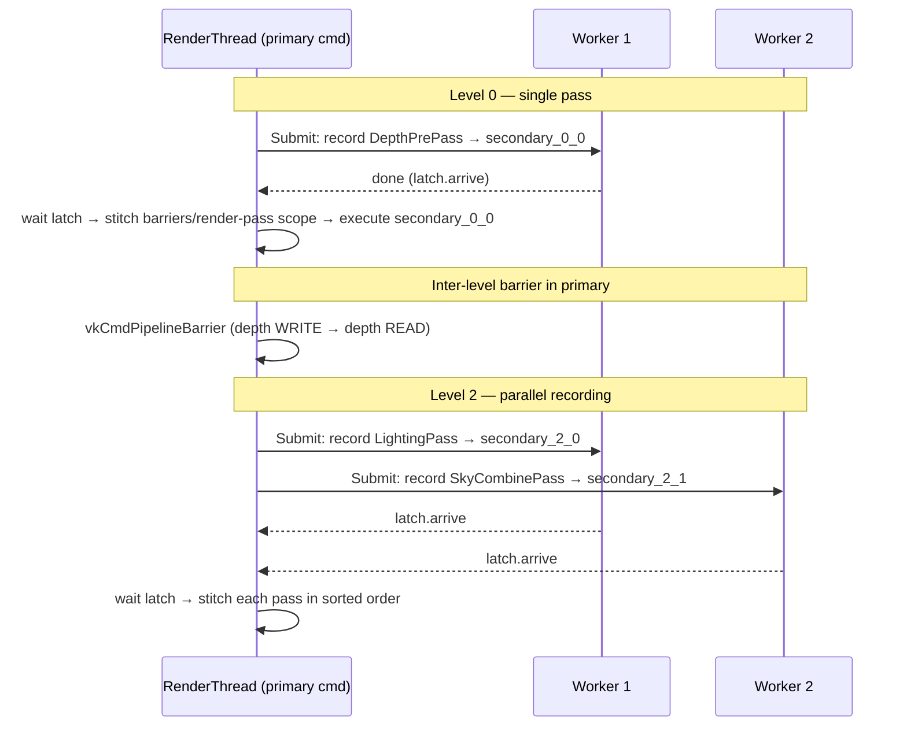

**Barrier placement — primary command buffer only:**

Every resource hazard creates a topology edge, so a producer and consumer cannot be
in the same dependency level. Therefore an `IntraLevelBarriers` category is neither
needed nor sound. Keep one pre-pass barrier list on `RGPass`; the render thread stamps
it in the primary immediately before executing that pass's secondary command buffer.

This is required for graphics passes: a graphics secondary is recorded with
`VK_COMMAND_BUFFER_USAGE_RENDER_PASS_CONTINUE_BIT` and executes inside an active
primary render-pass instance. Ordinary pipeline barriers do not belong in that scope.

### 13.4 Secondary Command Buffer Ownership

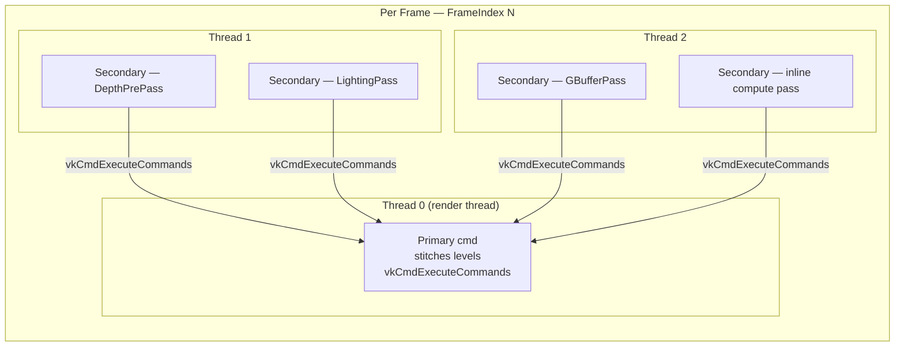

`CommandBufferManager::GetCommandBuffer()` cannot be used as-is for this feature.
Its four slots alternate primary/secondary (`0,2` are primary; `1,3` are secondary),
so it does not provide four secondaries per worker and an arbitrary slot may select a
primary buffer. Introduce a dedicated, explicitly-secondary per-frame worker pool
whose capacity grows to the number of passes assigned to that worker. Do not wrap a
fixed slot index; wrapping would overwrite a secondary that is still needed by the
primary.

Tasks also need worker affinity. `ThreadPool::Submit()` chooses a queue dynamically
and falls back to inline execution if all queues are full, so an item index is not a
safe command-buffer identity. Submit one batch task to each worker with an explicit
`SubmitToWorker(worker_index, ...)`, partition the level's pass indices among those
tasks, and let each worker acquire its secondaries with a local monotonically
increasing ordinal. `SubmitToWorker` is safe only with the render thread as its sole
producer, preserving the existing `SPSCQueue` invariant. It must not use the inline
fallback; report/backpressure on a full queue instead.

### 13.5 Graphics Pass vs Compute Pass Threading

**Graphics passes** require `VK_SUBPASS_CONTENTS_SECONDARY_COMMAND_BUFFERS` in
`vkCmdBeginRenderPass`. Existing callbacks cannot be recorded directly into such a
secondary: they currently call `BeginRenderPass` / `EndRenderPass` themselves. Phase
2 therefore adds a body-only recording contract (for example `RecordDraw(...)`) and
migrates graphics passes to it. The primary records, in sorted execution order:

```cpp
StampPrePassBarriers(primary, pass);
primary->BeginRenderPass(pass.Handle, pass.Framebuffer->Handle,
                         VK_SUBPASS_CONTENTS_SECONDARY_COMMAND_BUFFERS);
primary->ExecuteSecondaryCommandBuffers(pass.secondary);
primary->EndRenderPass();
```

This also means a graphics and inline-compute pass may be recorded in parallel but
must be stitched serially: execute a compute secondary outside any render-pass scope.

**Inline compute passes** have no render pass. Their secondary command buffers must be begun differently — the existing `BeginSecondary(GraphicPass*, VkFramebuffer)` is render-pass-specific and cannot be used. A new overload is needed:

```cpp
// New overload — needed for compute secondary cmd buffers
void CommandBuffer::BeginSecondaryCompute();
// Implementation: begin with no pInheritanceInfo render pass fields,
// VK_COMMAND_BUFFER_USAGE_ONE_TIME_SUBMIT_BIT only
```

This must be added to `VulkanDevice.h/.cpp` as part of the Phase 2 multi-threading implementation.

### 13.6 Thread Pool Prerequisites — Worker-Affine Batches and CountedLatch

The multi-threaded recording depends on a per-batch latch and an explicit
render-thread-to-worker submission API. This is not a generic `ParallelFor`: command
buffer ownership must be deterministic.

**CountedLatch / WaitAll**

C++20 `std::latch` (already available — engine requires C++20) provides exactly the semantics needed. No custom implementation is required; one latch counts the submitted worker-batch tasks.

`WaitAll` is not a pool method — it's the call-site `fence.wait()`. A global `ThreadPool::WaitAll()` would block all other submitted work; per-batch latches are the correct design.

**Worker-affine batches**

Add `SubmitToWorker(uint32_t worker_idx, void* ctx, TaskFn fn)` to `ThreadPool`, and
use it only from the render thread. It pushes directly to that worker's SPSC queue,
returns failure when full, and never invokes the task inline. `ThreadPoolHelper` then
creates at most one task per worker for a level; each task records its partition
serially and counts down the latch once. A worker index passed at submission time is
the authoritative ownership identity; no `thread_local` lookup is required.

`ThreadPoolHelper::ParallelForWorkers(level, fn)` is a thin render-thread-only wrapper
over those worker batches. Its callback receives `(pass_idx, worker_idx, local_ordinal)`.

```cpp
std::latch fence(active_worker_count);
for (uint32_t worker = 0; worker < active_worker_count; ++worker)
    SubmitToWorker(worker, MakeBatchContext(level, worker, &fence), RecordWorkerPartition);
fence.wait();
```

| Addition | Lines | Files | Risk |
|---|---|---|---|
| `CountedLatch` | 0 — use `std::latch` (C++20) | 0 | None |
| `WaitAll` | 0 — `fence.wait()` at call site | 0 | None |
| Worker-affine batch submission | ~40 | `ThreadPool.h`, `CommandBufferManager` | Medium |

These should be landed as a **standalone PR before the render graph multi-threading work**.

---

### 13.7 What Cannot Be Parallelized

- Passes with explicit dependency edges (cannot be in the same level by construction)
- `IAsyncComputePass` submissions — these go to a separate queue entirely, not the graphics cmd buffer
- The primary command buffer work (barrier stitching, `vkCmdExecuteCommands`) — always on the render thread
- Resize and recompile operations — already guarded as single-frame operations

### 13.8 Implementation Sketch

**New fields required on `RenderGraph`** (Phase 2 additions):
```cpp
// Add to RenderGraph
Core::Containers::Array<Core::Containers::Array<uint32_t>> m_topology_levels;
// RGPass retains one pre-pass barrier array.
// It is always stamped by the primary before this pass executes.
Core::Containers::Array<VkImageMemoryBarrier> ImageBarriers;
```

**Implementation using worker-affine batches from §13.6:**

```cpp
void RenderGraph::Execute(CommandBuffer* primary) {
    uint8_t frame_idx = Device->SwapchainPtr->CurrentFrame->Index;

    for (uint32_t level_idx = 0; level_idx < m_topology_levels.size(); ++level_idx) {
        auto& level = m_topology_levels[level_idx];

        // Parallel: one affine batch per worker. Each worker acquires only its own
        // dedicated secondary buffers and records its assigned pass bodies serially.
        Helpers::ThreadPoolHelper::ParallelForWorkers(level, [&](uint32_t pass_idx,
                                                                 uint32_t worker_idx,
                                                                 uint32_t local_ordinal) {
                RGPass& pass = Passes[pass_idx];
                if (!pass.Enabled) return;

                CommandBuffer* secondary = Device->CommandBufferMgr->AcquireWorkerSecondary(
                    QueueType::GRAPHIC_QUEUE, frame_idx, worker_idx, local_ordinal);

                if (/*Graphics*/ ...) {
                    secondary->BeginSecondary(static_cast<GraphicPass*>(pass.Handle),
                                              pass.Framebuffer->Handle);
                    pass.Callback->RecordDraw(..., secondary); // no Begin/EndRenderPass here
                } else {
                    secondary->BeginSecondaryCompute();
                    pass.Callback->Execute(..., secondary);
                }
                secondary->End();
            });

        // Primary: preserve sorted order, barriers, and render-pass boundaries.
        for (uint32_t pass_idx : level) {
            RGPass& pass = Passes[pass_idx];
            StampPrePassBarriers(primary, pass);
            ExecuteRecordedPass(primary, pass); // graphics opens/closes its render pass;
                                               // inline compute executes outside it
        }
    }
}
```

**Key notes:**
- Frame index: `Device->SwapchainPtr->CurrentFrame->Index` — not a `RenderGraph` member
- Thread pool: worker-affine batches from §13.6, synchronized with `std::latch` — **no spin-wait**
- Secondary ownership: `AcquireWorkerSecondary()` returns an explicitly-secondary buffer owned by the assigned worker; capacity grows instead of wrapping a fixed slot.
- Barriers: `ImageBarriers` remain a single per-pass array and are always stamped by the primary.
- `BeginSecondaryCompute()`: new `CommandBuffer` overload for compute secondaries (§13.5)
- Swapchain resources: excluded from precompiled `ImageBarriers`; transitioned dynamically per frame (§5)

---

## 14. Advanced Production Features (Phase 3)

| Feature | Why it matters | Approach |
|---|---|---|
| **Option B per-frame rebuild** | Eliminates persistent enabled/disabled graph state | Conditional `Register()` each frame; **requires PSO cache** |
| **Split barriers** | Allows producer/consumer overlap across queues | Release/acquire barrier pairs plus timeline waits |
| **True async compute overlap** | Lets independent compute overlap graphics | Queue scheduler with a critical-path cost model |
| **Subresource granularity** | Avoids unnecessary whole-image transitions | Per-aspect/mip/layer state intervals |
| **Render-pass fusion** | Preserves tile memory on TBDR GPUs | Legacy-render-pass fusion backend; dynamic rendering remains the default backend |
| **Parallel secondary recording** | Reduces CPU recording time | Worker-affine body recording; primary owns barriers and render-pass scopes (§13) |
| **Versioned writes** | Removes declaration-order multi-writer heuristic | Every write creates a new resource version |
| **Transfer queue integration** | Streaming uploads have no graph-declared consumer dependency | `ITransferPass` + ticket-based `ImportStreamingTexture` |
| **Bindless as graph resource** | Graph/bindless dependency gap causes missing barriers | `ReadBindless` declaration + frame-begin graph-owned descriptor batch |
| **Conditional rendering** | GPU-driven visibility requires no CPU readback stall | `UseConditional` wrapping via `VK_EXT_conditional_rendering` |
| **Readback and query pools** | Auto-exposure, occlusion results need deferred CPU delivery | `RGReadbackRing` + callback delivery at `RenderTimelineNextValue` |
| **Material permutation system** | PSO cache needs an author-side variant resolution layer | `MaterialTemplate`, `MaterialInstance`, `ResolveVariantKey`, `DrawSorter` |

The following section makes these target features explicit. They are implementation
milestones, not optional correctness work once the corresponding capability is enabled.

---

## 15. Complete Production-Grade Graph Target

### 15.1 Per-Frame Builder and Versioned Resources

Option B is the steady-state architecture. Each frame constructs a lightweight virtual
graph in a frame arena, compiles it, records it, and releases only the virtual metadata.
Physical images, buffers, descriptor layouts, PSOs, and allocator pages remain cached.

Every write produces a new version. A read consumes an explicit version, so a graph no
longer guesses which of several writers a reader intended to observe. `RGResourceHandle`
already has `Version`; Phase 3 makes it semantically authoritative.

```cpp
RGImageHandle gbuffer = builder.CreateImage("gbuffer", gbuffer_desc);
gbuffer = builder.WriteColor(pass, gbuffer, RGLoadOp::Clear, clear_value); // version 1
builder.ReadSampled(lighting, gbuffer, RGShaderStages::Fragment);           // reads v1

RGImageHandle lit = builder.CreateImage("lit", hdr_desc);
lit = builder.WriteColor(lighting, lit, RGLoadOp::Clear, clear_value);      // version 1
lit = builder.WriteStorage(bloom, lit, RGShaderStages::Compute);            // version 2
builder.ReadSampled(composite, lit, RGShaderStages::Fragment);              // reads v2
```

The compiler emits edges from the producer of the consumed version to its reader, and
from a prior version to the pass that creates the next version. A read of an unproduced,
non-imported version is a compile error. Passes with side effects must declare an
explicit sink (`WriteSwapchain`, `Export`, readback, query resolve, or `NeverCull`);
`NeverCull` is reserved for intentional external effects and is reported by validation.

### 15.2 Unified Images, Buffers, and Subresources

Resources are a tagged physical variant, not an image-only record with a `Kind` enum:

```cpp
struct RGSubresourceRange {
    VkImageAspectFlags Aspects;
    uint16_t BaseMip, MipCount;
    uint16_t BaseLayer, LayerCount;
};

struct RGUse {
    RGResourceHandle Handle;       // exact produced/imported version
    RGUsage          Usage;        // ColorAttachment, Sampled, StorageReadWrite, Transfer...
    RGShaderStages   Stages;       // vertex/fragment/compute/ray tracing; never inferred globally
    RGSubresourceRange Range;      // images; whole-range sentinel for buffers
};

struct RGPhysicalResource {
    RGResourceKind Kind;
    Textures::TextureHandle Image; // valid only for image kinds
    Rendering::BufferHandle Buffer;// valid only for buffer kinds
};
```

The compiler tracks state as interval maps over image aspect/mip/layer ranges and one
whole-resource state for a buffer. It splits only ranges touched by a use, coalesces
equal adjacent states after the pass, and emits `VkImageMemoryBarrier2` or
`VkBufferMemoryBarrier2` accordingly. A use declares exact stages, so fragment sampled
reads, vertex sampled reads, compute storage writes, indirect reads, and transfer work
receive different synchronization scopes.

### 15.3 Synchronization2, Queue Ownership, and Scheduling

All new graph barriers use `vkCmdPipelineBarrier2` with `VkDependencyInfo`; legacy
`vkCmdPipelineBarrier` remains only as a compatibility wrapper during migration. The
graph has one queue assignment per pass: graphics, async compute, or transfer. It
builds a queue submission plan from version edges.

Phase 3 replaces the Phase 1 `IAsyncComputePass` bypass with ordinary graph passes:

```cpp
enum class RGQueuePreference : uint8_t { Graphics, AsyncCompute, Transfer };

// Registration metadata, not a separate callback hierarchy. The compiler may fall back
// to Graphics when QueueTopology lacks a usable independent queue.
RGPassDesc{ .QueuePreference = RGQueuePreference::AsyncCompute };
```

An async-compute pass remains in the versioned DAG. Its produced versions therefore
drive culling, lifetimes, barrier derivation, and submission waits exactly like graphics
or transfer passes. Once all users migrate, delete `IAsyncComputePass`, `SubmitAsync()`,
and the special `Present()`-wait path.

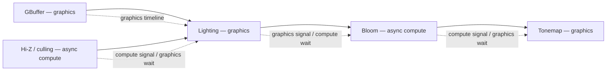

For a cross-queue resource edge, compilation emits:

1. A release barrier after the producer's last use.
2. A timeline semaphore signal in that queue submission.
3. A wait at the first consumer stage in the receiving submission.
4. An acquire barrier before the consumer's first use.

If queue families differ, the release/acquire pair carries the source and destination
family indices. If they are the same family, both indices are `VK_QUEUE_FAMILY_IGNORED`.
The scheduler may place a pass on async compute only when its dependencies permit it and
the estimated overlap exceeds synchronization cost; otherwise it records as inline
compute. A deterministic debug switch must force all passes onto the graphics queue.

#### 15.3.1 Cross-Platform Queue Topology and Capability Resolution

The engine targets Windows, macOS, and Linux. The graph is Vulkan/WSI-neutral: platform
surface creation is selected by the window layer (Win32, Metal/MoltenVK portability,
XCB, or Wayland), while queue selection is made solely from the physical device's queue
families, queue counts, present support for the active surface, and enabled device
features. No platform or vendor is assigned a hard-coded queue-family index.

At device creation, `VulkanDevice` builds an immutable `QueueTopology` from
`vkGetPhysicalDeviceQueueFamilyProperties`, surface-support queries, and enabled
features. It records graphics and present families independently, optional compute and
transfer families, whether each queue is a distinct `VkQueue`, and whether a
queue-family ownership transfer is required. The graph receives this topology; passes
declare their preferred queue class, never a queue-family number.

The normal selection policy requires the graphics family to support the active surface.
If no such family exists but a separate present family does, the device is accepted only
when the swapchain backend implements explicit graphics→present ownership release and
present→graphics acquire for swapchain images, plus the corresponding submission waits.
Otherwise reject that physical device for the active surface rather than assuming that
graphics capability implies presentation support.

| Runtime topology | Scheduling policy | Synchronization policy |
|---|---|---|
| One graphics-capable queue | Graphics, compute, and transfer record/submit in topological order on that queue. | No inter-queue semaphore or ownership transfer; ordinary in-queue barriers only. |
| Graphics plus a dedicated transfer queue | Upload/copy passes use transfer only when dependency analysis finds useful overlap; compute remains inline unless an eligible compute queue exists. | Timeline wait for cross-queue dependencies; release/acquire ownership barriers only when families differ. |
| Graphics plus compute queue | Eligible compute passes may use async compute; small or dependency-bound work remains inline. | Different queues in the same family still use timeline waits, but family indices are `VK_QUEUE_FAMILY_IGNORED`. Distinct families additionally use release/acquire ownership barriers. |
| Graphics, compute, and transfer queues | Scheduler constructs the multi-queue DAG and may overlap independent work subject to cost heuristics and queue availability. | One signal/wait edge per cross-queue dependency, coalesced per semaphore/submission; ownership transfers only across families. |

Two queues are considered separate only when the driver exposes distinct queue handles
(`queueCount` is sufficient for both allocations) or distinct families. A compute or
transfer family that aliases the graphics `VkQueue` is treated as one queue, even if it
advertises the relevant capability bits. The scheduler must always retain a legal
graphics-queue fallback for every pass.

Feature-dependent paths are selected at runtime, not by OS: Synchronization2 is Vulkan
1.3 or `VK_KHR_synchronization2`; timeline semaphores are Vulkan 1.2 or
`VK_KHR_timeline_semaphore`; dynamic rendering is Vulkan 1.3 or
`VK_KHR_dynamic_rendering`; conditional rendering remains optional. A device missing an
advanced feature uses the documented compatibility backend or disables only that
optional graph feature with a diagnostic. The platform window backend supplies the
appropriate surface extension at instance creation. When required by a macOS Vulkan
implementation, instance creation enables `VK_KHR_portability_enumeration` and its
enumeration flag, while device creation enables the advertised
`VK_KHR_portability_subset`; these are capability constraints, not a separate
render-graph design.

Timeline semaphores are mandatory for the Phase 3 multi-queue scheduler. A device that
lacks them uses the single-graphics-queue compatibility path; it does not attempt an
unbounded binary-semaphore emulation. This keeps semaphore lifetime, submission
coalescing, and deferred retirement deterministic on every supported OS.

### 15.4 Transient Allocator, Aliasing, and Memory Budgeting

The production allocator owns Vulkan memory pages rather than treating a texture handle
as memory. Compilation performs interval coloring over compatible transient resource
lifetimes, then binds distinct `VkImage`/`VkBuffer` objects to non-overlapping aliases
of allocator-page memory. Compatibility includes Vulkan memory requirements,
dedicated-allocation requirements, alignment, memory type, image-create flags, and all
view/usage constraints. Image aliases use `VK_IMAGE_CREATE_ALIAS_BIT` when required.

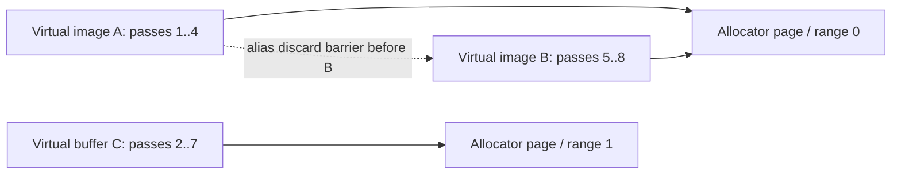

Aliasing is forbidden for exported, imported, history, readback, sparse, dedicated, or
cross-frame resources. The allocator records peak bytes by heap, reports alias savings,
honors a configurable transient budget, and has a deterministic fallback: allocate an
unaliased compatible page or fail graph compilation with a resource report—never reuse
live memory.

### 15.5 Rendering Backends, Load/Store Semantics, and PSOs

The graph declaration owns attachment load/store operations, clears, resolves, sample
count, and render area. A pass never performs implicit global clears. The default Vulkan
backend uses dynamic rendering; its `GraphicsPSOKey` includes the canonical attachment
format tuple, depth/stencil format, sample count, view mask, and pipeline layout hash.
This keeps PSO-cache identity aligned with rendering compatibility.

For tile-based GPUs, an optional legacy-render-pass backend may fuse consecutive,
dependency-compatible graphics passes when their attachments, subresource ranges,
render area, sample count, and load/store semantics permit it. Fusion is an optimization
behind a backend capability check; it must never change graph ordering or visibility.
Secondaries under dynamic rendering use the appropriate rendering inheritance info;
under the legacy backend they use render-pass continuation inheritance.

### 15.6 Validation, Observability, and Determinism

Development builds validate every compile: unique version producer, valid imported
initial state, no read-before-write, no overlapping alias lifetimes, legal queue-family
transfer pairs, descriptor/resource usage compatibility, and a present sink. They emit
a DOT/JSON graph dump containing passes, versions, culled passes, lifetimes, physical
allocations, barriers, queue submissions, and PSO-cache outcomes.

GPU labels nest as `Frame → Queue submission → Pass`; timestamps are placed around
passes and queue submissions. RenderDoc names physical resources with virtual-version
and alias-slot information. A deterministic test mode disables culling only when asked,
forces graphics queue execution, disables aliasing/fusion independently, and compares
output against the optimized plan. This makes synchronization and aliasing failures
reproducible rather than timing-dependent.

### 15.7 Transfer Queue and Streaming Integration

Texture streaming and buffer uploads currently bypass the graph entirely. The RRM calls
`SubmitAsyncUploads` after `Present`. Those uploads are consumed by `submit_1` of the
**next** frame, not the current one. Phase 3 gives the graph explicit ownership of the
consumer-side wait and acquire barrier through a streaming-upload ticket; RRM remains
the producer of copy commands and producer-side release barriers.

**Two integration points:**

**Streaming import** — the common case. The RRM publishes one ticket per submitted
upload from the prior frame. The ticket is available while the copy may still be
in-flight; the graph makes it visible by placing its timeline wait in the current
graphics submission. RRM must stop recording the graphics-side acquire command once
this path is enabled.

```cpp
struct StreamingUploadTicket {
    TextureHandle                         Texture;
    Hardwares::AsyncGPUOperationHandle    Completion;
    VkImageLayout                         PostReleaseLayout; // normally SHADER_READ_ONLY_OPTIMAL
    uint32_t                              ProducerQueueFamily;
};

RGImageHandle ImportStreamingTexture(cstring name, const StreamingUploadTicket& ticket);
// RRM's transfer submission transitions TRANSFER_DST_OPTIMAL → PostReleaseLayout and
// releases ownership. The graph imports that post-release state, waits on Completion,
// then emits the graphics acquire before the first reader. It does not transition from
// TRANSFER_DST_OPTIMAL or emit a second release/acquire pair.
```

If producer and graphics queues belong to different queue families, the graph's acquire
barrier carries the ticket's producer family and the graphics family. If they share a
family, those indices are `VK_QUEUE_FAMILY_IGNORED`; the timeline wait is still required
when producer and consumer are separate queue submissions. A texture without a pending
ticket is imported in its declared steady-state layout (normally
`SHADER_READ_ONLY_OPTIMAL`) with no upload wait.

**Explicit transfer pass** — for in-graph copies (mipmap generation, buffer
initialization, readback copies). These are ordinary passes with explicit resource
declarations. They are **cullable** when their outputs have no live consumers — making
every transfer pass non-cullable defeats graph culling and is wrong for internal copies.
A transfer pass that exists only for side effects (e.g., exporting data to the CPU)
must declare a readback sink or `Export` resource to prevent culling:

```cpp
struct ITransferPass : IRenderGraphPass
{
    virtual void RecordTransfer(VulkanDevice*, CommandBuffer* transfer_cmd) = 0;
    // No NeverCull override: GetPassFlags() belongs to IRenderGraphPass.
    // Passes with side effects declare an Export or readback sink in Setup().
    // Internal copies (mip generation) are culled when their output is unused.
};
```

The graph submits transfer passes on the transfer queue before the graphics submission.
The produced resources are declared with `RGUsage::TransferDst`; consuming graphics
passes declare reads. The compiler emits the release/acquire pair across queue families.
A deterministic debug mode routes all transfers to the graphics queue to simplify
validation.

---

### 15.8 Bindless Array as First-Class Graph Resource

The global texture array (descriptor set 1) is currently updated outside the graph via
`TextureHandleToUpdates`. No formal dependency exists between a graph write to a texture
and a subsequent bindless read. The graph emits no barrier for this edge.

**Two separable problems:**

**1. Image layout.** A texture written by a graph pass (e.g., a LUT, a render target
used as a source) must be in `SHADER_READ_ONLY_OPTIMAL` before any pass reads it via
the bindless array.

```cpp
// Builder declaration — takes the graph image version (RGImageHandle), not a physical
// TextureHandle, so the compiler can derive the writer → bindless-reader dependency edge.
// slot is the bindless array index assigned by the texture's registration.
// Creates a version edge: the pass producing `image` must complete before this pass.
// Graph emits the layout transition (e.g., COLOR_ATTACHMENT_WRITE → SHADER_READ).
// No change to descriptor binding; the pass still reads via set 1 + slot index.
void ReadBindless(RGImageHandle image, uint32_t slot, RGShaderStages stages);
```

**2. Descriptor update.** `vkUpdateDescriptorSets` for newly-added bindless entries
must happen before any draw that reads those slots, but does not require a pipeline
barrier — it is host-side descriptor state, separate from GPU image-layout barriers.
The frame graph is the sole owner of this descriptor-update batch: it drains
`TextureHandleToUpdates` after the frame-slot fence has completed and before any command
buffer records a bindless reader. `DeviceSwapchain::Present()` must no longer drain or
write this queue once graph ownership is enabled.

```
BeginFrame(frame_slot) order:
  1. Wait/reset the frame-slot fence; the slot's descriptors are no longer in flight.
  2. Drain TextureHandleToUpdates and call vkUpdateDescriptorSets once for the batch.
  3. Build/compile/record the graph. Its recorded GPU barriers establish image layouts.
```

History textures already resident from a prior frame are imported with
`SHADER_READ_ONLY_OPTIMAL` as their initial layout — no transition, no descriptor
update. Only newly registered bindless entries require the host update; graph resource
uses independently determine whether an image barrier is needed.

---

### 15.9 GPU-Side Conditional Rendering

CPU-side pass culling (`SetPassEnabled`, Option B registration) eliminates passes at
graph-compile time. GPU-side conditional rendering skips GPU commands at execution
time based on a buffer value written by a prior GPU pass, without a CPU readback stall.

Use cases: occlusion culling (skip draws whose occlusion query = 0), GPU-driven
visibility (meshlet/cluster culling output gates per-object rendering).

**Extension:** `VK_EXT_conditional_rendering` — optional device feature, queried at
device init. A pass that requires conditional rendering must provide an explicitly
declared fallback implementation (for example, an indirect-count or unconditional
variant) or graph compilation rejects that feature path. The graph must not silently
omit the wrapper, because that changes the pass's GPU work.

```cpp
struct ConditionalSpec {
    VkDeviceSize  Offset     = 0;
    // Vulkan default (Invert=false): execute commands when value is NON-ZERO.
    // VK_CONDITIONAL_RENDERING_INVERTED_BIT_EXT (Invert=true): execute when value is ZERO.
    // Typical GPU occlusion culling: write 1 if visible, 0 if occluded → Invert=false.
    bool          Invert     = false;
};

// The exact graph-buffer version establishes SHADER_WRITE → CONDITIONAL_RENDERING_READ.
// The graph resolves its physical VkBuffer only while recording.
void UseConditional(RGBufferHandle condition, const ConditionalSpec& spec);
```

The condition buffer version is written by a compute pass with `WriteBuffer`.
`UseConditional()` consumes that exact `RGBufferHandle` version and registers the
conditional-rendering read; callers do not separately declare an ambiguous string-based
`ReadBuffer`. The graph derives the barrier
(`SHADER_WRITE → CONDITIONAL_RENDERING_READ_EXT`) and wraps execution:

```cpp
// Phase 1: wrap Callback->Execute(). Phase 2 graphics recording: wrap the matching
// ExecuteSecondaryCommandBuffers call in the primary command buffer.
if (pass.ConditionalSpec.IsValid())
    vkCmdBeginConditionalRenderingEXT(cmd, &cond_info);
pass.Callback->Execute(...);
if (pass.ConditionalSpec.IsValid())
    vkCmdEndConditionalRenderingEXT(cmd);
```

---

### 15.10 Readback, Feedback, and Query Pools

**A. Buffer readback — auto-exposure, histogram, statistics**

A render pass writes results to a GPU buffer; the CPU reads them to drive
per-frame parameters (exposure, LOD bias, effect intensity). The read is deferred until
the submission timeline containing its copy completes, avoiding a GPU–CPU sync stall;
`FRAMES_IN_FLIGHT` is only an initial ring-capacity hint, not the completion criterion.

```cpp
using ReadbackFn = void(*)(const void* data, size_t size, void* ctx);

// Declares a readback sink attached to a GPU buffer.
// The graph copies gpu_buffer → a ring of host-visible staging buffers (one per frame).
// callback fires on the render thread when RenderTimelineNextValue for the producing
// frame has been reached — same deferred mechanism as DeferredFreeQueue.
RGReadbackHandle DeclareReadback(cstring name, RGBufferHandle gpu_buffer,
                                  ReadbackFn callback, void* ctx);
```

The graph adds a transfer pass at the end of the frame that copies `gpu_buffer` into a
host-visible staging allocation. Each allocation is leased until the exact graphics or
transfer timeline value that contains its copy has completed; it is not reused merely
because a fixed number of frames elapsed. A render-thread `ReadbackCompletionQueue`
polls those values and invokes the callback only after completion. For non-coherent
memory it calls `vkInvalidateMappedMemoryRanges` before the callback. The staging ring
is owned by the graph; callers must consume the `const void*` during the callback and
must not retain it.

**B. Occlusion query pools**

Occlusion queries use `vkCmdBeginQuery`/`vkCmdEndQuery` around draw calls. Results
must be read back without a CPU stall. The correct non-blocking path uses
`vkCmdCopyQueryPoolResults` to copy results into a staging buffer, then the same
`RGReadbackRing` mechanism delivers them to the CPU via callback.
`vkGetQueryPoolResults` is not used: with `VK_QUERY_RESULT_WAIT_BIT` it blocks the
render thread; without it it can return `VK_NOT_READY`. Neither form is the deferred
GPU-copy/readback model.

```cpp
RGQueryHandle DeclareOcclusionQueryPool(cstring name, uint32_t query_count);

// Pass declares it writes to the pool (draws inside begin/end query).
// Each frame slot owns a distinct query-pool/range. The graph resets that slot only
// after its prior timeline value has completed, never while old results are read back.
void WriteQueryPool(RGQueryHandle pool, uint32_t first_query, uint32_t count);

// After all passes writing to the pool, the graph emits:
//   vkCmdCopyQueryPoolResults(cmd, pool, 0, query_count,
//       staging_ring[slot], 0, sizeof(uint64_t),
//       VK_QUERY_RESULT_64_BIT | VK_QUERY_RESULT_WAIT_BIT)
// For non-coherent host-visible staging memory, before the callback fires:
//   vkInvalidateMappedMemoryRanges(device, 1, &range)
// Delivered as a uint64_t[query_count] array through a ReadbackFn callback.
RGReadbackHandle DeclareQueryReadback(RGQueryHandle pool, ReadbackFn callback, void* ctx);
```

**C. Timestamp queries — GPU profiling**

Timestamp queries are core Vulkan — no extension is needed. `vkCmdWriteTimestamp2`
is part of Synchronization2 (`VK_KHR_synchronization2`, promoted to Vulkan 1.3).
Before using timestamps:
- Check `VkQueueFamilyProperties::timestampValidBits > 0` for the target queue family.
- Check `VkPhysicalDeviceLimits::timestampPeriod > 0` — gives nanoseconds per tick.
- Check `timestampComputeAndGraphics` in `VkPhysicalDeviceLimits` before using
  timestamps on compute-capable queues.

The graph inserts `vkCmdWriteTimestamp2` before and after each pass when profiling is
enabled. Results are delivered to the observability layer (§15.6) with the same
deferred `RGReadbackRing` mechanism and the same `vkCmdCopyQueryPoolResults` path.

---

### 15.11 Material System and Shader Permutation Management

The PSO cache stores and retrieves compiled pipelines keyed by `GraphicsPSOKey`. The
material system is the layer above it: it defines what permutations exist, resolves
which one to use for a given draw, and manages pre-warming.

**Material template** — defines the shader base and the set of supported permutations:

```cpp
enum class MaterialPermutation : uint64_t {
    None          = 0,
    AlphaTest     = 1ULL << 0,
    AlphaBlend    = 1ULL << 1,
    DoubleSided   = 1ULL << 2,
    Clearcoat     = 1ULL << 3,
    SubsurfaceSSS = 1ULL << 4,
    WithNormalMap = 1ULL << 5,
    WithEmissive  = 1ULL << 6,
    // … up to bit 63
};

struct MaterialTemplate {
    cstring                  ShaderBaseName;         // "pbr_opaque", "pbr_transparent"
    MaterialPermutation      SupportedPermutations;  // bitmask of valid flags
    uint32_t                 PushConstantSize;        // size of per-draw parameter block
};
```

**Material instance** — baked combination of active flags and parameter values:

```cpp
struct MaterialInstance {
    const MaterialTemplate*  Template;
    MaterialPermutation      ActivePermutations;
    // Vulkan guarantees only 128 bytes of push constants (maxPushConstantsSize minimum).
    // Cap inline params at min(128, Device->Limits.maxPushConstantsSize).
    // Material data larger than the device limit spills to a per-material UBO or SSBO
    // bound via the pipeline layout; the push constant carries only an index into it.
    uint8_t                  Params[128];
};
```

**Pass context** — the render pass the material is drawn into changes which shader
variant is needed (a shadow pass needs only depth, not full PBR):

```cpp
enum class PassContext : uint8_t {
    Lit,          // full PBR lighting
    DepthPrePass, // depth-only, no fragment shader
    ShadowDepth,  // depth-only, shadow map projection
    Wireframe,    // override polygon mode
};
```

**Variant resolution** — the material system maps template + permutations + context
→ `ShaderVariantKey`, which feeds into `GraphicsPSOKey::VertexShaderHash` and
`FragmentShaderHash`:

```cpp
ShaderVariantKey MaterialSystem::ResolveVariantKey(
    const MaterialInstance& mat, PassContext ctx)
{
    ShaderVariantKey k = {};
    k.BaseShaderHash     = FNV1a64(mat.Template->ShaderBaseName, strlen(...));
    k.PermutationBitmask = static_cast<uint64_t>(mat.ActivePermutations);
    // Shadow and depth-prepass strip fragment permutations not needed for depth:
    if (ctx == PassContext::ShadowDepth || ctx == PassContext::DepthPrePass)
        k.PermutationBitmask &= ShadowSafePermutationMask;
    return k;
}
```

**Permutation pre-warming** — called at scene load time to pre-compile variants, with
a budget to prevent permutation explosion from dominating startup time:

```cpp
struct PrewarmBudget {
    uint32_t     MaxPermutations = 256;  // cap total PSO requests per scene load
    PSOPriority  Priority        = PSOPriority::High;
};

void MaterialSystem::PrewarmForScene(
    const Scene& scene,
    const PassContext* contexts, uint32_t context_count,
    PSOCache& cache, VulkanDevice* device,
    const PrewarmBudget& budget = {})
{
    // Enumerate unique (material template × active permutations × pass context) tuples.
    // De-duplicate: the same variant key from multiple instances is one PSO request.
    // Stop when budget.MaxPermutations is reached; remaining variants compile on demand.
    // → call cache.RequestAsync(key, layout, compat_pass, budget.Priority, callback)
}
```

**Draw sorting** — opaque and transparent objects require separate sort strategies.
A single universal sort breaks transparency:

```
Opaque bucket:
  1. PSO key hash            — minimise vkCmdBindPipeline
  2. Material instance index — minimise push-constant writes
  3. Depth front-to-back     — early-z efficiency

Transparent bucket (conventional alpha blending):
  1. Strict depth back-to-front — correct blending is mandatory
  2. Stable submission order as the tie-breaker
  PSO/material reordering is forbidden because it can change blend results.
  State sorting is permitted only for an explicitly order-independent transparency path.
```

The two buckets are recorded in separate draw calls (opaque first, then transparent)
and may be submitted to different passes. The render graph is unaware of draw sorting —
it provides the pass; the material system provides sorted draw lists per bucket, passed
to `RecordDraw()` (Phase 2 body-only contract).

---

## 16. Files to Change

### New interfaces
- `ZEngine/ZEngine/Rendering/Renderers/Base/IInlineComputePass.h` — replaces `IComputeCallbackPass.h`
- `ZEngine/ZEngine/Rendering/Renderers/Base/IAsyncComputePass.h` — Phase 1 compatibility adapter; `SubmitAsync()` and `GetPassFlags()=NeverCull`, removed after Phase 3 queue-preference migration

### Core graph (`RenderGraph.h/.cpp`)
- `m_needs_recompile` flag + deferred recompile in `Execute()` (Option A)
- `SubmitAsync(device, scene)` method
- Pass culling in `BuildTopology()` + base `GetPassFlags()` / explicit side-effect-sink opt-out
- Fix `BuildBarriers()`: sorted order, read-read skip, aliasing barrier
- `Execute()`: stamp pre-compiled barriers, remove framebuffer guard for InlineCompute, add debug labels
- `RGAccess::StorageWrite` enum entry + `kAccessTable` row (both must be added together)
- `WriteStorageImage`, `ReadWriteStorageImage`, `WriteSwapchain` builder methods
- Buffer-resource implementation for `WriteBuffer`/`ReadBuffer`: `BufferHandle`/allocation, buffer state tracking, and `VkBufferMemoryBarrier` derivation
- `ImportTexture(name, handle, initialLayout)` updated signature
- Phase 1: strict-compatible image reuse in `RGTransientPool`; Phase 2: allocator-backed true memory aliasing + `needs_alias_barrier`
- Remove unconditional `cb->ClearColor/ClearDepth` from `Execute()`
- Expand 16-view and 16-framebuffer stack caps to dynamic arena arrays

### Texture spec
- `ZEngine/ZEngine/Rendering/Specifications/TextureSpecification.h` — add `ClearColor[4]`, `ClearDepth`, `ClearStencil`

### VulkanDevice
- `ZEngine/ZEngine/Hardwares/VulkanDevice.h/.cpp` — `PFN_vkCmdBeginDebugUtilsLabelEXT` + `PFN_vkCmdEndDebugUtilsLabelEXT`; load via `vkGetDeviceProcAddr` after `vkCreateDevice`

### Sky system
- `ZEngine/ZEngine/Rendering/Renderers/Sky/SkyAtmospherePass.h/.cpp` → `IAsyncComputePass`
- `ZEngine/ZEngine/Rendering/Renderers/Sky/SkyCombinePass.h/.cpp` — new `IGraphicsPass`
- `ZEngine/ZEngine/Rendering/Renderers/Sky/SkySystem.h/.cpp` — remove `SubmitLUTs()` delegation
- `ZEngine/ZEngine/Applications/AppRenderPipeline.cpp` — replace `SceneRenderer->SubmitSkyLUTs()` with `SceneRenderer->RenderGraph->SubmitAsync(...)`

### Compute stub passes
- `ZEngine/ZEngine/Rendering/Renderers/Compute/{Bloom,SSAO,Skinning,FrustumCulling}Pass.h/.cpp` — base class → `IInlineComputePass`

### ZUI (graph integration completed; `WriteSwapchain` migration pending)
- `ZUIRenderer` has been restructured as `ZUIPass : IRenderGraphCallbackPass` and is registered in `GraphicRenderer`'s main render graph as the last pass. `UseSwapchainAsRenderTarget()` is still called in `ZUIPass::Compile()` on the main graph's `RenderPassBuilder`. `ZUIPass::Execute()` fetches the current swapchain `VkFramebuffer` directly. The private `RenderGraph` factory instance is gone.
- `ZUIPass::Compile()` must be updated to use the PSO cache 4-step path when `pso-cache-architecture.md` lands.

### Phase 2 — Multi-threaded recording additions
- `ZEngine/ZEngine/Helpers/ThreadPool.h` — add render-thread-only `SubmitToWorker()` and worker-affine batch helper; `#include <latch>` — **prerequisite, land first**
- `ZEngine/ZEngine/Hardwares/CommandBufferManager.h/.cpp` — dedicated growable, explicitly-secondary worker buffers (`AcquireWorkerSecondary`); do not reuse alternating primary/secondary `GetCommandBuffer()` slots
- `ZEngine/ZEngine/Rendering/Renderers/RenderGraph.h/.cpp` — add `m_topology_levels` (allocator-initialized nested arrays), level computation, primary `StampPrePassBarriers`, and `ExecuteRecordedPass` helpers
- Graphics pass interface/implementations — add body-only `RecordDraw()` and migrate existing graphics callbacks; primary owns `BeginRenderPass`/`EndRenderPass` in Phase 2
- `ZEngine/ZEngine/Hardwares/VulkanDevice.h/.cpp` — add `CommandBuffer::BeginSecondaryCompute()` overload (secondary cmd buffer without render pass inheritance)

### Transfer, bindless, conditional, readback, and material (§15.7–15.11)
- `ZEngine/ZEngine/Rendering/Renderers/Base/ITransferPass.h` — new; `RecordTransfer()`; pass is cullable unless it declares an Export/readback sink in `Setup()`
- `RenderGraphResourceBuilder` — add ticket-based `ImportStreamingTexture`, `ReadBindless`, `UseConditional`, `DeclareReadback`, `DeclareOcclusionQueryPool`, `DeclareQueryReadback`
- `RenderResourceManager` / async-upload queue — publish `StreamingUploadTicket`s and retain producer release barriers; remove its graphics-side acquire recording when graph ownership is enabled
- frame-begin path — make the graph the sole `TextureHandleToUpdates` drain and bindless `vkUpdateDescriptorSets` owner; remove Present's competing descriptor-update batch; wrap conditional passes in `vkCmdBeginConditionalRenderingEXT`/End
- `ZEngine/ZEngine/Rendering/Renderers/Readback/RGReadbackRing.h/.cpp` — new timeline-leased host-visible staging allocations and a render-thread `ReadbackCompletionQueue`; do not use `DeferredFreeQueue` for callbacks
- query subsystem — per-frame-slot query pools/ranges, timeline retirement, and `vkCmdCopyQueryPoolResults` into the matching readback allocation
- `ZEngine/ZEngine/Hardwares/VulkanDevice.h/.cpp` — query and enable `VK_EXT_conditional_rendering`; expose `vkCmdBeginConditionalRenderingEXT`/End function pointers
- `ZEngine/ZEngine/Rendering/Materials/MaterialTemplate.h` — new; `ShaderBaseName`, `SupportedPermutations`, `PushConstantSize`
- `ZEngine/ZEngine/Rendering/Materials/MaterialInstance.h` — new; `ActivePermutations`, packed `Params`
- `ZEngine/ZEngine/Rendering/Materials/MaterialSystem.h/.cpp` — new; `ResolveVariantKey`, `PrewarmForScene`, draw-sort key construction
- `ZEngine/ZEngine/Rendering/Materials/DrawSorter.h/.cpp` — new; opaque PSO/material/front-to-back sorting and strict stable back-to-front conventional-transparency sorting

### Phase 3 — Production graph compiler and backends
- `ZEngine/ZEngine/Rendering/Renderers/RenderGraph.h/.cpp` — make `RGResourceHandle::Version` authoritative; add `RGUse`, subresource ranges, load/store/resolve declarations, exported-resource sinks, tagged image/buffer physical resources, and `RGQueuePreference`; retire the Phase 1 async bypass
- `ZEngine/ZEngine/Rendering/Renderers/RenderGraphCompiler.h/.cpp` — new frame-arena compiler: version-edge construction, culling, interval state tracking/coalescing, queue submission plan, barrier batches, and validation/report generation
- `ZEngine/ZEngine/Rendering/Renderers/RGTransientAllocator.h/.cpp` — new allocator-page lifetime coloring, strict Vulkan memory-requirements checks, true image/buffer aliases, budget statistics, and safe non-aliased fallback
- `ZEngine/ZEngine/Hardwares/VulkanDevice.h/.cpp` — discover and persist `QueueTopology` (independent graphics/present, optional compute/transfer, queue handles/counts, family-transfer requirements), select feature fallbacks, and enable required Vulkan 1.2/1.3 or KHR capabilities including portability subset where required
- `ZEngine/ZEngine/Hardwares/DeviceSwapchain.h/.cpp` — validate present support for the selected graphics family against the active platform surface; never infer it from graphics capability alone
- command-buffer wrappers — expose `vkCmdPipelineBarrier2`, dynamic rendering, rendering inheritance, timestamp queries, and queue-family release/acquire barriers; retain legacy compatibility wrappers only for devices lacking the selected feature path
- `ZEngine/ZEngine/Rendering/Renderers/RenderGraphVulkanBackend.h/.cpp` — new dynamic-rendering backend plus optional legacy render-pass fusion backend selected by device capability and graph compatibility
- `ZEngine/tests/Rendering/RenderGraphTest.cpp` — versioning, subresource, image/buffer barrier, queue-transfer, alias-lifetime, culling, and deterministic optimized-vs-baseline coverage across synthetic single-queue, shared-family multi-queue, and separate-family queue topologies

---

## 17. Implementation Order

| Step | Deliverable | Risk |
|---|---|---|
| 1 | `IInlineComputePass` + fix `Execute()` framebuffer guard | Low — rename only, one guard change |
| 2 | Option A runtime recompile (`m_needs_recompile` flag) | Low — fixes Issue #779 |
| 3 | Fix `BuildBarriers()` sorted order + read-read skip | Medium — correctness critical |
| 4 | `StorageWrite` enum/table + `WriteStorageImage` builder | Low — additive |
| 5 | Pass culling in `BuildTopology()` | Medium — affects pass registration |
| 6 | `IAsyncComputePass` + `SkyAtmospherePass` migration | High — removes bypass code |
| 7 | GPU debug markers (function pointer loading) | Low — additive |
| 8 | `ImportTexture(initialLayout)` + per-frame external layout/ownership contract | Medium — correctness contract |
| 8b | `WriteBuffer`/`ReadBuffer` physical resources and buffer barriers | High — new resource path |
| 9 | Per-frame stamp of pre-compiled barriers | Medium — replaces runtime rebuild |
| 10 | Strict-compatible transient image reuse | Medium — pool logic change |
| 11 | `WriteSwapchain` migration for ZUIPass swapchain declaration | Low — ZUIPass already in graph |
| 12 | Clear value propagation + remove unconditional ClearColor | Low |
| — | **PSO cache** (`pso-cache-architecture.md`) | Prerequisite for steps below |
| 13 | Route all `Compile()` calls through PSO cache 4-step path | Medium — all passes updated |
| 14 | Null pipeline guard in `Execute()` for Compiling/invalidated PSOs | Low — additive guard |
| 15 | Option B per-frame `Register()` interface | High — **requires PSO cache** |
| 16 | Worker-affine secondary recording and body-only graphics callbacks | High — Phase 2; requires the §13 infrastructure |
| 17 | Versioned resource builder, explicit side-effect sinks, and frame-arena compiler | High — replaces multi-writer heuristic |
| 18 | Runtime `QueueTopology` and feature-capability resolution, including a single-graphics-queue fallback and explicit separate-present-family policy | High — cross-platform foundation; validate active surface present support |
| 19 | Tagged buffer resources, subresource interval state tracking, and Synchronization2 barriers | High — synchronization foundation |
| 20 | Queue submission planner, timeline waits, and queue-family release/acquire transfers | High — consumes `QueueTopology`; validate graphics-only fallback first |
| 21 | Allocator-page transient aliasing, budgets, and alias diagnostics | High — memory-safety critical |
| 22 | Dynamic-rendering backend, rendering-compatible PSO keys, and optional render-pass fusion | High — backend split |
| 23 | Graph validation dumps, timestamps, RenderDoc naming, and deterministic A/B test mode | Medium — required release gate |
| 24 | Streaming-upload tickets + graph acquire barriers; remove RRM graphics acquires | High — transfers consumer ownership safely |
| 25 | `ReadBindless` declaration + frame-begin graph-owned bindless descriptor batch | Medium — one descriptor-update owner |
| 26 | `VK_EXT_conditional_rendering` device query + `UseConditional` pass wrapping | Low — additive wrapping |
| 27 | `RGReadbackRing` + `DeclareReadback` + deferred callback delivery | High — new buffer lifetime model |
| 28 | Occlusion query pool resource + `DeclareQueryReadback` | Medium — depends on step 27 |
| 29 | `ITransferPass` + explicit in-graph copy commands | Medium — depends on queue submission planner (step 20) |
| 30 | `MaterialTemplate` + `MaterialInstance` + `ResolveVariantKey` | Medium — author-side permutation system |
| 31 | `MaterialSystem::PrewarmForScene` wired to PSO cache `RequestAsync` | Medium — depends on PSO cache |
| 32 | `DrawSorter` — opaque PSO/material/front-to-back plus strict transparent back-to-front | Low — additive sort pass |

Steps 1–2 unblock all compute stubs and fix sky mode switching immediately. Steps 3–9 establish the Phase 1 correctness baseline. Steps 10–16 complete the cached, parallel-recording graph. Steps 17–23 complete the production-grade target: cross-platform queue topology, explicit versioning, subresource Synchronization2, multi-queue scheduling, true aliasing, rendering backends, and observability. Steps 24–32 close the remaining production gaps: streaming integration, bindless as a first-class resource, GPU-side conditional rendering, CPU feedback, and the material permutation system.
