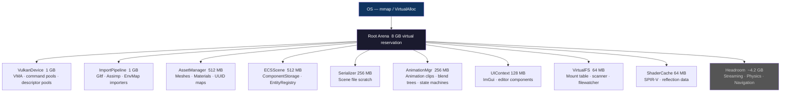
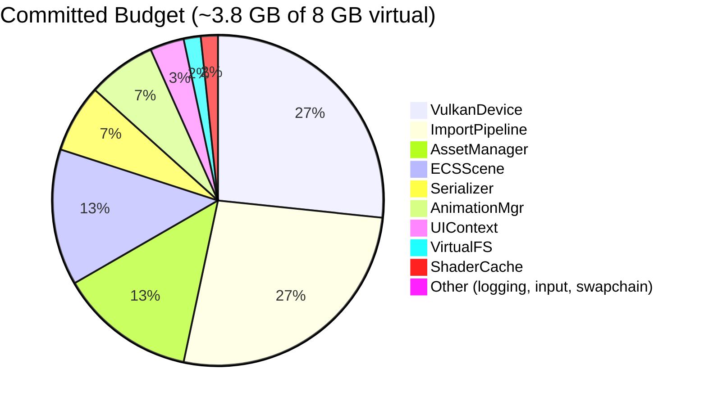
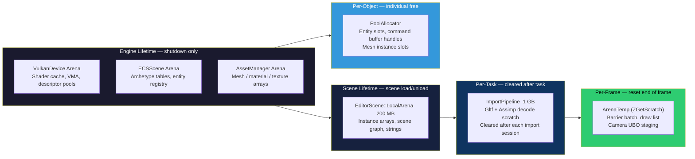
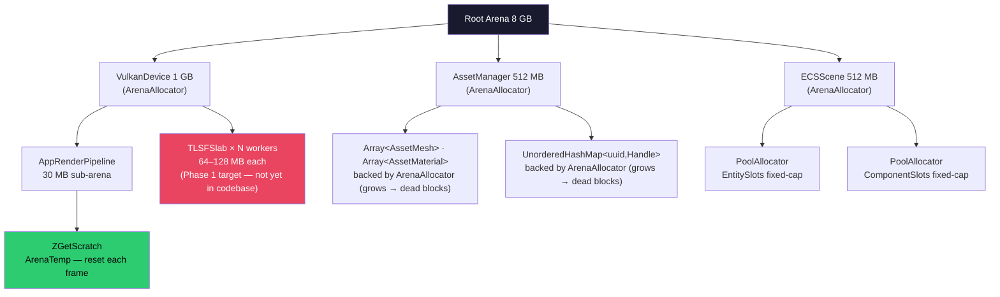
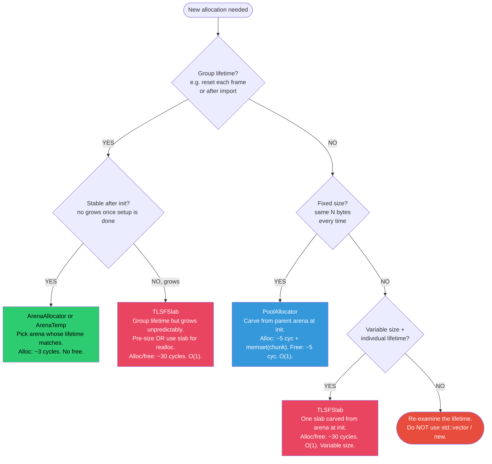
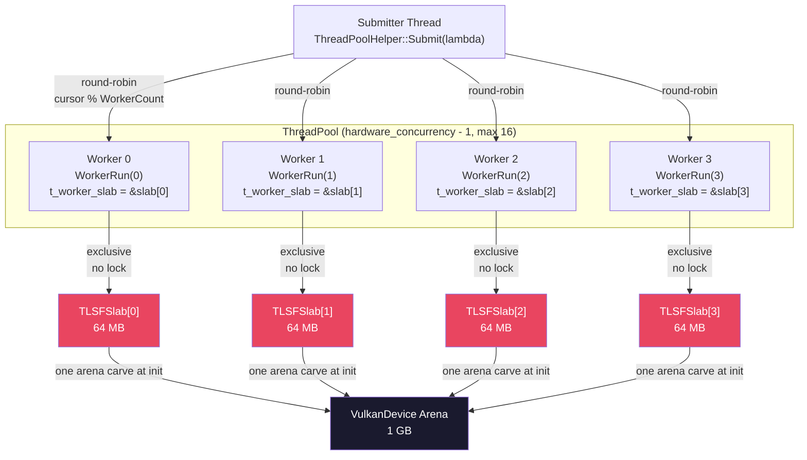
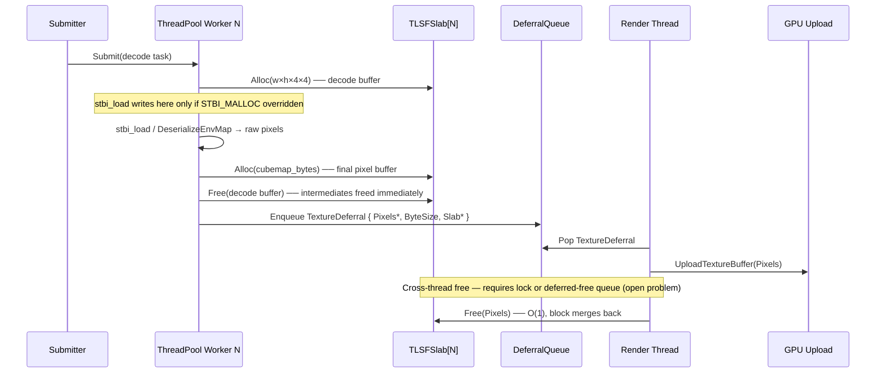
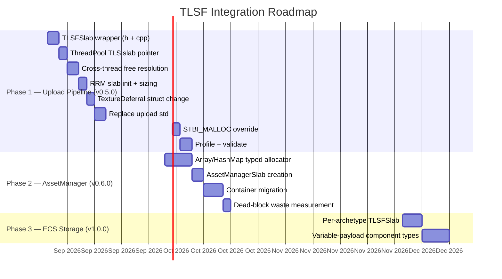

# Engine Memory Architecture — 8 GB Root Arena

---

# Memory Budget — Committed Distribution

---

# Memory Model — Lifetime Hierarchy

---

# Memory Model — Allocation Flow

---

# Allocation Decision Tree

---

# Thread Safety — Per-Worker TLSFSlabs

---

# Upload Pipeline — Sequence View

---

# Roadmap — TLSF Integration

