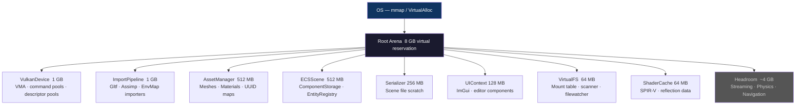
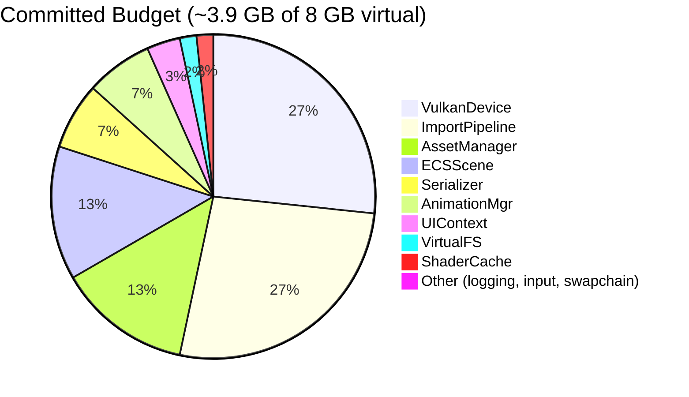
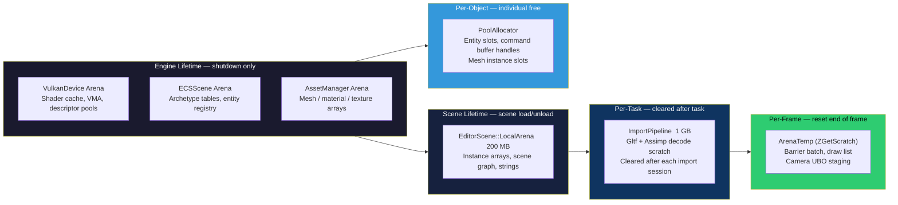
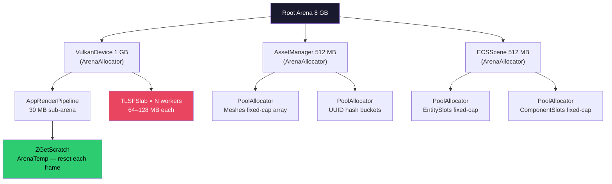
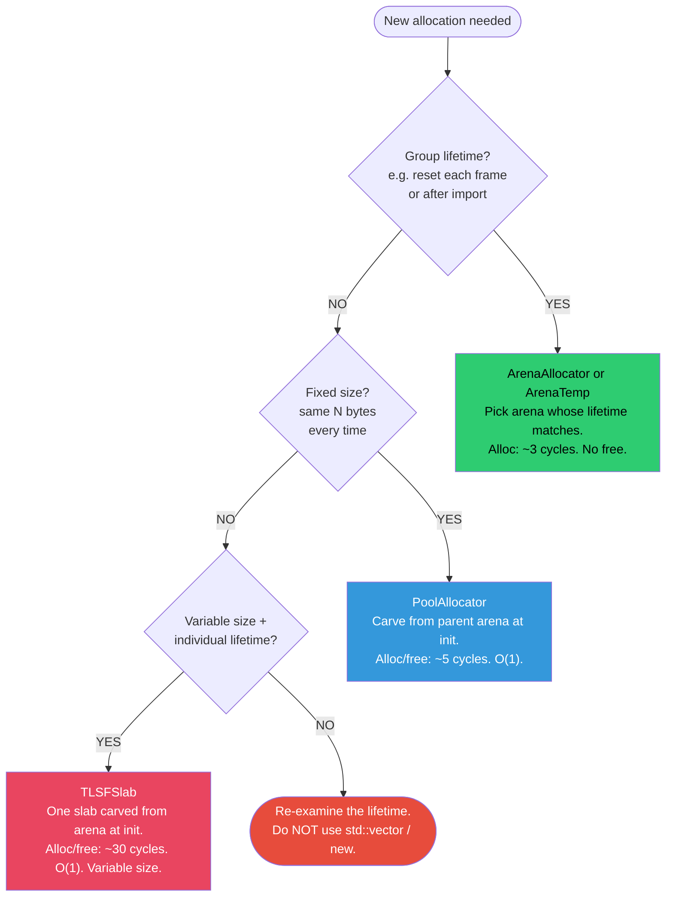
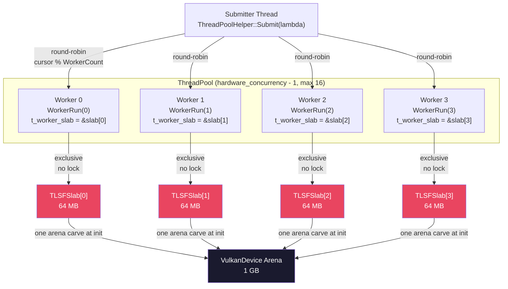
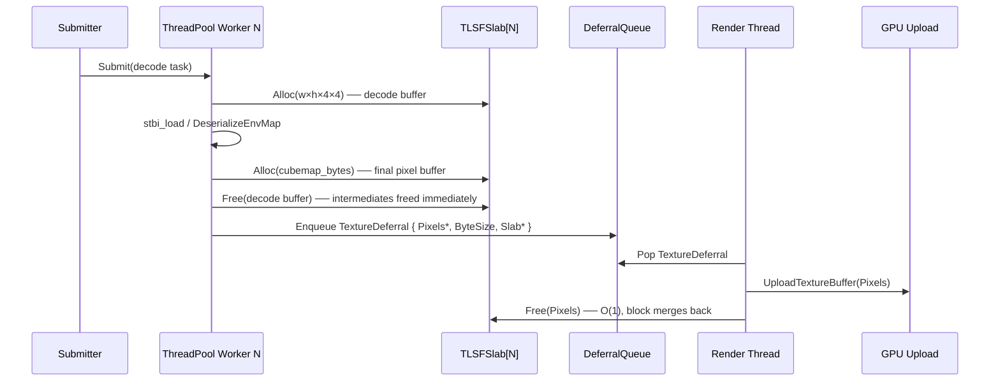
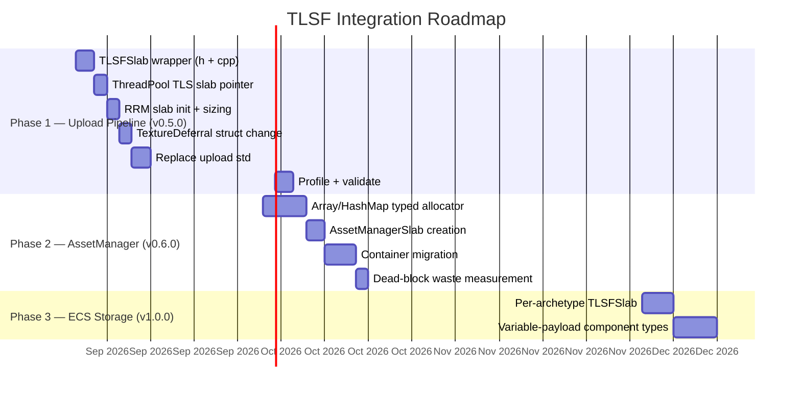

<!-- _class: title -->

# ZEngine
## Engine Architecture & Memory Management

Design — Concepts — Performance — TLSF Integration Roadmap

---

# Agenda

1. Why Custom Memory Management
2. Engine Memory Architecture
3. Memory Budget — 8 GB Root Arena
4. **ArenaAllocator** — Design, Performance, Pros & Cons
5. **PoolAllocator** — Design, Performance, Pros & Cons
6. Memory Model — Lifetime Hierarchy
7. Allocation Decision Tree
8. The Gap — What We Cannot Handle Today
9. **TLSF** — Algorithm, Guarantees, Performance
10. Integration Plan — Upload Pipeline
11. Next Steps & Future Scope

---

# Why Custom Memory Management?

<div class="columns">
<div>

### The system heap problem

`malloc` / `new` are **general purpose** — they handle every case adequately, but optimize for none.

- Non-deterministic latency (lock contention, OS page faults)
- Fragmentation accumulates silently over hours of runtime
- No visibility — engine cannot inspect, budget, or limit allocations
- Poor cache locality — related objects land on unrelated pages
- Per-allocation metadata overhead (~16–32 bytes per block)

</div>
<div>

### What a game engine needs

- **Frame-rate consistency** — GC pauses and lock spikes are unacceptable at 60+ FPS
- **Predictable memory use** — OOM at runtime must be detectable at startup
- **Cache-friendly layout** — hot data lives in sequential memory, not scattered across heap
- **Debug visibility** — know exactly where every byte came from, and why
- **Zero hot-path touches** — alloc/free on the render thread is off the table

</div>
</div>

> The goal is not to be clever. It is to know exactly what lifetime each allocation has, and pick the cheapest allocator that matches it.

---

# Engine Memory Architecture



Total committed: ~3.9 GB. Virtual: 8 GB. Physical RSS much lower — pages committed on first write.

---

# Memory Budget — 8 GB Root Arena



---

# Memory Budget — Key Numbers

| Subsystem | Budget | What Lives There |
|---|---|---|
| VulkanDevice | 1 GB | VMA, descriptor pools, command buffers, swapchain |
| ImportPipeline | 1 GB | GltfImporter (64 MB) + AssimpImporter (128 MB) × 2 instances |
| AssetManager | 512 MB | `Meshes[]`, `Materials[]`, `Textures[]`, UUID hash maps (5000-entry cap each) |
| ECSScene | 512 MB | `ComponentStorage` dense arrays, `EntityRegistry`, `ActorManager` |
| Serializer | 256 MB | EditorSceneSerializer scratch (150 MB sub-arena) |
| UIContext (editor) | 128 MB | ImguiLayer (64 MB) → DockspaceUI (32 MB) → AssetImporter (8 MB) |
| ShaderCache | 64 MB | SPIR-V, reflection data |
| VirtualFS | 64 MB | Mount table, scanner cache, file watcher events |

**Headroom reserved for future systems:**

| Planned System | Budget | Notes |
|---|---|---|
| StreamingManager | 2 GB | Open-world chunk streaming, cleared per region transition |
| PhysicsEngine | 512 MB | Rigid bodies, broad-phase |
| NavigationEngine | 256 MB | NavMesh, pathfinding, agent state |

---

# ArenaAllocator — Design

The fundamental primitive. Everything else is built on top of it.

<div class="columns">
<div>

### Virtual Reservation

```
 mmap(NULL, ZGiga(8), PROT_NONE, ...)
   │
   └── physical pages committed on first write
         → RSS << virtual reservation
```

The OS reserves the address range immediately. Physical RAM is paged in lazily. An 8 GB reservation costs only a few KB of kernel metadata.

### Sub-arenas

```
 parent.CreateSubArena(ZMega(350), &child)
   │
   └── child.m_memory = parent.m_current
       child.m_size   = 350 MB
       child.Allocate() bumps within its window
```

Sub-arenas share the parent's physical pages but track their own cursor.

</div>
<div>

### Memory Layout

```
 m_memory (base pointer)
   │
   ▼
 ┌──────────────────────────────────────────┐
 │  alloc A  │  alloc B  │  alloc C  │ ... │ committed
 └───────────┴───────────┴───────────┴─────┤
                          ▲                │
                    m_current_offset       │
                          ├───────────────►│ m_size
                                   uncommitted
```

### Alignment

Every allocation is forward-aligned to the requested boundary:

```cpp
aligned = (current + align - 1) & ~(align - 1)
next     = aligned + size
// assert next <= m_size
m_current_offset = next
return m_memory + aligned
```

</div>
</div>

---

# ArenaAllocator — API Surface

```cpp
struct ArenaAllocator {
    void Initialize(size_t size);            // mmap / VirtualAlloc reservation
    void Shutdown();                         // munmap / VirtualFree

    void* Allocate(size_t size,              // bump forward, align, return pointer
                   size_t alignment = DEFAULT_ALIGNMENT);
    void* Resize(void* ptr, size_t old_size, // extend in-place if last alloc,
                 size_t new_size, size_t alignment); // else new alloc + copy
    void  Clear();                           // reset cursor to initial offset
    void  CreateSubArena(size_t size, ArenaAllocator* out);
};

// Scratch (temp) arena — LIFO pairing
ArenaTemp scratch = ZGetScratch(arena);   // saves current cursor
// ... transient allocations ...
ZReleaseScratch(scratch);                 // restores cursor to saved position
```

### Key invariant

`Resize` on the **last** allocation in the arena extends it in-place (cursor rewind + rebump). On any other allocation it allocates a new block forward and copies — **the old block becomes permanently dead weight**.

This is safe and correct for scratch arenas. It is a slow memory leak for long-lived growing containers.

---

# ArenaAllocator — Performance

<div class="columns">
<div>

### Allocation cost

```
 Allocate(n, align):
   aligned   = (cur + align-1) & ~(align-1)   // 2 ops
   next      = aligned + n                     // 1 op
   assert    next <= m_size                    // 1 cmp
   cur       = next                            // 1 store
   return    base + aligned                    // 1 add
```

**~3–5 CPU cycles per allocation.**

No lock. No metadata write. No tree traversal. Just arithmetic on a single pointer.

### Comparison

| Allocator | Alloc cost | Free cost |
|---|---|---|
| ArenaAllocator | **3–5 cycles** | N/A |
| PoolAllocator | 5–8 cycles | 5–8 cycles |
| TLSF | ~20–40 cycles | ~20–40 cycles |
| jemalloc (system) | 50–300 cycles | 50–300 cycles |
| ptmalloc (glibc) | 100–500 cycles | 100–500 cycles |

</div>
<div>

### Cache behavior

Sequential allocations land in sequential addresses. For objects processed together (e.g. all `MeshInstance` structs during a frame), the entire working set fits in a predictable number of cache lines.

```
 Arena layout for one frame:
 ┌────┬────┬────┬────┬────┬────┐
 │ M0 │ M1 │ M2 │ M3 │ M4 │M5 │
 └────┴────┴────┴────┴────┴───┘
    one cache line (64 bytes) per mesh instance

 System heap for one frame:
 ┌────┐          ┌────┐     ┌────┐
 │ M0 │          │ M1 │     │ M2 │  ... scattered across pages
 └────┘          └────┘     └────┘
```

On a CPU with a 64-byte cache line, processing 100 sequentially-arena-allocated objects touches 100 cache lines. The same objects on the system heap may touch up to 100 different pages.

</div>
</div>

---

# ArenaAllocator — Pros

<div class="columns3">
<div class="card green">

### Fastest possible allocation

3–5 cycles — just a pointer bump. No lock, no metadata write, no free-list search. Faster than any general allocator by at least one order of magnitude.

</div>
<div class="card green">

### Zero fragmentation

No free means no holes. The arena is always a single contiguous block of used memory followed by free space. Fragmentation is architecturally impossible.

</div>
<div class="card green">

### Cache locality

Sequential allocations produce sequential addresses. Objects allocated together are processed together. The CPU prefetcher works at maximum efficiency.

</div>
</div>

<br>

<div class="columns3">
<div class="card green">

### Deterministic

Every Allocate call takes the same number of cycles regardless of fragmentation state, thread count, or prior allocation history. No GC jitter.

</div>
<div class="card green">

### Cheap sub-arenas

`CreateSubArena` is just a windowed view of the parent's address range — no OS call, no copy, no lock. Hierarchical memory budgets cost nothing at runtime.

</div>
<div class="card green">

### Debug visibility

The current offset is a single integer. Memory pressure for any subsystem is one subtraction.

</div>
</div>

---

# ArenaAllocator — Cons & Constraints

<div class="columns">
<div class="card red">

### No individual free

Once allocated, a block cannot be returned independently. The only reclamation mechanism is `Clear()` (reset entire arena) or `ZReleaseScratch()` (restore to a saved cursor position).

This is a design choice, not a bug. It enforces the lifetime contract.

**Consequence:** ArenaAllocator is wrong when you need to free individual objects at arbitrary times — entity removal, texture eviction, mid-session asset unload.

</div>
<div>
<br>

### Grow leaks dead blocks

```
 Array<T> initial:
 ┌────────────────────────┐ free
 │   8 entries (64 B)     │──►
 └────────────────────────┘
         ▲ cursor

 Array<T> after push (grows to 16):
 ┌────────────────────────┬─────────────────────────────┐ free
 │   8 entries (DEAD)     │   16 entries (live)         │──►
 └────────────────────────┴─────────────────────────────┘
                                   ▲ cursor
                   ▲ 64 bytes permanently lost
```

For `Array<T>` backed by a long-lived arena (like `AssetManager::Arena`), every `push_back` that triggers a realloc wastes the old block for the lifetime of the arena.

**Mitigation:** pre-size containers via `init(arena, expected_capacity)` to eliminate grows. Works for import pipelines; difficult for session-lifetime collections with unpredictable growth.

</div>
</div>

---

# PoolAllocator — Design

Fixed-size free list. Carved from an ArenaAllocator at initialization time.

<div class="columns">
<div>

### Layout

```
 Parent arena gives PoolAllocator a single block:

 ┌──────────────────────────────────────────┐
 │  chunk 0  │  chunk 1  │  chunk 2  │ ...  │
 └──┬────────┴──┬────────┴──┬────────┴──────┘
    │           │           │
    │   free list (links stored INSIDE chunks):
    │
    head ──► [chunk 2] ──► [chunk 0] ──► nullptr
                    ▲ PoolFreeNode* stored in first bytes of each free chunk
```

### Invariants

- All chunks are **exactly** `chunk_size` bytes
- Free list links occupy the first `sizeof(PoolFreeNode*)` bytes of each free chunk
- `Allocate()` — pop head, return the chunk pointer
- `Free(ptr)` — assert ownership + alignment, push head

</div>
<div>

### Initialization

```cpp
void PoolAllocator::Initialize(
    ArenaAllocator* arena,
    size_t total_size,
    size_t chunk_size,
    size_t alignment)
{
    // One arena carve for all chunks at once
    m_memory     = arena->Allocate(total_size, alignment);
    m_chunk_size = chunk_size;
    m_capacity   = total_size / chunk_size;

    // Link all chunks into the free list
    for (size_t i = 0; i < m_capacity; i++) {
        auto* node = (PoolFreeNode*)(m_memory + i * chunk_size);
        node->Next = head;
        head       = node;
    }
}
```

The parent arena is touched **once** at init. After that, alloc/free never touch the arena.

</div>
</div>

---

# PoolAllocator — API Surface

```cpp
struct PoolAllocator {
    using Arena = ArenaAllocator;

    void  Initialize(Arena* arena, size_t total_size,
                     size_t chunk_size, size_t alignment = DEFAULT_ALIGNMENT);
    void* Allocate();            // O(1) — pop free-list head
    void  Free(void* ptr);       // O(1) — push free-list head (bounds-checked)
    void  Clear();               // O(capacity) — rebuild free list, zero memory
};
```

### Usage in engine

```cpp
// Entity slot pool — 4096 entities, each 128 bytes
PoolAllocator entity_pool;
entity_pool.Initialize(&ecs_arena, 4096 * 128, 128);

// Allocate one entity slot
void* slot = entity_pool.Allocate();     // pops free list — ~5 cycles

// Return the slot
entity_pool.Free(slot);                  // pushes free list, asserts ownership — ~8 cycles
```

### Safety invariants enforced

- `Free` asserts `ptr >= m_memory && ptr < m_memory + total_size`
- `Free` asserts `(ptr - m_memory) % chunk_size == 0` (chunk-aligned)
- Use-after-free: subsequent `Allocate()` returns the freed chunk — callers must clear before use
- Double-free: second `Free` of same ptr corrupts the free list — detected by address assertion in debug

---

# PoolAllocator — Performance

<div class="columns">
<div>

### Allocation

```
 Allocate():
   assert head != nullptr           // 1 cmp
   result = head                    // 1 mov
   head   = head->Next              // 1 load
   return result                    // 1 ret
```

**~5 cycles.** One load, one store, one return.

### Free

```
 Free(ptr):
   assert in range + aligned        // 2 cmps (debug)
   node       = (PoolFreeNode*)ptr  // cast, 0 cycles
   node->Next = head                // 1 store
   head       = node                // 1 store
```

**~5–8 cycles.**

### No lock

Thread safety requires a CAS or spinlock — but all current engine pool allocators are used from a single thread (the main thread or a single render thread). No synchronization cost.

</div>
<div>

### Comparison for a pool-suited workload (entity add/remove)

| Allocator | Alloc | Free | Fragmentation |
|---|---|---|---|
| PoolAllocator | **~5 cyc** | **~5 cyc** | Zero |
| TLSF | ~20–40 cyc | ~20–40 cyc | < 2× |
| jemalloc | ~100 cyc | ~100 cyc | Low |
| ptmalloc | ~200 cyc | ~200 cyc | Medium |

### Memory overhead

```
 PoolAllocator backing for 4096 entities × 128 B:

   Total reserved: 524 288 bytes (512 KB)
   Metadata:       1 pointer in each free chunk
                   = 0 bytes overhead on allocated chunks
   Header cost:    sizeof(PoolAllocator) = ~48 bytes

 vs jemalloc for same workload:
   Each 128-byte alloc gets a ~32-byte header  → 25% overhead
   Total overhead: ~131 KB just for metadata
```

</div>
</div>

---

# PoolAllocator — Pros & Cons

<div class="columns">
<div>

### Pros

<div class="card green">
O(1) alloc AND free. Unlike the arena, individual objects can be returned without resetting the entire pool.
</div>
<br>
<div class="card green">
Zero fragmentation. All chunks are the same size — there are no holes, no wasted gaps, no coalescing needed. The free list is just a sequence of identical slots.
</div>
<br>
<div class="card green">
Cache-friendly free list. Free chunks link through their own memory — the link pointer lives in the chunk itself, no separate metadata array.
</div>
<br>
<div class="card green">
Backed by arena. Lifetime is tied to the parent arena — pool memory is reclaimed automatically when the arena is shut down.
</div>

</div>
<div>

### Cons

<div class="card red">
Fixed chunk size — only suited for objects of exactly one size. A pool for 128-byte entities cannot serve a 200-byte component.
</div>
<br>
<div class="card red">
Multi-size objects require multiple pools. Each pool must be pre-sized and pre-registered. Pooling heterogeneous objects means either wasting memory (largest size wins) or managing a family of pools.
</div>
<br>
<div class="card red">
Capacity is fixed at init time. Once all slots are allocated, Allocate() returns null. Growing a pool requires a new backing arena carve — no in-place extension.
</div>
<br>
<div class="card red">
Clear() is O(capacity) — it must traverse all chunks to rebuild the free list. This is acceptable for shutdown but unacceptable as a per-frame reset.
</div>

</div>
</div>

---

# Memory Model — Lifetime Hierarchy



Before writing `new` or `std::vector`, identify the lifetime. Pick the cheapest allocator that matches it. If nothing fits, the lifetime is unclear — clarify it first.

---

# Memory Model — Allocation Flow



No allocation escapes its designated arena. The root cursor is monotonic — the only reclamation is arena reset or pool destruction.

---

# Allocation Decision Tree



---

# The Gap — What Neither Allocator Handles

<div class="columns">
<div>

### Today: texture upload pipeline

Each texture goes through a thread pool worker:

```
 stbi_load / DeserializeEnvMap
         │
         ▼
 std::vector<float> output_buf    ← malloc(w*h*4*4)
         │
 Bitmap vertical_cross            ← std::vector inside → malloc
 Bitmap cubemap                   ← std::vector inside → malloc
         │
 std::vector<uint8_t> buffer      ← malloc(final_bytes)
         │
 TextureDeferral { Buffer = std::vector }
         │
 ThreadSafeQueue
         │
 CompleteDeferrals()
         │
 ~TextureDeferral()               ← free()
```

Each upload: **4–5 system heap round-trips.**
Multiple concurrent uploads: **contention on the global malloc lock.**

</div>
<div>

### Why ArenaAllocator does not fit

```
 Upload A: 16 MB   ← arena bump
 Upload B: 256 KB  ← arena bump
 Upload A done     ← NO FREE. 16 MB permanently dead.
 Upload C: 16 MB   ← arena bump
 ...
```

After 100 uploads the arena has leaked hundreds of MB — all dead blocks from completed uploads that could never be freed.

### Why PoolAllocator does not fit

```
 Chunk size = max texture = 48 MB

 8 in-flight uploads × 48 MB = 384 MB reserved
 A 256 KB thumbnail wastes 47.75 MB per slot.
```

Multiple pools by size class avoids waste — but blocks cannot merge across pools, and you must choose size class boundaries upfront.

</div>
</div>

---

# TLSF — What Is It?

**Two-Level Segregated Fit** (mattconte/tlsf) is a dynamic allocator designed for systems where alloc/free latency must be deterministic.

<div class="columns">
<div>

### Guarantees

| Property | Value |
|---|---|
| `tlsf_malloc(n)` | O(1) — worst case, not amortized |
| `tlsf_free(ptr)` | O(1) — including neighbor coalesce |
| `tlsf_realloc(ptr,n)` | O(1) if in-place, O(n) copy otherwise |
| Internal fragmentation | < 2× requested size |
| External fragmentation | Bounded — adjacent frees always merge |
| Per-block overhead | ~8–16 bytes (boundary tag header) |

### Origins

Originally designed for embedded real-time systems (RTEMS, uC/OS). Also used in Sony PS3 SDK, Haiku OS, and several game engines. The O(1) guarantee is formal — no code path is longer than O(1) regardless of heap state.

</div>
<div>

### Backed by a fixed slab

TLSF does not call `malloc` internally. It operates entirely within a flat buffer you hand it:

```cpp
// You provide the memory
uint8_t backing[64 * 1024 * 1024]; // 64 MB slab

// TLSF manages it
tlsf_t pool = tlsf_create_with_pool(backing, sizeof(backing));

// Allocate from it
void* a = tlsf_malloc(pool, 16 * 1024 * 1024);  // 16 MB
void* b = tlsf_malloc(pool, 256 * 1024);         // 256 KB

// Free returns to the slab — coalesces with neighbors
tlsf_free(pool, a);  // 16 MB block merges back into free space

// The slab is immediately reusable for the next allocation
void* c = tlsf_malloc(pool, 14 * 1024 * 1024);  // 14 MB — succeeds
```

This is the key difference from `malloc`: the backing memory comes from **our** arena — one reservation, zero system heap involvement after init.

</div>
</div>

---

# TLSF — Internal Design: Two-Level Bitmap

TLSF organizes free blocks into a two-tier segregated free list indexed by a bitmap. Finding the right free list is a single bit-scan instruction.

```
 First-Level Index (FL): floor(log2(block_size))
 Second-Level Index (SL): subdivides each FL band into 16–32 sub-classes

 FL bitmap (one bit per size class)
 ┌──┬──┬──┬──┬──┬──┬──┬──┐
 │0 │0 │1 │0 │1 │1 │0 │1 │  1 = at least one free block in this class
 └──┴──┴──┴──┴──┴──┴──┴──┘
       │        │  │     │
       │        │  └─── FL=7 → SL bitmap for 64MB–128MB range
       │        └────── FL=5 → SL bitmap for 16MB–32MB range
       └─────────────── FL=3 → SL bitmap for 4MB–8MB range

 Second-Level bitmap for FL=5 (16 MB – 32 MB):
 ┌──┬──┬──┬──┬──┬──┬──┬──┬──┬──┬──┬──┬──┬──┬──┬──┐
 │0 │0 │1 │0 │0 │0 │1 │0 │0 │0 │0 │1 │0 │0 │0 │0 │
 └──┴──┴──┴──┴──┴──┴──┴──┴──┴──┴──┴──┴──┴──┴──┴──┘
           │           │           │
         17.5MB       19MB        22MB  ← free block size classes

 Free list head for each SL:
 [17.5MB] → block → block → nullptr
 [19MB  ] → block → nullptr
 [22MB  ] → block → block → block → nullptr
```

`tlsf_malloc(n)`:
1. Compute FL = `floor(log2(n))`, SL = sub-class of n within FL band — 2 ops
2. Find next set bit in the bitmap at or above (FL, SL) — 1 `BSF` instruction
3. Pop the head of that free list — 1 load
4. Split remainder back into a smaller free block — 2 list ops
**Total: ~8–12 operations — O(1) by construction.**

---

# TLSF — Block Structure

Each block in the TLSF heap has a small header. Headers form a doubly-linked physical list for coalescing.

```
 Memory layout of a TLSF slab:

 ┌───────────────────────────────────────────────────────────────────┐
 │                     TLSF slab (e.g. 64 MB)                       │
 ├──────────┬──────────────────────┬──────────────┬─────────────────┤
 │ TLSF hdr │    Allocated Block   │  Free Block  │ Allocated Block │
 │ ~3 KB    │                      │              │                 │
 └──────────┴─────────────┬────────┴──────────────┴─────────────────┘
                           │
                  Block header (8–16 bytes):
                  ┌────────────────────────────────────┐
                  │ prev_phys_block* │ size | flags     │
                  │ (free only:      │                  │
                  │  next_free*,     │   F = free bit   │
                  │  prev_free*)     │   P = prev free  │
                  └────────────────────────────────────┘
                  │                                    │
                  │◄── header overhead: 8 B alloc     ►│
                  │                    16 B free        │

 Coalesce on free:
 ┌───────────┬──────────┬───────────┐     ┌──────────────────────┐
 │ free 8MB  │ free 4MB │ free 6MB  │ ──► │    merged free 18MB  │
 └───────────┴──────────┴───────────┘     └──────────────────────┘
   All three blocks are adjacent in physical memory →
   tlsf_free() merges them in O(1) using prev_phys_block pointer.
```

Coalescing is what prevents the "fragmentation cliff" seen with multiple pools: TLSF can always recombine adjacent free space regardless of what size class it was in.

---

# TLSF — Performance Profile

<div class="columns">
<div>

### Alloc and free cost

```
 tlsf_malloc(n):
   FL, SL  = bitmap indices of n        ~2 ops
   BSF on bitmap to find free slot      ~1 op (hardware BSF)
   pop free list head                   ~2 ops
   split remainder                      ~4 ops
   ─────────────────────────────────────
   ~20–40 cycles total (cache-warm)
```

```
 tlsf_free(ptr):
   merge left neighbor  (check P-bit)   ~3 ops
   merge right neighbor (check F-bit)   ~3 ops
   compute FL, SL for merged block      ~2 ops
   push onto free list                  ~2 ops
   set bitmap bit                       ~1 op
   ─────────────────────────────────────
   ~20–40 cycles total (cache-warm)
```

### Cache miss cost

The free list traversal is O(1) — but the first pop involves loading the free block header. If the slab is hot in L2, this is ~5 cycles. If cold, it is one L3 or DRAM miss (~50–200 cycles).

For the texture upload slab (active during every import session), the slab is L2/L3 resident.

</div>
<div>

### Comparison for variable-size, individual-lifetime workload

| Allocator | Alloc | Free | Notes |
|---|---|---|---|
| ArenaAllocator | **3 cyc** | — | No free; leak on grow |
| PoolAllocator | **5 cyc** | **5 cyc** | Fixed size only |
| **TLSF** | **~30 cyc** | **~30 cyc** | Variable size, O(1) |
| jemalloc | ~100 cyc | ~100 cyc | Lock + bookkeeping |
| ptmalloc | ~200 cyc | ~200 cyc | Heavy metadata |

### Why TLSF beats jemalloc here

1. **No lock.** Per-slab, per-thread — no contention.
2. **Known backing.** The slab is pre-allocated from our arena — no OS calls, no TLB misses on new pages.
3. **Bounded fragmentation.** jemalloc fragments over hours; TLSF coalesces on every free.
4. **Deterministic.** No background compaction thread, no epoch-based reclaim.

</div>
</div>

---

# TLSFSlab — The Engine Wrapper

<div class="columns">
<div>

### Structure

```cpp
// ZEngine/ZEngine/Core/Memory/TLSFSlab.h

struct TLSFSlab {
    void*  Backing = nullptr;
    tlsf_t Pool    = nullptr;

    void  Init(ArenaAllocator* arena, size_t bytes);
    void* Alloc(size_t n);
    void* Realloc(void* ptr, size_t n);
    void  Free(void* ptr);
    void  Shutdown();
    size_t Overhead() const; // diagnostic: TLSF metadata bytes
};
```

### Relationship to arena

```
 Device->Arena  (ArenaAllocator, 1 GB)
   │
   └── ZPushSize(&Device->Arena, 64MB, 64)
                     │
                     ▼
         ┌──────────────────────────────────┐
         │   TLSFSlab::Backing  (64 MB)     │
         │                                  │
         │  [tlsf metadata ~3KB]            │
         │  [free block: 64MB - 3KB]        │
         │                                  │
         │  tlsf_malloc ──► alloc from here │
         │  tlsf_free   ──► merge here      │
         └──────────────────────────────────┘

 Arena cursor moves once at Init.
 Arena is NOT touched by subsequent Alloc/Free calls.
```

</div>
<div>

### Init

```cpp
void TLSFSlab::Init(ArenaAllocator* arena, size_t bytes)
{
    Backing = ZPushSize(arena, bytes, 64);
    ZENGINE_VALIDATE_ASSERT(Backing, "TLSFSlab: arena OOM");
    Pool    = tlsf_create_with_pool(Backing, bytes);
    ZENGINE_VALIDATE_ASSERT(Pool,    "TLSFSlab: tlsf_create failed");
}
```

### Alloc / Free

```cpp
void* TLSFSlab::Alloc(size_t n)
{
    void* p = tlsf_malloc(Pool, n);
    ZENGINE_VALIDATE_ASSERT(p, "TLSFSlab: slab exhausted");
    return p;
}

void TLSFSlab::Free(void* ptr)
{
    if (ptr) tlsf_free(Pool, ptr);
}
```

### Shutdown

```cpp
void TLSFSlab::Shutdown()
{
    if (Pool)    { tlsf_destroy(Pool); Pool    = nullptr; }
    // Backing is part of the parent arena — it is NOT freed here.
    // The parent arena's Shutdown() reclaims the entire range.
    Backing = nullptr;
}
```

</div>
</div>

---

# Thread Safety — Per-Worker Slabs



Thread-local `t_worker_slab` set at `WorkerRun(idx)` start. Lambdas call `GetWorkerSlab()`. **Zero contention** — each slab is single-threaded by construction.

---

# Upload Pipeline — Before vs After

<div class="columns">
<div>

### Before (today)

```
 Worker thread
   ├── std::vector<float> output_buf
   │       └── malloc(w × h × 4 × 4)    ← system heap
   │
   ├── Bitmap vertical_cross
   │       └── std::vector<uint8_t>      ← malloc
   │
   ├── Bitmap cubemap
   │       └── std::vector<uint8_t>      ← malloc
   │
   ├── std::vector<uint8_t> buffer
   │       └── malloc(final_bytes)       ← malloc
   │
   └── TextureDeferral {
           Buffer = std::vector<uint8_t> ← ownership move into queue
       }

 Render thread (CompleteDeferrals)
   └── ~TextureDeferral()
           └── ~vector<uint8_t>()        ← free() on system heap
```

4–5 system heap round-trips per texture.
Multiple workers contend on glibc's arena lock.

</div>
<div>

### After (with TLSF)

```
 Worker thread  (t_worker_slab = &slab[idx])
   ├── float* raw = slab->Alloc(w×h×4×4) ← TLSF, no lock
   │
   ├── Bitmap vertical_cross (uses slab)  ← TLSF
   │       └── slab->Free(raw)            ← freed immediately when done
   │
   ├── Bitmap cubemap (uses slab)         ← TLSF
   │       └── freed immediately
   │
   ├── uint8_t* pixels = slab->Alloc(n)   ← TLSF, only live alloc
   │       └── memmove(pixels, cubemap, n)
   │
   └── TextureDeferral {
           Pixels   = pixels
           ByteSize = n
           Slab     = &slab[idx]          ← back-ref for free
       }

 Render thread (CompleteDeferrals)
   └── UploadTextureBuffer(pixels)
       d.Slab->Free(d.Pixels)             ← O(1) TLSF free, block merges
```

1 live TLSF allocation at handoff. Zero system heap involvement.

</div>
</div>

---

# Upload Pipeline — Sequence View



The slab block is live only from decode completion to GPU upload confirmation — the narrowest possible window. Every free immediately coalesces with adjacent free space, keeping the slab in a clean, fully-mergeable state for the next texture.

---

# TextureDeferral — Struct Change

<div class="columns">
<div>

### Before

```cpp
struct TextureDeferral {
    // std::variant<> occupies max(sizeof(T)) bytes
    // + discriminant + alignment padding
    // = ~40 bytes for the variant alone
    std::variant<
        unsigned char*,           // borrowed (IsLarge = false)
        std::vector<uint8_t>      // owned    (IsLarge = true)
    > Buffer;

    Textures::TextureHandle TexHandle = {};
    uint8_t FrameIdx   = 0;
    uint8_t ThreadIdx  = 0;
    bool    IsLarge    = false;
};
```

`std::vector<uint8_t>` inside the variant: 24 bytes on the stack (pointer + size + capacity), heap allocation holds the actual pixel data. Moving the deferral into the queue moves the vector's internal state — no pixel copy, but the heap allocation stays live until `~TextureDeferral` runs on the render thread.

</div>
<div>

### After

```cpp
struct TextureDeferral {
    unsigned char*              Pixels   = nullptr;
    size_t                      ByteSize = 0;
    Textures::TextureHandle     TexHandle = {};
    uint8_t                     FrameIdx  = 0;
    uint8_t                     ThreadIdx = 0;
    bool                        IsLarge   = false;
    // null when IsLarge=false (borrowed pointer, slab not involved)
    Core::Memory::TLSFSlab*     Slab     = nullptr;
};
```

Flat struct. No heap ownership in the struct itself.

`CompleteDeferrals()` change:

```cpp
// Before:
auto& buf = std::get<std::vector<uint8_t>>(d.Buffer);
UploadTextureBuffer(d.FrameIdx, d.ThreadIdx, d.TexHandle,
                    buf.data());
// implicit: vector destructs → free()

// After:
UploadTextureBuffer(d.FrameIdx, d.ThreadIdx, d.TexHandle,
                    d.Pixels);
if (d.IsLarge && d.Slab)
    d.Slab->Free(d.Pixels);  // O(1), merges back into slab
```

</div>
</div>

---

# Fragmentation: Arena vs Pool vs TLSF

```
 Texture upload session — 10 textures, mixed sizes:
 [16MB] [256KB] [8MB] [16MB] [256KB] [256KB] [8MB] [16MB] [256KB] [8MB]

 ArenaAllocator (if it had free — it does not, showing the leak pattern):
 ┌──────┬───┬──────┬──────┬───┬───┬──────┬──────┬───┬──────┐
 │ 16MB │256│  8MB │ 16MB │256│256│  8MB │ 16MB │256│  8MB │ total: ~73MB
 └──────┴───┴──────┴──────┴───┴───┴──────┴──────┴───┴──────┘
  All freed? Cursor reset = all 73MB back. But no INDIVIDUAL free.

 PoolAllocator (chunk = 16MB, 8 slots = 128MB reserved):
 ┌──────┬──────┬──────┬──────┬──────┬──────┬──────┬──────┐
 │ 16MB │ 16MB │ 16MB │ 16MB │ 16MB │ 16MB │ 16MB │ 16MB │ 128MB reserved
 │ used │wasted│ used │ used │wasted│wasted│ used │ used │ 64MB wasted
 └──────┴──────┴──────┴──────┴──────┴──────┴──────┴──────┘

 TLSF (one 64MB slab):
 Alloc 16MB:  [16MB used] [48MB free]
 Alloc 256KB: [16MB] [256KB] [~47.7MB free]
 Free 16MB:   [16MB FREE] [256KB] [~47.7MB free]
 Coalesce:    [16MB FREE] [256KB] [~47.7MB free]  ← left merge skipped (256KB between)
 Alloc 8MB:   [8MB used] [8MB FREE] [256KB] [~47.7MB free]  ← fits in 16MB freed slot

 After all 10 textures freed: single contiguous 64MB free block.
 Fragmentation: zero. All adjacent frees coalesced.
```

---

# Sizing and Memory Impact

<div class="columns">
<div>

### Slab size per worker

| Texture type | Max size | With intermediates |
|---|---|---|
| 2D RGBA 8-bit, 4K | 64 MB | 64 MB |
| 2D float HDR, 2K | 32 MB | 32 MB |
| Cubemap (equirect → 6 faces) | 48 MB | ~96 MB (input + output) |
| Environment map (.zenvmap) | 48 MB | 48 MB |

Worst case: equirect → cubemap conversion holds two 48 MB bitmaps simultaneously = **96 MB peak**.

Recommended slab size: **128 MB** per worker to cover the worst case with headroom.

### Reservation vs RSS

Like all slabs backed by the arena, the 128 MB slab is a **virtual reservation**. Physical pages are committed only when TLSF writes a block header to that region. A worker that only handles 256 KB textures will commit far fewer physical pages than 128 MB.

</div>
<div>

### Total reservation

| Config | Workers | Per-slab | Total |
|---|---|---|---|
| Developer (12-core) | 11 | 128 MB | 1.4 GB virtual |
| CI runner (4-core) | 3 | 128 MB | 384 MB virtual |
| Target console (8-core) | 7 | 64 MB | 448 MB virtual |

These reservations come from the existing `VulkanDevice` arena budget (1 GB). No new top-level budget slot required.

### TLSF metadata overhead

```
 tlsf_create_with_pool overhead: ~3 KB per slab
 Block header per alloc:         8 bytes
 Block header per free block:    16 bytes (extra 2 pointers)

 For 10 concurrent allocs in a 64MB slab:
 Overhead: 3 KB + 10×16 B = ~3.2 KB
 Overhead fraction: 3.2 KB / 64 MB = 0.005%
```

Negligible in practice.

</div>
</div>

---

# Future Scope — AssetManager

The `AssetManager` arena backs long-lived `Array<T>` and `UnorderedHashMap<K,V>` containers. Every `grow()` wastes a dead block.

```
 AssetManager::Arena (512 MB)
   │
   ├── Meshes[]              Array<AssetMesh>      — grows with every import
   ├── NodeHierarchies[]     Array<AssetNode>       — grows with every import
   ├── Materials[]           Array<AssetMaterial>   — grows with every import
   ├── UUIDToTextureHandle   UnorderedHashMap<uuid,TextureHandle>
   └── UUIDToMaterialSlot    UnorderedHashMap<uuid,uint32_t>
```

After a session importing 500 assets with 3 resizes each:

```
 Dead blocks per container = ~log2(current_size) × avg_wasted_block_size
 5 containers × ~3 grows × avg 50MB = ~750 MB of dead arena blocks
```

A `TLSFSlab` backing these containers would give `realloc()` behavior: if the block immediately following the container's current allocation is free, TLSF extends in-place — zero copy. Dead block accumulation drops to near zero.

**Requires:** `Array<T>` and `UnorderedHashMap<K,V>` to accept a typed allocator parameter. This is a separate refactor — the container interface currently only accepts `ArenaAllocator*`.

---

# Future Scope — ECS Component Storage

```
 ComponentStorage today (planned — issue #642):

 ArchetypeTable[Position]     PoolAllocator  — 3× float, fixed size, fine
 ArchetypeTable[Velocity]     PoolAllocator  — 3× float, fixed size, fine
 ArchetypeTable[MeshRenderer] PoolAllocator  — uuid + handle, fixed size, fine
 ArchetypeTable[Physics]      ???            — variable: shape data, constraints
 ArchetypeTable[Script]       ???            — variable: script bytecode + state
```

When component types carry variable-size payloads (script state, animation clips, physics shapes), a `PoolAllocator` per archetype requires knowing the maximum instance size upfront. A `TLSFSlab` per archetype table handles heterogeneous payloads cleanly:

```
 ArchetypeTable[Physics]
   ├── backing: TLSFSlab (16 MB, carved from ECSScene arena)
   ├── entity 1: RigidBody  { mass, inertia, 6 constraint params }  = 72 bytes
   ├── entity 2: Cloth      { mesh_ref, wind_params[32], pin[16] }  = 320 bytes
   └── entity 3: Softbody   { particle[128] }                       = 512 bytes
```

No pre-declared fixed size. TLSF handles the mix in O(1).

---

# Roadmap



---

# Roadmap — Implementation Phases

<div class="columns">
<div>

### Phase 1 — Upload pipeline (target: v0.5.0)

1. Add `ZEngine/ZEngine/Core/Memory/TLSFSlab.h` / `.cpp`
2. Add `thread_local TLSFSlab* t_worker_slab` to `ThreadPool.h`; set in `WorkerRun(idx)`
3. Create `m_upload_slabs[MAX_WORKERS]` in `RenderResourceManager`; init from `Device->Arena`
4. Replace `TextureDeferral::Buffer` variant with `Pixels + Slab`
5. Replace `std::vector<uint8_t>` in upload lambda with slab allocs
6. Profile: import session memory pressure before/after

**Validation:** import 50 mixed textures (256 KB to 4K HDR), measure system heap allocation count = 0 during upload.

</div>
<div>

### Phase 2 — Asset containers (target: v0.6.0)

1. Add typed allocator parameter to `Array<T>` and `UnorderedHashMap<K,V>`
2. Create `AssetManagerSlab` (TLSFSlab, 256 MB, from `AssetManager::Arena`)
3. Migrate all 5 `AssetManager` containers to use the slab
4. Remove dead-block waste from grow path

### Phase 3 — ECS component storage (target: v1.0.0)

1. Per-archetype `TLSFSlab` for variable-payload component types
2. Integrate with ComponentStorage allocation protocol (issue #642+)

### Metrics to track

| Metric | Before | Target |
|---|---|---|
| System heap allocs during import | N per texture | 0 |
| AssetManager arena dead bytes | ~750 MB / session | < 10 MB |
| Max GPU upload latency | non-deterministic | < 2× median |

</div>
</div>

---

<!-- _class: center -->

# Summary

<br>

| Allocator | Cost | Free? | Size | Best For |
|---|---|---|---|---|
| **ArenaAllocator** | ~3 cycles | No | Any | Scratch, import, per-frame |
| **PoolAllocator** | ~5 cycles | Yes | Fixed | Entity slots, handles, same-type objects |
| **TLSFSlab** | ~30 cycles | Yes | Variable | Upload buffers, asset metadata, ECS payloads |
| System heap | ~100–500 cycles | Yes | Variable | Nothing on the hot path |

<br>

> Arena and Pool cover 95% of engine allocations today.
> TLSF fills the remaining 5% — variable size, individual lifetimes — currently leaking through to the system heap.
> The upload pipeline is Phase 1: measurable, isolated, zero risk to other systems.
