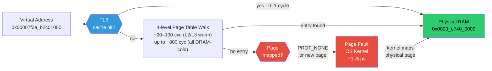
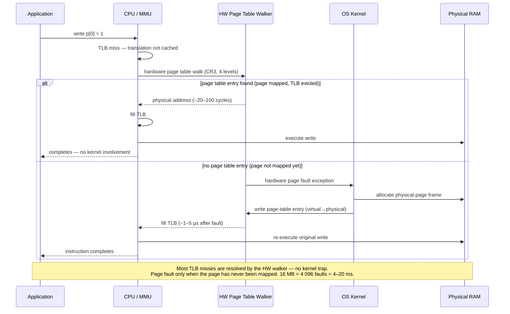
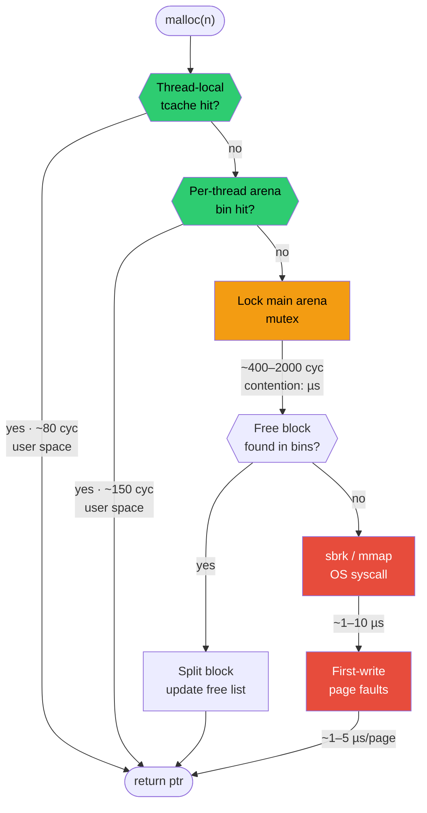
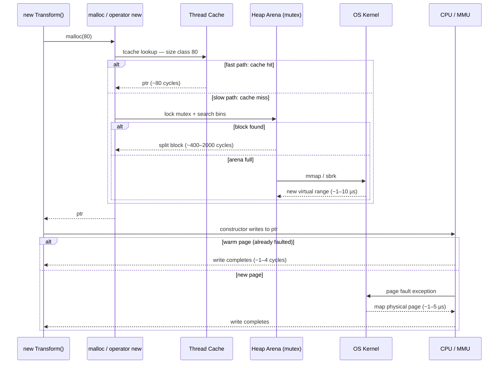

<!-- _class: title -->

# The System Heap
## How It Works — and Why It Is Slow for a Real-Time Engine

Virtual Memory · Page Faults · Physical Mapping · `malloc` Internals

---

# Virtual Memory — the Illusion Every Process Lives In

Every process sees a flat, private address space. On 64-bit Linux this is 128 TB. No process actually has 128 TB of RAM — the OS creates the illusion through **virtual memory**.

<div class="columns">
<div>

### Virtual vs physical addresses

`int* p = new int(42)` — the pointer value `p` is a **virtual address**. The CPU never uses it directly. Every memory access passes through a hardware translation unit (MMU) that converts it to a physical address.



### What the OS does at process start

The OS gives the process a virtual address space. It does **not** allocate physical RAM up front. Physical pages are mapped on demand — the first time code actually reads or writes a virtual address.

</div>
<div>

### The Translation Lookaside Buffer (TLB)

Walking the 4-level page table on every memory access would be catastrophically slow (4 extra memory reads per access). The CPU caches recent translations in the **TLB** — a small, fast, fully-associative cache of `virtual page → physical frame` mappings.

```
 L1 TLB (data):
   ~64 entries × 4 KB page = 256 KB of coverage
   hit cost: 0–1 cycle (parallel with L1 cache access)

 L2 TLB (unified):
   ~1024–4096 entries × 4 KB = 4–16 MB of coverage
   hit cost: ~5–7 cycles

 TLB miss (hardware page-table walk):
   page table entries in L2/L3:  ~20–100 cycles
   page table entries cold (DRAM): ~200–800 cycles (4 × DRAM latency)
   on SMP — mapping change requires TLB shootdown: ~1–10 µs
```

A process that touches more than 256 KB of memory in varied patterns constantly evicts TLB entries. Every eviction means paying the full page-table walk cost on the next access.

</div>
</div>

---

# Page Faults — When the OS Steps In

A **page fault** occurs when the CPU tries to access a virtual address that has no physical mapping yet. The CPU raises a hardware exception, the OS takes over, resolves the mapping, and returns control to the process.

<div class="columns">
<div>

### The two types

**Minor (soft) page fault** — the page exists in memory but the mapping is not in the page table yet (e.g. a freshly `mmap`'d range, or a copy-on-write fork).
- OS cost: fill one page-table entry, return.
- Wall-clock: **~1–5 µs**.

**Major (hard) page fault** — the page was swapped to disk and must be read back.
- OS cost: seek + read from disk.
- Wall-clock: **~1–10 ms** (SSD) / **~10–100 ms** (HDD).

### When they happen



`malloc` defers physical page allocation to first write. The cost is hidden inside the first access, not inside `malloc` itself.

</div>
<div>

### Why this is catastrophic for a renderer

A texture decode worker calls:

```cpp
// Decoding a 4096×4096 RGBA float HDR image
std::vector<float> buf(4096 * 4096 * 4);  // 256 MB
```

The `vector` constructor zero-fills the buffer. Each zero-fill write to a fresh page triggers a minor page fault:

```
 256 MB / 4 KB per page = 65 536 page faults
 65 536 × ~2 µs average = ~130 ms of kernel time
```

The **import pipeline stalls for 130 ms** — 7.8 dropped frames at 60 FPS — not because decode is slow, but because the OS is wiring physical memory for `std::vector`.

### The engine's answer

`ArenaAllocator` calls `mprotect` to commit pages in aligned chunks **before** handing memory to callers. The fault cost is paid in one known call during `Allocate()`, not scattered across the first write to each page inside user code. The cost still exists — but it is predictable, attributable, and measurable.

</div>
</div>

---

# Inside `malloc` — What Happens Before Your Code Runs

`malloc` and `new` do not ask the OS for memory on every call. They maintain a **user-space heap** — a pool of previously acquired memory — and sub-allocate from it. Asking the OS is the slow path.

<div class="columns">
<div>

### The call path



On a warm cache with a single thread, `malloc` is 80–150 cycles. Under 8 worker threads all allocating simultaneously, **any call can block at the mutex** for an unbounded duration.

</div>
<div>

### What `free` does

```
 free(ptr):

 1. Read the block's size header (8 bytes before ptr).
 2. Determine if ptr goes into tcache, fastbin, or main arena.
 3. For larger blocks: coalesce with adjacent free blocks.
    Requires reading the NEXT block's header to check if free.
    → random memory access → likely cache miss.
 4. Update the free list doubly-linked pointers.
 5. For mmap-backed large blocks (>= MMAP_THRESHOLD, default 128 KB):
    munmap() is called directly → OS reclaims pages immediately.
    → TLB shootdown across all cores on SMP.
    For smaller blocks: returned to bin. No OS call.
    malloc_trim() may call madvise(MADV_DONTNEED) periodically
    when the heap top chunk is large — NOT on every free().
```

`free` modifies at least 2 cache lines (the freed block's header, the adjacent block's header). Under multithreaded use, step 3–4 require the arena mutex. TLB shootdown only occurs for large (`munmap`-backed) frees or periodic heap trimming — not for typical small-object frees.

### The hidden block header

Every allocated block carries metadata the allocator wrote just before the pointer it returned:

```
 Address returned to caller: 0x7f0000_10
 Actual block start:         0x7f0000_00   ← 16 bytes before

 [prev_size 8B][size|flags 8B] | [your data starts here]
                                ▲
                             what malloc() returns
```

This 16-byte header is why `sizeof` and `malloc`'s internal size are always different.

</div>
</div>

---

# Putting It Together — The True Cost of `new T` in an Engine

A single `new T` in a hot path in a game engine does not cost one instruction. It chains through every mechanism described on the previous slides.



| | Best case | Typical | Worst case |
|---|---|---|---|
| tcache hit, warm page | **~80 cycles** | | |
| arena search, no fault | | **~500 cycles** | |
| contention + page fault | | | **~50 µs (150 000 cycles)** |

The ratio between best and worst case is **~1875:1**.

A real-time engine cannot tolerate this variance. **The frame budget is 16.6 ms. A single worst-case `new` consumes 0.3% of it. Ten concurrent worst-case `new` calls consume 3%.** And these calls happen in the thousands per frame across texture uploads, ECS updates, and import pipelines.

> The problem is not that `malloc` is slow on average. The problem is that its latency is **non-deterministic** — you cannot reason about it, schedule around it, or budget for it. A custom allocator's contract is: *I will cost exactly this much, always.*

---

# Why the Engine Replaces the Heap

<div class="columns">
<div>

### What the system heap cannot provide

<div class="card red">

**No determinism.** Any call may hit the slow path. The renderer cannot guarantee a frame completes in 16.6 ms when allocation cost varies by 1875×.

</div>
<div class="card red">

**No locality.** Objects allocated minutes apart land on unrelated pages. The CPU prefetcher cannot predict access patterns. TLB coverage is exhausted by scattered allocations. Every hot loop pays the cache miss tax.

</div>
<div class="card red">

**No visibility.** The engine cannot see which subsystem allocated what, how close any subsystem is to its budget, or whether a platform has enough RAM before the game launches.

</div>
<div class="card red">

**No ownership.** Any code anywhere can allocate any amount. There is no lifetime contract. Memory silently leaks into fragmentation and is never returned to the OS.

</div>

</div>
<div>

### What custom allocators provide

<div class="card green">

**Determinism.** `ArenaAllocator::Allocate` is a pointer bump — 3–5 cycles plus a bounded `mprotect` call if crossing a page boundary. No mutex, no free-list search, no surprise.

</div>
<div class="card green">

**Locality.** Sequential allocations produce sequential addresses. Objects that are processed together are stored together. The prefetcher works at maximum efficiency. One TLB entry can cover an entire frame's working set.

</div>
<div class="card green">

**Visibility.** Every arena has a cursor. Memory pressure is `current_offset - initial_offset`. Budget enforcement is a single comparison. OOM is detectable at startup, not at runtime.

</div>
<div class="card green">

**Ownership.** Every allocation has a named arena, a declared lifetime, and a single owner. Reclamation is `Clear()` — two cursor stores that reset the bump pointer, returning all memory to the pool in constant time.

</div>

</div>
</div>

---

<!-- _class: center -->

# Summary

<br>

| Mechanism | What happens | Engine impact |
|---|---|---|
| Virtual memory | Every address is translated through a 4-level page table | TLB misses: 20–100 cycles (L2/L3 warm); up to ~800 cycles if cold |
| Physical mapping | Pages are not backed by RAM until first write | Up to 65 536 page faults on a 256 MB buffer: ~130 ms |
| `malloc` fast path | Thread-local cache lookup | ~80 cycles — acceptable |
| `malloc` slow path | Arena mutex + free-list search + OS syscall | 2 µs to 100 µs — frame-budget violation |
| `free` | Header read, coalesce, list update | Random cache misses; mutex under contention |
| Block header overhead | 16 bytes per allocation — always | 5–3100% size tax depending on object size |

<br>

> The system heap is not broken. It is correct, general, and well-engineered for its purpose — handling any allocation, from any code, at any time.
>
> An engine is not any code. Its allocation patterns are **known**: lifetimes are bounded, sizes are predictable, ownership is explicit. Custom allocators exploit this knowledge. The heap, by design, cannot.
