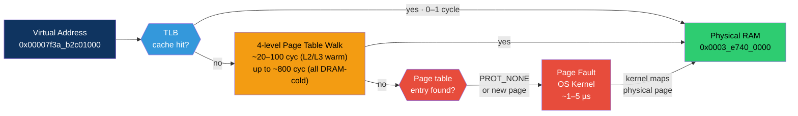
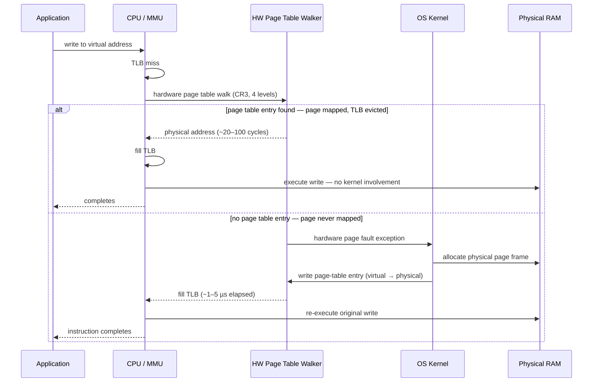
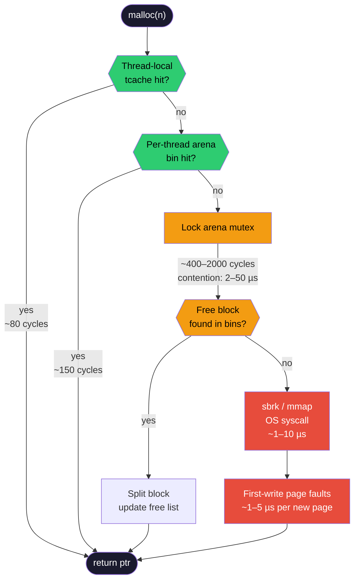
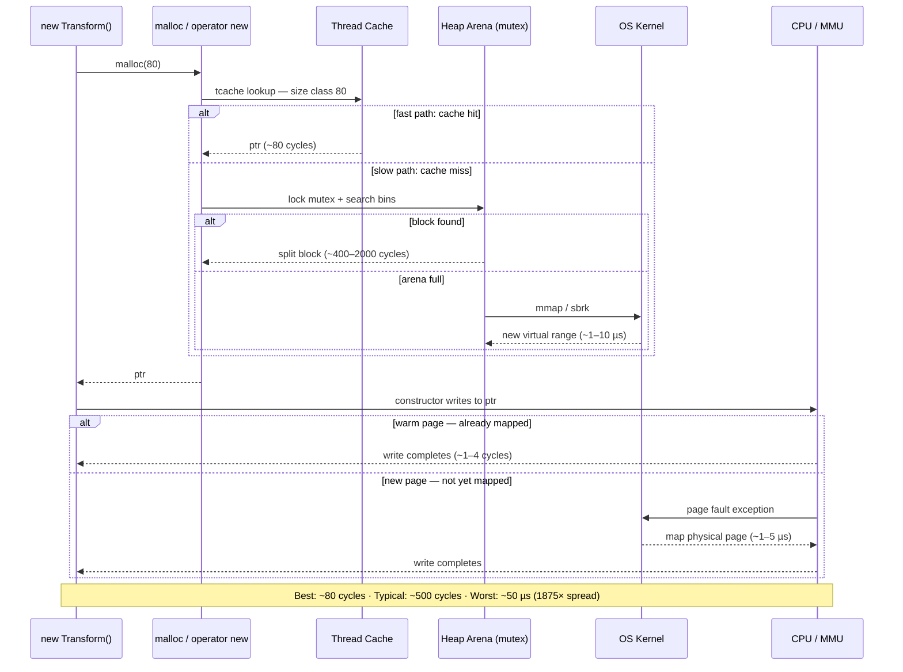

# Virtual Address Translation

```mermaid
flowchart LR
    VA["Virtual Address\n0x00007f3a_b2c01000"]
    TLB{{"TLB\ncache hit?"}}
    PA["Physical RAM\n0x0003_e740_0000"]
    PGT["4-level Page Table Walk\n~20–100 cyc (L2/L3 warm)\nup to ~800 cyc (all DRAM-cold)"]
    MAP{{"Page table\nentry found?"}}
    PF["Page Fault\nOS Kernel\n~1–5 µs"]

    VA --> TLB
    TLB -- "yes · 0–1 cycle" --> PA
    TLB -- "no" --> PGT
    PGT -- "yes" --> PA
    PGT -- "no" --> MAP
    MAP -- "PROT_NONE\nor new page" --> PF
    PF -- "kernel maps\nphysical page" --> PA

    style VA  fill:#0f3460,color:#fff
    style TLB fill:#3498db,color:#fff
    style PGT fill:#f39c12,color:#000
    style MAP fill:#e74c3c,color:#fff
    style PF  fill:#e74c3c,color:#fff
    style PA  fill:#2ecc71,color:#000
```

---

# Page Fault — Kernel Path

```mermaid
sequenceDiagram
    participant APP as Application
    participant MMU as CPU / MMU
    participant WLK as HW Page Table Walker
    participant OS  as OS Kernel
    participant RAM as Physical RAM

    APP->>MMU: write to virtual address
    MMU->>MMU: TLB miss
    MMU->>WLK: hardware page table walk (CR3, 4 levels)

    alt page table entry found — page mapped, TLB evicted
        WLK-->>MMU: physical address  (~20–100 cycles)
        MMU->>MMU: fill TLB
        MMU->>RAM: execute write — no kernel involvement
        MMU-->>APP: completes
    else no page table entry — page never mapped
        WLK->>OS: hardware page fault exception
        OS->>RAM: allocate physical page frame
        OS->>WLK: write page-table entry (virtual → physical)
        WLK-->>MMU: fill TLB  (~1–5 µs elapsed)
        MMU->>RAM: re-execute original write
        MMU-->>APP: instruction completes
    end
```

---

# `malloc` — Decision Path

```mermaid
flowchart TD
    START(["malloc(n)"])

    TC{{"Thread-local\ntcache hit?"}}
    AR{{"Per-thread arena\nbin hit?"}}
    MX["Lock arena mutex"]
    BIN{{"Free block\nfound in bins?"}}
    SPLIT["Split block\nupdate free list"]
    OS["sbrk / mmap\nOS syscall\n~1–10 µs"]
    PF["First-write page faults\n~1–5 µs per new page"]
    RET(["return ptr"])

    START --> TC
    TC -- "yes\n~80 cycles" --> RET
    TC -- "no" --> AR
    AR -- "yes\n~150 cycles" --> RET
    AR -- "no" --> MX
    MX -- "~400–2000 cycles\ncontention: 2–50 µs" --> BIN
    BIN -- "yes" --> SPLIT --> RET
    BIN -- "no" --> OS --> PF --> RET

    style START fill:#1a1a2e,color:#fff
    style TC    fill:#2ecc71,color:#000
    style AR    fill:#2ecc71,color:#000
    style MX    fill:#f39c12,color:#000
    style BIN   fill:#f39c12,color:#000
    style OS    fill:#e74c3c,color:#fff
    style PF    fill:#e74c3c,color:#fff
    style RET   fill:#1a1a2e,color:#fff
```

---

# `new Transform()` — Full Cost Chain

```mermaid
sequenceDiagram
    participant APP as new Transform()
    participant ML  as malloc / operator new
    participant TC  as Thread Cache
    participant AR  as Heap Arena (mutex)
    participant OS  as OS Kernel
    participant MMU as CPU / MMU

    APP->>ML: malloc(80)
    ML->>TC: tcache lookup — size class 80

    alt fast path: cache hit
        TC-->>ML: ptr  (~80 cycles)
    else slow path: cache miss
        ML->>AR: lock mutex + search bins
        alt block found
            AR-->>ML: split block  (~400–2000 cycles)
        else arena full
            AR->>OS: mmap / sbrk
            OS-->>AR: new virtual range  (~1–10 µs)
        end
    end

    ML-->>APP: ptr

    APP->>MMU: constructor writes to ptr
    alt warm page — already mapped
        MMU-->>APP: write completes  (~1–4 cycles)
    else new page — not yet mapped
        MMU->>OS: page fault exception
        OS-->>MMU: map physical page  (~1–5 µs)
        MMU-->>APP: write completes
    end

    Note over APP,MMU: Best: ~80 cycles · Typical: ~500 cycles · Worst: ~50 µs (1875× spread)
```
