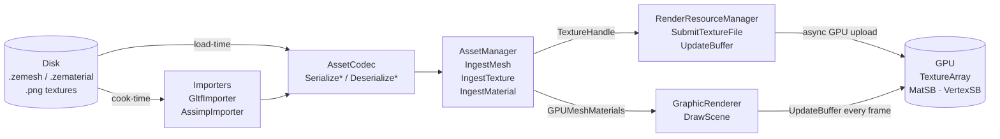
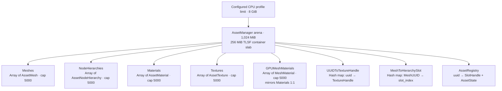
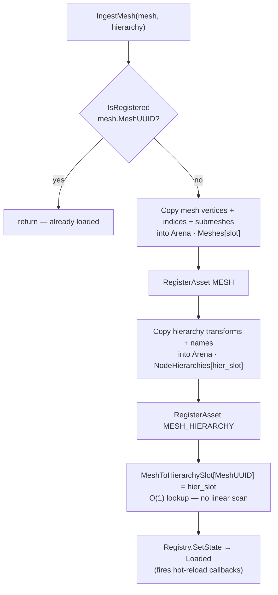
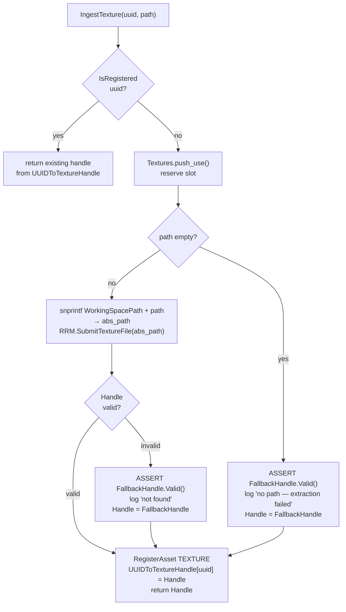
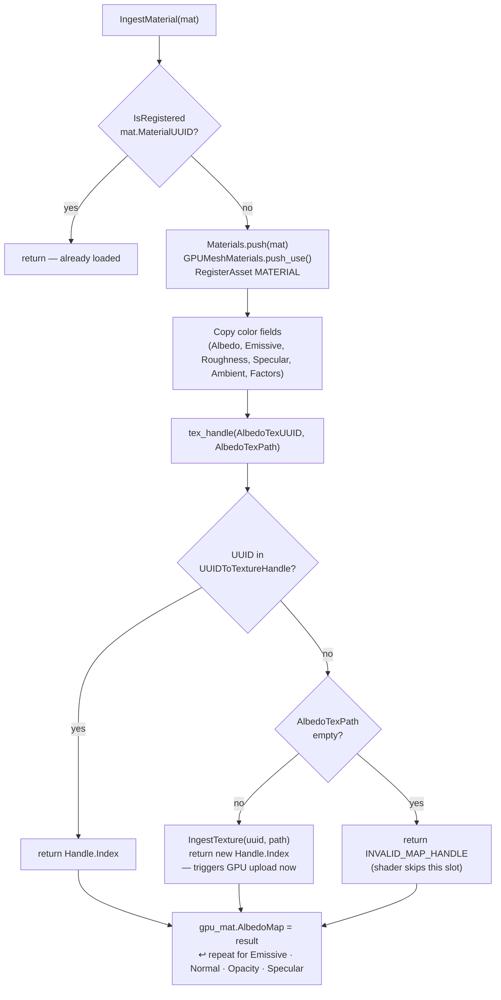
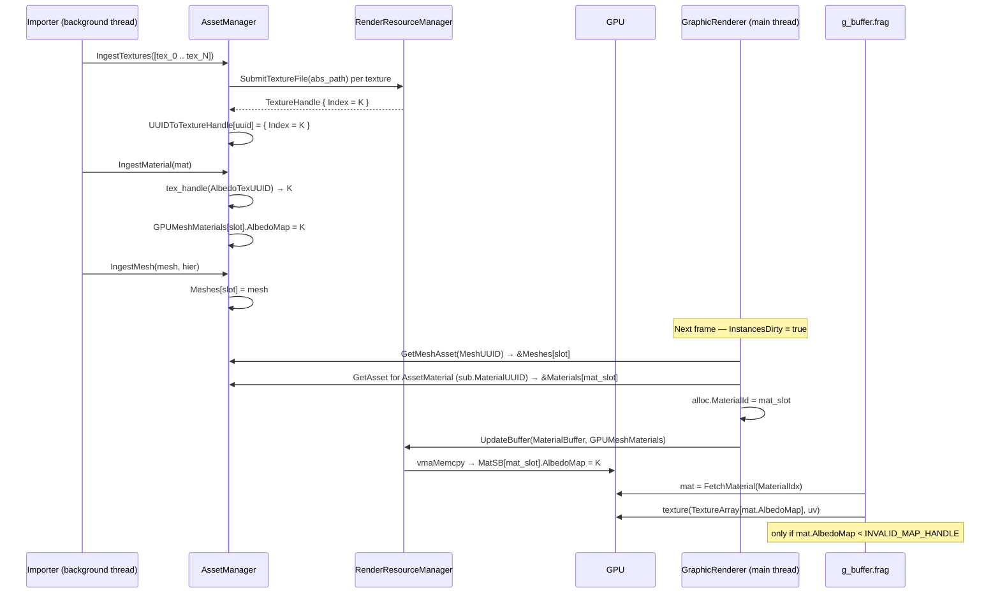
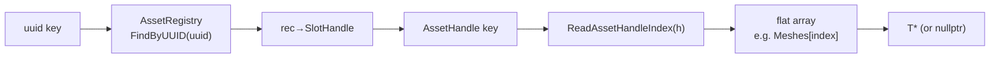
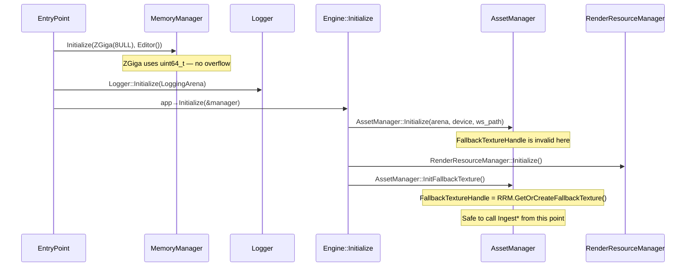

# Asset Manager

Single authority over all CPU-side cooked asset data at runtime. Owns every mesh, material,
texture, and node hierarchy ingested during a session, and owns the `GPUMeshMaterials` mirror
that drives the `MatSB` storage buffer read by the G-buffer fragment shader every frame.

**Status:** Current runtime ownership reference. The manager has 1,024 MiB in the configured
CPU profile and a 256 MiB TLSF container slab; its CPU assets are session-lifetime data. GPU
geometry residency/eviction is a separate `RenderResourceManager` responsibility.

See also: [Engine Architecture](engine-architecture.md) · [Rendering Domain](rendering-domain.md) · [Memory Management](memory-management.md)

---

## Table of Contents

- [Position in the Pipeline](#position-in-the-pipeline)
- [Memory Layout](#memory-layout)
- [Data Structures](#data-structures)
- [Ingest Pipeline](#ingest-pipeline)
  - [Deduplication](#deduplication)
  - [IngestMesh](#ingestmesh)
  - [IngestTexture](#ingesttexture)
  - [IngestMaterial](#ingestmaterial)
- [GPU Material Binding — End to End](#gpu-material-binding-end-to-end)
- [Lookup API](#lookup-api)
- [Thread Safety](#thread-safety)
- [Initialization Order Contract](#initialization-order-contract)
- [Known Gaps](#known-gaps)

---

## Position in the Pipeline



**AssetManager does not** stream assets in or out. Everything ingested lives for the lifetime
of the session in a fixed arena. A future `StreamingManager` will sit above it and manage
residency.

---

## Memory Layout

The manager receives the 1,024 MiB `AssetManager` arena configured by `MemoryBudgetConfig`.
The meshes, node hierarchies, materials, texture-handle map, and material-slot map use a 256 MiB
TLSF slab so their variable-size growth can reclaim old blocks. `GPUMeshMaterials`, textures,
and some maps remain arena-backed. This is explicit engine-owned allocation, not a claim that
third-party import/decode code never uses another allocator.



---

## Data Structures

### Flat arrays and slot indexing

Access to any asset is always by **slot index** extracted from an `AssetHandle`. The UUID is
first resolved through `AssetRegistry` to an `AssetHandle`; the handle encodes the type and
slot in a single `uint32_t`:

```
31      28 27                              0
┌──────────┬─────────────────────────────────┐
│  type(4) │         slot index (28)          │
└──────────┴─────────────────────────────────┘
```

`CreateHandle(slot, type)` and `ReadAssetHandleIndex(handle)` are the only encode/decode
points — no caller should bit-shift manually.

### `MeshMaterial` — the GPU struct

`MeshMaterial` is uploaded verbatim to `MatSB` (set 0, binding 5) every frame via
`RRM::UpdateBuffer`. It mirrors `AssetMaterial` but replaces UUID texture references with
**bindless `TextureArray` indices**.

```
struct MeshMaterial {             // std140 · 96 bytes
    gpuvec4  AmbientColor;
    gpuvec4  EmissiveColor;
    gpuvec4  AlbedoColor;
    gpuvec4  SpecularColor;
    gpuvec4  RoughnessColor;
    gpuvec4  Factors;
    uint64_t EmissiveMap;         // TextureArray index  OR  0xFFFFFFFF (INVALID_MAP_HANDLE)
    uint64_t AlbedoMap;
    uint64_t SpecularMap;
    uint64_t NormalMap;
    uint64_t OpacityMap;
    uint64_t _padding;
};
```

Fragment shader gate: `if (material.AlbedoMap < INVALID_MAP_HANDLE)` — valid textures have
small indices; unset slots hold `0xFFFFFFFF` and are skipped, falling back to the material
color fields.

---

## Ingest Pipeline

### Deduplication

Every `Ingest*` method calls `IsRegistered(uuid)` first. If the UUID is already in
`AssetRegistry`, the call is a **no-op** — the asset is already resident.

### IngestMesh



### IngestTexture

`IngestTexture(uuid, path)` is the **single canonical texture upload point**. Both
`IngestTextures` (batch) and `IngestMaterial` (per-slot fallback) call it.



The `ASSERT FallbackHandle.Valid()` enforces the startup invariant: `InitFallbackTexture()`
must run before any ingest. A crash here means the initialization sequence is broken — not
a recoverable error.

### IngestMaterial



The path-fallback branch (`IngestTexture` called from inside `IngestMaterial`) is what makes
**scene reload** and **dragged-.zmesh** work without a prior `IngestTextures` call: the material
carries its own texture paths from the `.zematerial` JSON and can trigger GPU upload on demand.

---

## GPU Material Binding — End to End



---

## Lookup API

`GetAsset<T>(key)` resolves a UUID or handle to a pointer into the flat arrays.
Two key types are supported for each of the four asset types (8 specializations total):



If the UUID is not registered or the slot index is out of range, all paths return `nullptr`.

---

## Thread Safety

| Method | Thread-safe | Notes |
|---|---|---|
| `IngestMesh` | Yes | Acquires `IngestMutex` (recursive) |
| `IngestTexture` | Yes | Acquires `IngestMutex` |
| `IngestTextures` | Yes | Calls `IngestTexture` per element |
| `IngestMaterial` | Yes | Acquires `IngestMutex`; may call `IngestTexture` (recursive lock) |
| `IsRegistered` | No standalone synchronization | Caller must not race registry mutation. |
| `GetAsset<T>(uuid/handle)` | No standalone synchronization | Safe after ingestion is quiescent or under the caller's synchronization. |
| `GetMeshNodeHierarchy` | No standalone synchronization | O(1) lookup; does not acquire `IngestMutex`. |
| `TryGetMeshBounds` | Yes | Acquires `IngestMutex` and copies the bounds. |
| `InitFallbackTexture` | Main thread only | Called once during engine init |

`IngestMutex` is `std::recursive_mutex` — `IngestMaterial` can call `IngestTexture` while
holding the lock without deadlocking.

---

## Initialization Order Contract



Any `IngestTexture` call that reaches the fallback path before `InitFallbackTexture` fires:
```
ZENGINE_VALIDATE_ASSERT(FallbackTextureHandle.Valid(),
    "FallbackTextureHandle not initialized — InitFallbackTexture must be called before ingesting assets")
```

---

## Known Gaps

| Gap | Tracking |
|---|---|
| CPU-side cooked asset eviction — manager data remains session-lifetime | Future streaming/asset residency policy |
| GPU geometry residency/eviction policy | Implemented separately in `RenderResourceManager`; do not infer CPU AssetManager eviction from it. |
| Raster and environment-map import paths remain duplicated | [#750](https://github.com/JeanPhilippeKernel/RendererEngine/issues/750) |
| Manual reimport from the content browser needs current ZUI-panel integration | [#602](https://github.com/JeanPhilippeKernel/RendererEngine/issues/602) |
| Importer and ZUI regression-test scaffolding is absent | [#735](https://github.com/JeanPhilippeKernel/RendererEngine/issues/735) |
| Initial scanner results do not yet enqueue an import batch | `VFSScanner` currently registers assets; watcher modifications enqueue immediate reimport. |
