# Engine Architecture

Authoritative reference for ZEngine's overall architecture — threads, communication, and how all subsystems fit together. Update it when a significant architectural change lands in `develop`.

See also: [Rendering Domain](rendering-domain.md) · [Memory Management](memory-management.md) · [Asset Manager](asset-manager.md) · [ZUI System](zui-system.md)

---

## Table of Contents

- [Big Picture](#big-picture)
- [Thread Model](#thread-model)
- [Main Thread — Per-Frame Work](#main-thread-per-frame-work)
- [Render Thread — Per-Frame Work](#render-thread-per-frame-work)
- [Cross-Thread Communication](#cross-thread-communication)
- [ECS and Simulation](#ecs-and-simulation)
- [Asset Pipeline](#asset-pipeline)
- [Virtual File System (VFS)](#virtual-file-system-vfs)
- [Initialization Order](#initialization-order)
- [Shutdown Order](#shutdown-order)

---

## Big Picture

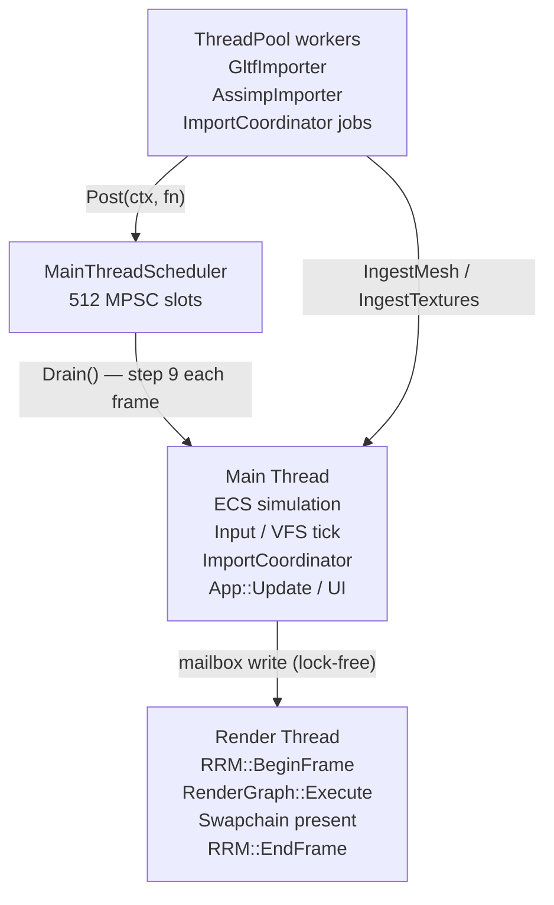

**Key design rules:**
- Main thread owns all ECS state, input, and UI logic.
- Render thread owns all Vulkan command recording and submission.
- Neither thread blocks on the other within a frame.
- Background workers never touch Vulkan — GPU work is enqueued to `RenderResourceManager` and drained on the render thread.

---

## Thread Model

| Thread | Count | Launched by | Joins at |
|---|---|---|---|
| Main thread | 1 | OS entrypoint (`main()`) | Process exit |
| Render thread | 1 | `Engine::Run()` | `Engine::Deinitialize()` |
| ThreadPool workers | `hw_concurrency - 1` | `ThreadPoolHelper::Initialize()` | `ThreadPoolHelper::Shutdown()` |

The render thread is launched **before** `MainThreadRun()` begins and joined **first** in teardown — before any GPU resource is touched.

---

## Main Thread — Per-Frame Work

`Engine::MainThreadRun()` — `ZEngine/ZEngine/Engine.cpp`

```
loop (until s_close_requested):

  1. PollEvent()                    GLFW platform event pump; events feed ZUIContext
  2. VFSContext::Tick()             Drain FileWatcher debounce queue
  3. skip frame if minimized
  4. frame_timer.End()             Measure raw delta (clamped 250 ms)
  5. accumulator.Accumulate(dt)

  6. Fixed simulation (60 Hz, max 5 catch-up steps):
       WorldTick::Tick(scene, fixed_dt, cmds)   ECS systems in DAG order
       WorldCommands::Flush(scene)              Deferred structural mutations
       ActorManager::Tick(fixed_dt)             Actor OnTick() callbacks
       Scene::SnapshotTransforms()              PreviousPosition ← Position
       accumulator.ConsumeStep()

  7. alpha = accumulator.Alpha()    Interpolation factor for renderer

  8. ImportCoordinator::Tick()      Dispatch pending import jobs to ThreadPool

  9. MainThreadScheduler::Drain()   Execute callbacks posted by background threads

 10. g_app->OnUpdate(raw_dt)       Subclass update (Editor: viewport hover → camera gate)
     CameraController→Update(dt)   After OnUpdate so hover state is current

 11. Build RenderPayload (if mailbox slot available):
       BeginOverlayFrame → ZUIBeginFrame(ctx, dt)
       OnRenderUI() → ZUILayer::Render() — build ZUI box tree
       EndOverlayFrame → ZUIEndFrame (ZUILayoutSolve + ZUIInteractionPass)
       FillOverlayPayload → ZUIRenderer::PreparePayload (DFS → draw list)
       SyncECSToRenderScene(alpha) + PrepareScene
       MailBoxBufferHead.store(next, release)

 12. FrameRateCap::Wait()          Applied unconditionally — including when mailbox is
                                    full (buffer-full continue also calls Wait so the
                                    main loop never spins at 100k+ Hz)
```

---

## Render Thread — Per-Frame Work

`Engine::RenderThreadRun()` — `ZEngine/ZEngine/Engine.cpp`

```
loop (until s_request_terminate):

  1. Mailbox read (lock-free)         Wait for payload; re-use last if none

  2. Swapchain::AcquireNextImage      Block on fence for in-flight slot

  3. RRM::BeginFrame(frame_index)
       FlushPendingUploads:
         ├─ ResetGeometryBuffersInternal  (if scene-reload flag is set)
         ├─ BeginBatchUpload
         ├─ DoUploadMesh × N           All mesh uploads in ONE GPU submission
         ├─ EndBatchUpload
         └─ DoUploadTexture × M        Per-texture timeline upload

  4. AppRenderPipeline::Tick (if InstancesDirty)
       GetMeshOffsets → SubMeshAllocation per submesh
       Upload TransformSB, DrawDataSB, VkDrawIndirectCommand[]

  5. RenderGraph::Execute
       DepthPrePass  → DrawIndirect   (all scene meshes, depth only)
       SkyboxPass    → DrawIndexed    (builtin cube)
       GridPass      → DrawIndexed    (builtin quad + push constants)
       GbufferPass   → DrawIndirect   (all scene meshes, full G-buffer)
       LightingPass  → Draw(3)        (full-screen deferred lighting triangle)

  6. ZUIRenderer::Submit              Upload ZUIDrawVtx/Idx, scissor/tex batches,
                                      DrawIndexed via ZUIPass (targets swapchain)

  7. Swapchain::Present               Submit + present, advance timeline semaphore

  8. RRM::EndFrame(frame_index)       Drain DeferredFreeQueue for this slot

  9. render_timer.End()               Sample wall-clock delta (includes vsync wait)
     g_engine_ctx→SmoothedDeltaTime = render_timer.SmoothedDelta()
                                       Written here so FPS display reflects true GPU rate
```

The render thread never writes ECS state. It reads only from the `RenderPayload` and `RenderScene::MeshInstance[]` (seqlock snapshot).

---

## Cross-Thread Communication

Three distinct channels, each with a different mechanism.

### 1. Main → Render: Lock-free mailbox

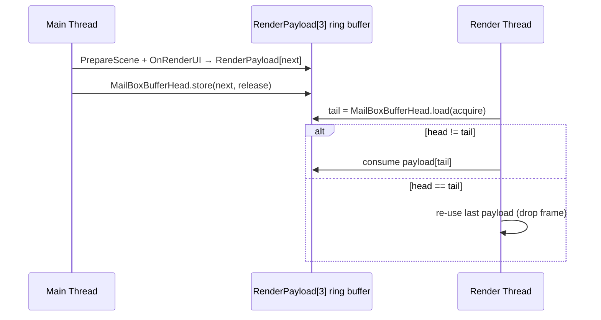

`MailBoxBufferHead` is a `PaddedAtomic<uint32_t>` index into a 3-slot ring. No mutex, no blocking.

### 2. Background → Main: MainThreadScheduler

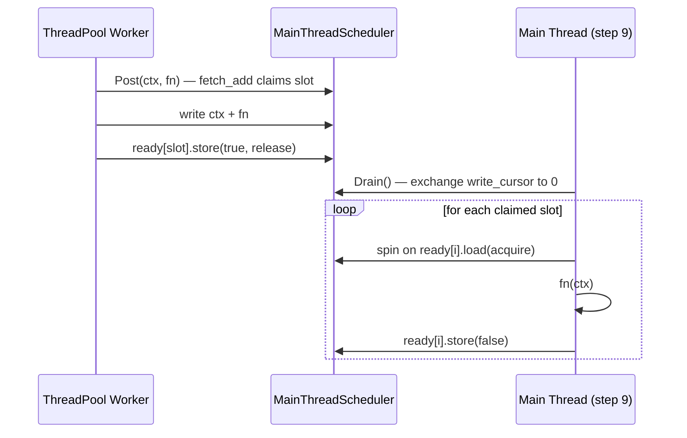

512 arena-allocated slots, lock-free MPSC, no heap, C-style `Post(void* ctx, void (*fn)(void*))`.

**Current users:** `AssetImporterUIComponent` — posts `TriggerScan()` after import completes or fails.

### 3. Asset thread → Render thread: RRM pending queue

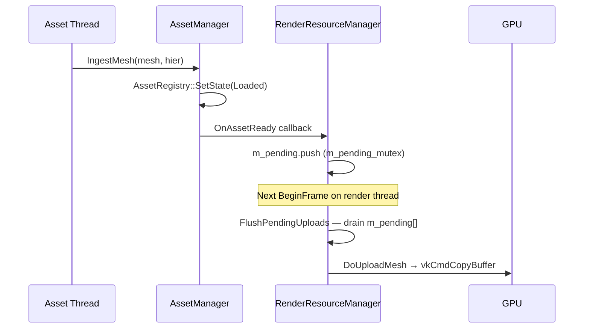

`m_pending[MAX_PENDING=256]` is a fixed array protected by `m_pending_mutex`. All Vulkan work stays on the render thread.

---

## ECS and Simulation

**Files:** `ZEngine/ZEngine/ECS/`

### Two-tier object model

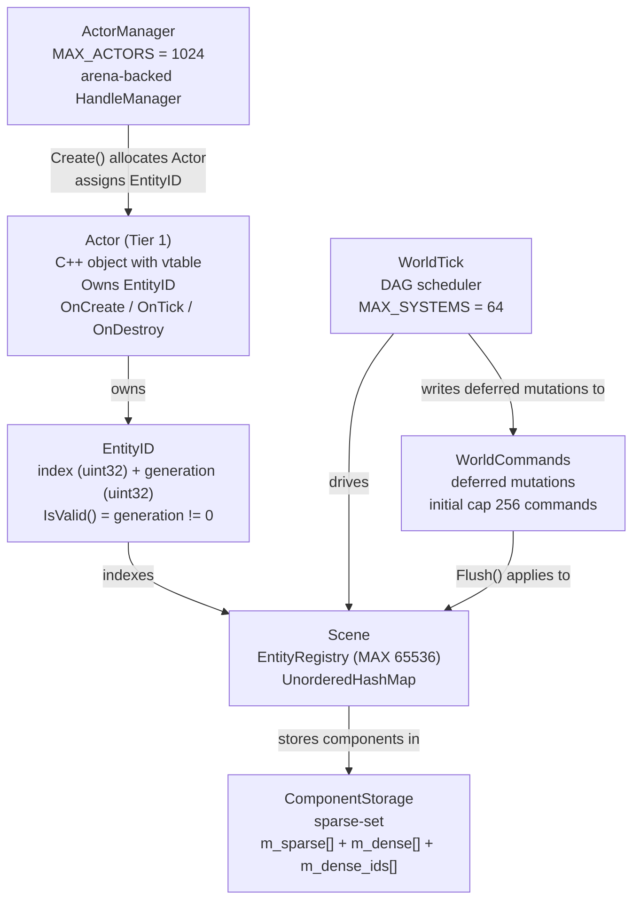

| Tier | Type | Used for | Limit |
|---|---|---|---|
| 1 | `Actor` — C++ object with vtable, owns an `EntityID` | Player, camera, lights, scripted objects | 1 024 |
| 2 | Raw `EntityID` — data only, no vtable | Foliage, particles, projectiles, bulk objects | 65 536 |

Both tiers share the same `ComponentStorage<T>` sparse-set arrays. `Scene::ForEach<Ts...>()` and `Query<Ts...>` visit all alive entities regardless of tier.

---

### Components

All components live in `ECS/Components/`, namespace `ZEngine::ECS::Components`. A `ComponentTypeID` (`uint32_t`) is assigned lazily at the first call to `ComponentTypeOf<T>()` via an atomic counter. Up to 64 component types are supported (one bit per type in the 64-bit `ArchetypeMask`).

| Component | Key fields | Notes |
|---|---|---|
| `TransformComponent` | `Position`, `Rotation`, `Scale`, `PreviousPosition` (all `Vec3f`) | Fits one cache line (`sizeof ≤ 64`). `PreviousPosition` used for fixed-timestep interpolation. Distinct from `Rendering::Components::TransformComponent`. |
| `MeshComponent` | `uuids::uuid MeshUUID`, `uint32_t RenderInstanceId` | `RenderInstanceId = UINT32_MAX` = not yet registered in `RenderScene`. The bridge to update this is not yet implemented (see ECS → Render gap below). |
| `CameraComponent` | `FovY`, `Near`, `Far`, `AspectRatio`, `bool IsMain` | Exactly one entity should have `IsMain = true`. |
| `LightComponent` | `Type` (Directional/Point/Spot), `Intensity`, `Range`, `SpotAngle`, `Color[3]` | Range and SpotAngle unused for Directional lights. |
| `MaterialComponent` | `uuids::uuid MaterialUUID` | Per-instance material override. Absent = use mesh's baked material UUIDs. |
| `NameComponent` | `char Value[128]` | Display name for Outliner and debug. |
| `RigidBodyComponent` | `MotionType` (Static/Kinematic/Dynamic), `Mass`, `Friction`, `Restitution`, `uint32_t BodyID` | `BodyID = UINT32_MAX` = inactive. Physics integration (Jolt) planned Sprint 6. |
| `UUIDComponent` | `uuids::uuid Value` | Stable cross-session identity for scene serialization. |

---

### Scene

`Scene` owns the entity registry and all component storages. All arena allocations go through the `ArenaAllocator*` provided at `Initialize`.

```cpp
// Entity lifecycle
EntityID CreateEntity();
void     DestroyEntity(EntityID id);   // removes from all storages
bool     IsAlive(EntityID id) const;

// Component access (all template, O(1) via sparse-set)
template<T> void  AddComponent(EntityID id, T component);
template<T> T*    GetComponent(EntityID id);
template<T> bool  HasComponent(EntityID id) const;
template<T> void  RemoveComponent(EntityID id);

// Query — visits all alive entities that have all Ts
template<typename... Ts, typename Fn>
void ForEach(Fn&& fn);   // Fn signature: void(EntityID, Ts&...)

// Fixed-timestep interpolation support
void SnapshotTransforms();                              // PreviousPosition ← Position
void FillRenderableTransforms(float alpha,             // lerp Position by alpha
    Array<RenderableTransform>& out);
```

**`ForEach` iteration model:** iterates entity slots in the `EntityRegistry`, checks the `ArchetypeMask` against `(ComponentTypeOf<T1> | ComponentTypeOf<T2> | ...)`, and skips non-matching entities. Does not iterate component dense arrays directly. `Query<Ts...>` is a thin wrapper that pre-computes the mask at construction.

---

### Actor

`Actor` is the Tier-1 entity class. It cannot be instantiated directly — only via `ActorManager::Create<T>()`.

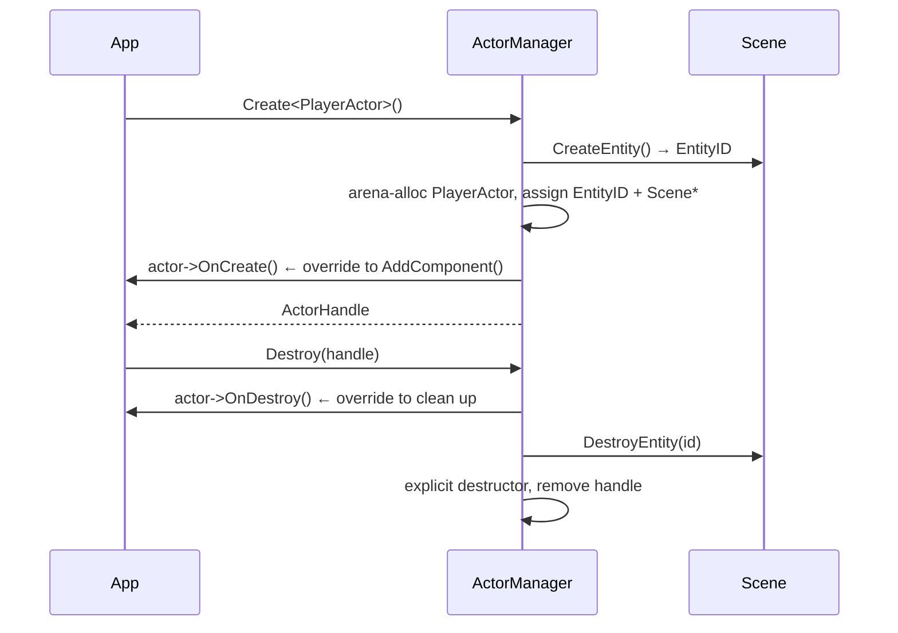

**Virtual interface:**
```cpp
virtual void OnCreate()       {}   // called once after entity assigned; add components here
virtual void OnDestroy()      {}   // called before entity destroyed
virtual void OnTick(float dt) {}   // called every frame by ActorManager::Tick()
```

**Component helpers (inline on the Actor base):**
```cpp
template<T> void AddComponent(T c);
template<T> T*   GetComponent();
template<T> bool HasComponent() const;
template<T> void RemoveComponent();
```

No default components are attached by the base class. A typical `OnCreate()` override looks like:
```cpp
void PlayerActor::OnCreate() {
    AddComponent(TransformComponent{});
    AddComponent(MeshComponent{ .MeshUUID = uuid });
    AddComponent(NameComponent{ .Value = "Player" });
}
```

---

### WorldTick — System Scheduler

`WorldTick` builds a dependency DAG from registered systems (`SystemFn = void(*)(Scene&, float, WorldCommands&)`) and executes them in topological wave order. It ships no built-in systems — application code registers all systems.

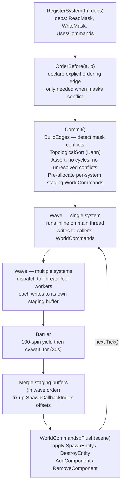

**Conflict rule:** systems A and B conflict if any of these overlap: `A.WriteMask & B.ReadMask`, `A.WriteMask & B.WriteMask`, `A.ReadMask & B.WriteMask`. Conflicting systems must have an explicit `OrderBefore` edge or `Commit()` asserts.

---

### WorldCommands — Deferred Mutations

Structural scene mutations (`AddComponent`, `DestroyEntity`, etc.) cannot happen inside a parallel wave — they would race with other workers reading the same sparse-set arrays. Every mutation is buffered in `WorldCommands` and applied atomically after the wave barrier.

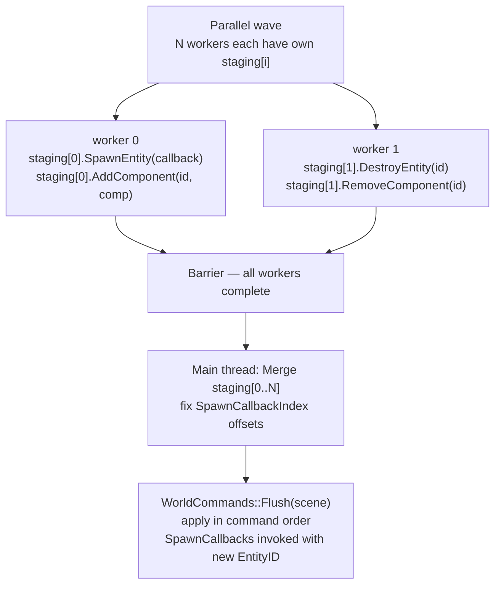

**Supported command kinds:**

| Command | What it does in `Flush()` |
|---|---|
| `SpawnEntity(callback)` | Calls `scene.CreateEntity()`; invokes optional `SpawnCallback(EntityID)` with the new id |
| `DestroyEntity(id)` | Deduplicates; guards for already-dead entity |
| `AddComponent<T>(id, T)` | Copies component (≤ 256 bytes) into fixed buffer; calls `scene.AddComponent` |
| `RemoveComponent<T>(id)` | Stores type-erased apply-fn pointer; calls `scene.RemoveComponent<T>` |

Staging buffers are pre-allocated at `Commit()` (arena-backed, initial cap 256 commands per system) and reused every frame via `Clear()` — no heap after the first exercised frame.

---

### ECS → Render Bridge (gap — issue #604)

The connection between ECS state and the render pipeline is **partially implemented but not wired**.

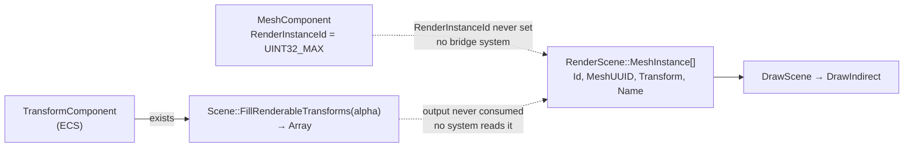

**What exists:**
- `Scene::FillRenderableTransforms(float alpha, Array<RenderableTransform>& out)` — lerps between `PreviousPosition` and `Position` for all entities with `TransformComponent`. The function is fully implemented.
- `MeshComponent::RenderInstanceId` — the intended hook for linking an ECS entity to a `RenderScene::MeshInstance`.
- `RenderScene::SetInstanceTransform(uint32_t id, Mat4f)` — the receiving API on the render side.

**What is missing:**
- No ECS system that reads `MeshComponent` + `TransformComponent` and calls `RenderScene::SetInstanceTransform`.
- `MeshComponent::RenderInstanceId` is always `UINT32_MAX`; nothing ever calls `RenderScene::AddMeshInstance` and writes the result back.
- `FillRenderableTransforms` output is never consumed.

Until the bridge is wired, mesh transforms in the scene are set manually by editor code via `RenderScene::SetInstanceTransform` when actors are dragged in the viewport.

---

## Asset Pipeline

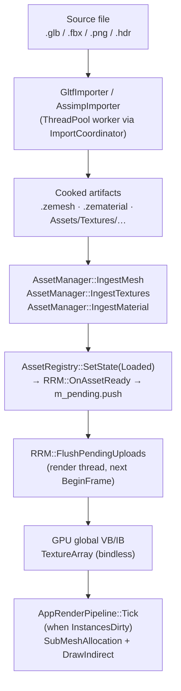

On scene reload: `EditorScene::ExtractAsync` calls `RRM::ResetGeometryBuffers()` before ingestion;
the render thread resets global buffer cursors to 0 so new geometry starts fresh.

---

## Virtual File System (VFS)

**Files:** `ZEngine/ZEngine/Core/VFS/`

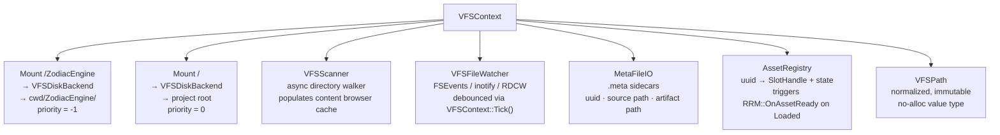

**FileWatcher → hot-reload flow:**

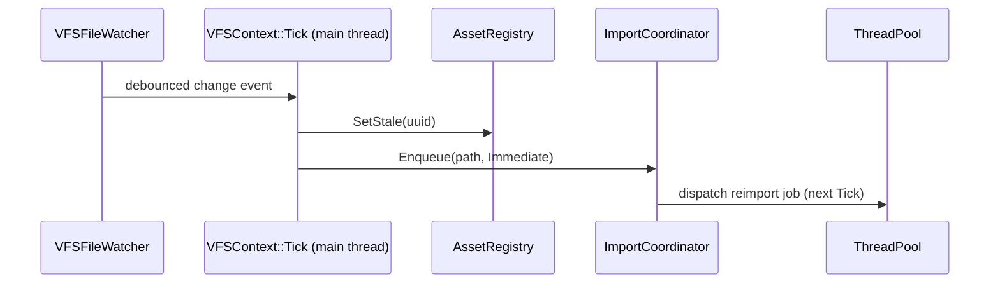

---

## Initialization Order

`Engine::Initialize()` — `ZEngine/ZEngine/Engine.cpp`

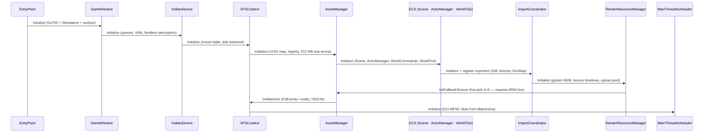

Hard dependencies: Device before VFS (surface), RRM before fallback texture, watcher after working directory.

---

## Shutdown Order

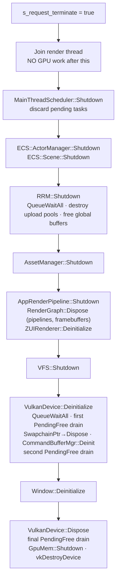

See [Rendering Domain — Shutdown](rendering-domain.md#shutdown-and-teardown) for the Vulkan object destruction rules.
