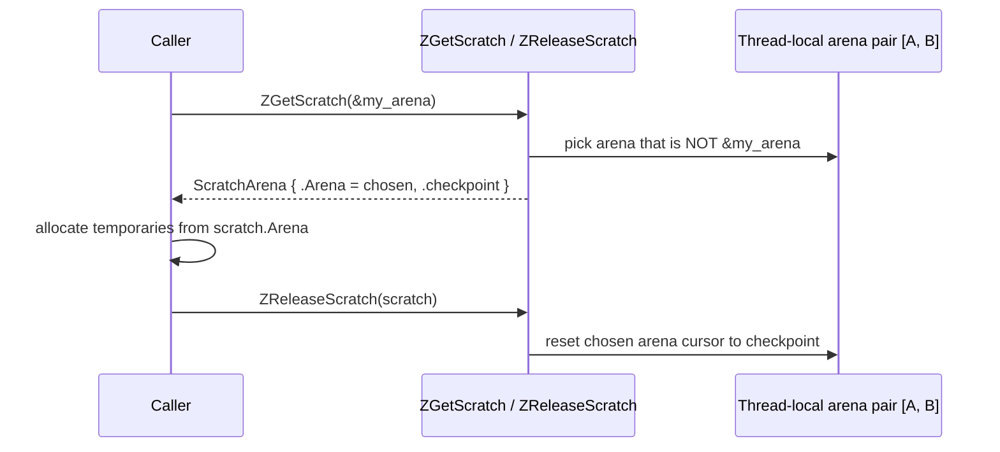
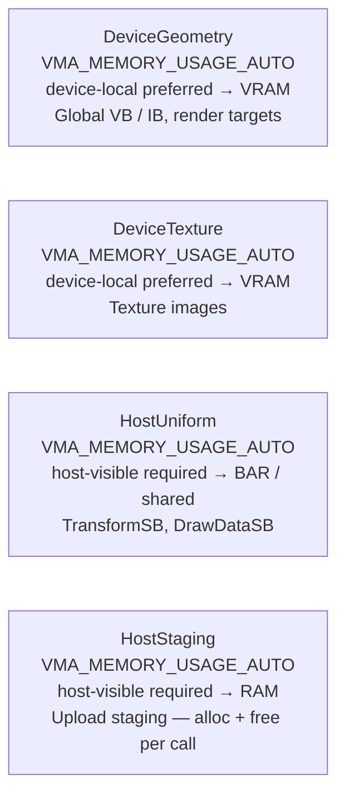
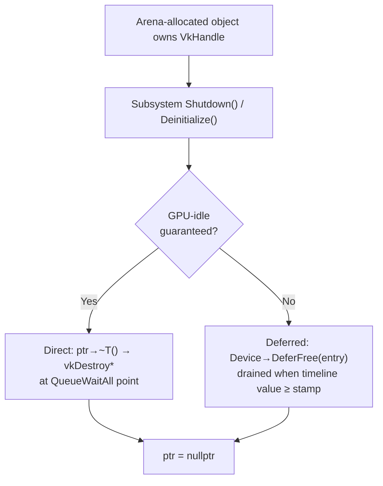

# Memory Management

ZEngine uses a custom arena-based memory model with no `new`/`delete` in hot paths. This page documents all memory primitives, allocation patterns, GPU memory domains, and the rules for objects that own Vulkan handles.

See also: [Engine Architecture](engine-architecture.md) · [Asset Manager](asset-manager.md)

---

## Table of Contents

- [Philosophy](#philosophy)
- [Lifetime Model](#lifetime-model)
- [Allocation Decision Framework](#allocation-decision-framework)
- [CPU Memory — ArenaAllocator](#cpu-memory-arenaallocator)
- [CPU Memory — PoolAllocator](#cpu-memory-poolallocator)
- [CPU Memory — TLSFSlab](#cpu-memory-tlsfslab)
- [Allocation Macros](#allocation-macros)
- [Scratch Arenas](#scratch-arenas)
- [Thread Safety](#thread-safety)
- [Memory Budget](#memory-budget)
- [Performance Comparison](#performance-comparison)
- [Container Ownership Rules](#container-ownership-rules)
- [GPU Memory — VMA Allocator](#gpu-memory-vma-allocator)
- [GPU Memory Domains](#gpu-memory-domains)
- [Arena-Allocated Vulkan Objects](#arena-allocated-vulkan-objects)
- [Platform Notes](#platform-notes)
- [Memory Profiler](#memory-profiler)

---

## Philosophy

1. **One up-front allocation.** `MemoryManager` reserves 8 GB of virtual address space at startup as `MainArena`. Individual objects never call `malloc`/`new` outside of third-party libraries.
2. **Sub-arenas carve fixed budgets.** Each subsystem gets a dedicated sub-arena sized to its worst-case working set. Running out of a sub-arena is a budgeting error to fix at design time, not a runtime failure to handle.
3. **Lifetime = scope.** Objects allocated from an arena are freed by `ArenaAllocator::Clear()` (cursor reset). There is no per-object free. Pick the allocator whose lifetime matches the object's lifetime.
4. **No destructor guarantee.** `ZPushStructCtor` places objects via placement-new, but arena release does **not** call destructors. Any object that owns an OS or GPU resource must have its destructor called explicitly before the arena is cleared.
5. **Zero hot-path touches.** Alloc/free on the render thread or in inner simulation loops is off the table.

> Before writing `new` or `std::vector`, identify the lifetime. Pick the cheapest allocator that matches it. If nothing fits, the lifetime is unclear — clarify it first.

---

## Lifetime Model

Each allocation belongs to exactly one lifetime tier:

| Tier | When freed | Allocator | Examples |
|---|---|---|---|
| **Engine** | Shutdown only | `ArenaAllocator` | `VulkanDevice`, `ECSScene`, `AssetManager` arenas |
| **Scene** | Scene load/unload | `ArenaAllocator` | `EditorScene::LocalArena` (200 MB) — instance arrays, scene graph, strings |
| **Per-task** | After task completes | `ArenaAllocator` | `ImportPipeline` (1 GB) — GltfImporter, Assimp decode scratch |
| **Per-frame** | End of frame | `ArenaTemp` (scratch) | Draw lists, barrier batches, camera UBO staging |
| **Per-object** | Individual free needed | `PoolAllocator` | Entity slots, command buffer handles, mesh instance slots |
| **Variable** | Individual free, variable size | `TLSFSlab` (roadmap) | Texture decode buffers, asset metadata grows |

---

## Allocation Decision Framework

```
New allocation needed
        │
        ▼
Group lifetime? (reset all at once after frame / import / scene)
    YES ──► Stable after init? (no grows once setup is done)
                YES ──► ArenaAllocator  (~3 cyc + memset)
                NO  ──► TLSFSlab        (~30 cyc, O(1) — roadmap v0.5.0)
    NO
        │
        ▼
    Fixed size? (same N bytes every time)
        YES ──► PoolAllocator  (~5 cyc + memset(chunk), O(1))
        NO
            │
            ▼
        Variable size + individual lifetime?
            YES ──► TLSFSlab  (~30 cyc, O(1) — roadmap v0.5.0)
            NO  ──► Re-examine the lifetime. Do NOT use std::vector / new.
```

---

## CPU Memory — ArenaAllocator

**File:** `ZEngine/ZEngine/Core/Memory/Allocator.h`

```cpp
struct ArenaAllocator
{
    void  Initialize(size_t size);
    void* Allocate(size_t size, size_t alignment = DEFAULT_ALIGNMENT);
    void* Resize(void* ptr, size_t old_size, size_t new_size, size_t alignment);
    void  CreateSubArena(size_t size, ArenaAllocator* out);
    void  Clear();     // reset cursor to 0, keep pages
    void  Shutdown();  // unmap pages
};
```

`Allocate` bumps a cursor — O(1), no locks. Virtual address space is reserved up-front; physical pages are committed on first write (RSS much lower than virtual reservation). Every `Allocate` calls `secure_memset(ptr, 0, n)` — negligible for small objects, dominant for large buffers (e.g. ~0.4 ms for a 16 MB decode buffer at 40 GB/s).

`Resize` extends in-place if the pointer is the most recent allocation; otherwise allocates a new block forward and copies, leaving the old block permanently dead. Safe for scratch arenas; a slow memory leak for long-lived growing containers.

`CreateSubArena` advances the parent cursor by `size`. The child manages its own cursor independently.

### Key invariants

- `ArenaAllocator` is **not thread-safe** — all arenas are carved on the main thread before any worker starts.
- Arena release does **not** call destructors. Call `ptr->~T()` explicitly on objects owning OS/GPU handles.
- `ZReleaseScratch` pairs must be released in **strict LIFO order** — see [Scratch Arenas](#scratch-arenas).

---

## CPU Memory — PoolAllocator

**File:** `ZEngine/ZEngine/Core/Memory/Allocator.h`

Fixed-size free list backed by a single arena carve at init. Suited for objects of a single known size (entity slots, component handles) with individual lifetimes.

```cpp
struct PoolAllocator
{
    void  Initialize(ArenaAllocator* arena, size_t total_size,
                     size_t chunk_size, size_t alignment = DEFAULT_ALIGNMENT);
    void* Allocate();   // O(1) — pop free-list head, zero chunk
    void  Free(void*);  // O(1) — push free-list head; asserts range + alignment
    void  Clear();      // O(capacity) — zero all chunks, rebuild free list
};
```

Free list links are stored **inside** free chunks — zero separate metadata. After `Clear()` or across alloc/free cycles, allocation order is LIFO-scrambled; sequential layout is only guaranteed at init.

### Safety invariants

| Check | Enforced? |
|---|---|
| `Free` ptr in range | Always-on assert |
| `Free` ptr chunk-aligned | Always-on assert |
| Double-free | **Not detected** — second `Free` corrupts the free list silently (issue [#697](https://github.com/JeanPhilippeKernel/RendererEngine/issues/697)) |
| Exhaustion | `Allocate` returns `nullptr` — caller must check (issue [#681](https://github.com/JeanPhilippeKernel/RendererEngine/issues/681)) |

### When NOT to use PoolAllocator

- Multiple object sizes — requires multiple pools or wasteful over-sizing to largest.
- Capacity unknown at init — no in-place growth; growing requires a new arena carve.
- Per-frame `Clear()` — O(capacity) traversal is too expensive.

---

## CPU Memory — TLSFSlab

**Status: Planned — Phase 1 target v0.5.0. Not yet in codebase.**
**Tracking:** [#687](https://github.com/JeanPhilippeKernel/RendererEngine/issues/687) and related issues.

`TLSFSlab` wraps `mattconte/tlsf` (already vendored via FetchContent) with a backing buffer carved from a parent `ArenaAllocator`. Fills the gap for variable-size, individually-freed allocations that neither Arena nor Pool can handle: texture decode buffers, asset metadata containers that grow unpredictably.

```cpp
struct TLSFSlab {
    void   Init(ArenaAllocator* arena, size_t bytes);
    void*  Alloc(size_t n);         // O(1) worst-case — asserts on exhaustion
    void*  Realloc(void* ptr, size_t n);  // O(1) if in-place, O(n) copy otherwise
    void   Free(void* ptr);         // O(1) — coalesces with adjacent free blocks
    void   Shutdown();              // tlsf_destroy; does NOT free backing
    size_t Overhead() const;
};
```

The backing buffer is carved from the parent arena **once** at `Init`. Subsequent `Alloc`/`Free` never touch the arena. Internal fragmentation is bounded at ≤ 1.0625× requested size. Adjacent frees always coalesce — no fragmentation cliff over time.

### Phase 1 use case: texture upload pipeline

Each texture decode currently does 4–5 system heap round-trips (`std::vector<float>`, `Bitmap`, `std::vector<uint8_t>`). Phase 1 replaces all of these with per-worker `TLSFSlab` allocs, reducing system heap involvement to zero during import.

**Open problem:** `CompleteDeferrals()` runs on the render thread and calls `Free` on a worker's slab — a data race on ARM64. Resolution required before Phase 1 ships (issue [#690](https://github.com/JeanPhilippeKernel/RendererEngine/issues/690)).

### Roadmap

| Phase | Target | Scope |
|---|---|---|
| 1 | v0.5.0 | Per-worker upload slabs, `TextureDeferral` refactor, `STBI_MALLOC` override |
| 2 | v0.6.0 | `AssetManager` containers (typed allocator for `Array<T>` / `UnorderedHashMap`) |
| 3 | v1.0.0 | Per-archetype ECS slab for variable-payload component types |

---

## Allocation Macros

**File:** `ZEngine/ZEngine/ZEngineDef.h`

| Macro | Equivalent | Notes |
|---|---|---|
| `ZKilo(n)` | `uint64_t(n) * 1024` | Always 64-bit — no overflow |
| `ZMega(n)` | `uint64_t(n) * 1024²` | Always 64-bit |
| `ZGiga(n)` | `uint64_t(n) * 1024³` | Always 64-bit |
| `ZPushArray(arena, T, count)` | `arena->Allocate(count * sizeof(T), alignof(T))` | Returns `T*`, no constructor |
| `ZPushStruct(arena, T)` | `ZPushArray(arena, T, 1)` | Returns `T*`, no constructor |
| `ZPushStructCtor(arena, T)` | `new (ZPushStruct(arena, T)) T()` | Placement-new, default constructor |
| `ZPushStructCtorArgs(arena, T, ...)` | `new (ZPushStruct(arena, T)) T(...)` | Placement-new with args |

**When to use each:**
- `ZPushStruct` / `ZPushArray` — POD structs, trivial types.
- `ZPushStructCtor` — objects with non-trivial default constructor (`CommandPool`, `Semaphore`, …).
- `ZPushStructCtorArgs` — objects requiring constructor arguments (`GameWindow`, `VulkanDevice`, …).

Calling `delete` on an arena-allocated pointer is **undefined behavior**. Call `ptr->~T()` explicitly, then set the pointer to `nullptr`.

---

## Scratch Arenas

Short-lived per-call temporaries use a scratch arena to avoid polluting long-lived arenas.



**Rules:**
- Never store a pointer into a scratch arena past `ZReleaseScratch`.
- Always pair `ZGetScratch` / `ZReleaseScratch` — no early returns between them.
- `ZGetScratch` / `ZReleaseScratch` must be released in **strict LIFO order**. Releasing an outer scratch while an inner scratch is still live leaves the inner's save point stale — a subtle corruption that manifests later.
- Each thread has its own arena pair — scratch arenas are not shared across threads.

---

## Thread Safety

| Allocator | Thread-safe? | Notes |
|---|---|---|
| `ArenaAllocator` | No | All arenas carved on main thread before workers start. Workers never call `ArenaAllocator::Allocate` after init. |
| `PoolAllocator` | No | All current pools are single-threaded (main thread or one render thread). CAS / spinlock needed if shared. |
| `TLSFSlab` (planned) | No per-slab lock | Each worker owns its slab exclusively via `thread_local`. Cross-thread `Free` is a data race — see issue [#690](https://github.com/JeanPhilippeKernel/RendererEngine/issues/690). |
| `GpuAllocator` (VMA) | Yes | VMA handles its own synchronization internally. |

---

## Memory Budget

`MemoryBudgetConfig` in `ZEngine/ZEngine/Core/Memory/MemoryManager.h`.

```mermaid
graph TD
    root["MainArena · 8 GB virtual\nmmap / VirtualAlloc — demand-paged\nRSS much lower than reservation"]

    vkd["VulkanDevice · 1 GB\nVMA, descriptor pools, command pools,\nswapchain, TLSFSlab × N workers (Phase 1)"]
    asset["AssetManager · 512 MB\nMesh / material / texture / hierarchy arrays\nUUID maps, AssetRegistry"]
    ecs["ECSScene · 512 MB\nComponentStorage dense arrays\nEntityRegistry, ActorManager"]
    imp["ImportPipeline · 1 GB\nGltf + Assimp decode scratch\nCleared after each import session"]
    ser["Serializer · 256 MB\nScene save/load temporaries"]
    anim["AnimationManager · 256 MB\nSkeleton data, clip arrays, blend trees"]
    ui["UIContext · 128 MB\nZUI system — FrameArena, PersistentArena,\nfont atlases, panel state"]
    vfs["VirtualFS · 64 MB\nMount table, scanner cache, watcher events"]
    shader["ShaderCache · 64 MB\nSPIR-V bytecode, reflection data"]
    swap["Swapchain · 8 MB"]
    log["Logging · 8 MB\nRing buffer, category filter"]
    input["Input · 4 MB"]

    root --> vkd & asset & ecs & imp & ser & anim
    root --> ui & vfs & shader & swap & log & input
```



| Subsystem | Budget | What lives there |
|---|---|---|
| VulkanDevice | 1 GB | VMA, descriptor pools, command buffers, swapchain, upload slabs (Phase 1) |
| ImportPipeline | 1 GB | GltfImporter (64 MB) + AssimpImporter (128 MB) × 2 instances |
| AssetManager | 512 MB | `Meshes[]`, `Materials[]`, `Textures[]`, UUID hash maps |
| ECSScene | 512 MB | `ComponentStorage` dense arrays, `EntityRegistry` |
| Serializer | 256 MB | EditorSceneSerializer scratch (150 MB sub-arena) |
| AnimationManager | 256 MB | Animation clips, blend tree nodes, state machines |
| UIContext | 128 MB | ZUI FrameArena, PersistentArena, font atlases, panel state |
| ShaderCache | 64 MB | SPIR-V, reflection data |
| VirtualFS | 64 MB | Mount table, scanner cache, file watcher events |

**Total committed: ~3.8 GB. Headroom: ~4.2 GB** reserved for future systems:

| Planned system | Budget |
|---|---|
| StreamingManager | 2 GB |
| PhysicsEngine | 512 MB |
| NavigationEngine | 256 MB |

---

## Performance Comparison

Approximate cycle counts on a cache-warm allocation path (bookkeeping only — does not include `memset(n)` zeroing which scales linearly with size):

| Allocator | Alloc cost | Free cost | Fragmentation | Best for |
|---|---|---|---|---|
| **ArenaAllocator** | ~3–5 cyc + `memset(n)` | N/A | Zero | Scratch, import, per-frame |
| **PoolAllocator** | ~5–8 cyc + `memset(chunk)` | ~5–8 cyc | Zero | Entity slots, fixed-size objects |
| **TLSFSlab** (planned) | ~20–40 cyc | ~20–40 cyc | ≤ 1.0625× | Upload buffers, growing containers |
| System heap (jemalloc) | ~50–300 cyc | ~50–300 cyc | Accumulates | Nothing on the hot path |
| System heap (ptmalloc) | ~100–500 cyc | ~100–500 cyc | Accumulates | Nothing on the hot path |

> Arena and Pool cover ~95% of engine allocations. TLSFSlab fills the remaining 5% — variable size, individual lifetimes — currently leaking through to the system heap.

---

## Container Ownership Rules

**File:** `ZEngine/ZEngine/Core/Containers/Array.h`

### `Array<T>` is move-only

`Array<T>` copy constructor and copy assignment are **deleted**. The arena owns the backing memory; a shallow copy would alias the same buffer. Moving transfers the pointer and nulls the source.

```cpp
Array<T>(const Array&)             = delete;
Array<T>& operator=(const Array&)  = delete;
Array<T>(Array&& other) noexcept;
Array<T>& operator=(Array&& other) noexcept;
```

### Passing conventions

```cpp
void Inspect(const Array<uint32_t>& arr);   // read-only
void Mutate(Array<uint32_t>& arr);          // in-place mutation
void Consume(Array<uint32_t> arr);          // ownership transfer — caller std::move()
```

### `ArrayView<T>` for non-owning slices

`ArrayView<T>` is a plain `{T*, size_t}` — freely copyable, no ownership semantics.

### Growing containers leak dead arena blocks

Every `Array<T>::grow()` that reallocates on an arena abandons the old block — it becomes permanently dead for the lifetime of the arena. After 100 import sessions, ~20 MB of dead blocks accumulate in the `AssetManager` arena. Mitigation: pre-size containers via `init(arena, expected_capacity)`. Long-term fix: Phase 2 TLSFSlab backing (issue [#695](https://github.com/JeanPhilippeKernel/RendererEngine/issues/695)).

### `HashMap` / `UnorderedHashMap` with move-only values

```cpp
map.insert(key, std::move(my_array));        // rvalue overload for move-only values
for (auto& [k, v] : my_map) { v.push(42); } // reference — no copy
```

The `insert(const K&, const V&)` overload is gated with `requires std::is_copy_assignable_v<V>` — using it with a move-only value is a compile error.

---

## GPU Memory — VMA Allocator

**File:** `ZEngine/ZEngine/Core/Memory/GpuAllocator.h`

GPU memory is managed by Vulkan Memory Allocator (VMA). `GpuAllocator` wraps `VmaAllocator` and exposes typed helpers:

```cpp
BufferView  AllocateBuffer(VkDeviceSize, VkBufferUsageFlags, GpuMemoryDomain, const char* debug_name);
void        FreeBuffer(BufferView&);

BufferImage AllocateImage(VkImageCreateInfo&, GpuMemoryDomain, VkDevice,
                           VkImageAspectFlagBits, VkImageViewType, uint32_t layers, const char*);
void        FreeImage(BufferImage&, VkDevice);
```

`BufferView` and `BufferImage` hold raw VkHandles + VmaAllocation. They are **not** arena-allocated and must be freed explicitly before the device is destroyed.

---

## GPU Memory Domains



**Rule:** `HostUniform` buffers are written with `vmaCopyMemoryToAllocation`. `DeviceGeometry` and `DeviceTexture` require a staging copy via `VkCommandBuffer`.

---

## Arena-Allocated Vulkan Objects

Arena `Clear()` does not call destructors. Objects holding `VkCommandPool`, `VkSemaphore`, etc. must have their destructor called explicitly before the device is destroyed.



| Class | Strategy | Reason |
|---|---|---|
| `CommandPool` | Direct | Always freed at GPU-idle |
| `FramebufferVNext` | Direct | Called after `QueueWaitAll` |
| `GraphicPipeline` | Direct | Same |
| `Semaphore` | Deferred | Can be signalled; deferred prevents in-flight use |
| `Fence` | Deferred | Same |

`DeferredFreeQueue` is a 2048-slot circular buffer, drained in `Deinitialize()` and `Dispose()`.

**Checklist for a new arena-allocated class holding a Vulkan handle:**
1. Add an explicit destroy call in `Shutdown()` or `Deinitialize()`.
2. Decide: direct (GPU-idle guaranteed) or deferred.
3. Set the pointer to `nullptr` after destruction.
4. Never call `delete` on an arena-allocated pointer.

---

## Platform Notes

### macOS Apple Silicon — 16 KB pages

`mprotect` rounds to 16 KB boundaries. The arena uses `sysconf(_SC_PAGE_SIZE)` → 16384 on arm64. A single 1-byte first-allocation commits 16 KB of physical RAM (vs 4 KB on Linux/Windows). Creating many small arenas at startup is 4× more expensive in physical pages than on Linux.

### macOS Apple Silicon — Unified Memory Architecture

CPU and GPU share the same physical memory pool. With MoltenVK, a TLSFSlab-backed decode buffer (Phase 1) could be passed directly to Metal as `MTLBuffer { storageMode = .shared }`, eliminating the GPU staging copy entirely on Apple Silicon. Not yet implemented — `TextureDeferral` still stages through VMA today.

### ARM64 weak memory ordering

ARM64 (Apple Silicon, Linux ARM) uses a weakly-ordered memory model. Stores require explicit barriers (`dmb`/`stlr`) to guarantee visibility across cores. The planned render-thread `d.Slab->Free(d.Pixels)` on a worker's TLSF slab (Phase 1 open problem) is a data race on all platforms but is more reliably observable on ARM64 under TSAN. Resolve with issue [#690](https://github.com/JeanPhilippeKernel/RendererEngine/issues/690) before Phase 1 ships.

### Linux — Transparent Huge Pages

On Linux with `THP = madvise`, calling `madvise(ptr, size, MADV_HUGEPAGE)` on hot arenas promotes pages to 2 MB huge pages. TLB coverage improves from 4 KB × 512 entries = 2 MB to 2 MB × 512 = 1 GB per miss. Measurable win for dense ECS archetype iteration. No code change required beyond one `madvise` call in `ArenaAllocator::Initialize` for arenas larger than 2 MB.

### Windows — Commit semantics

On Windows, `VirtualAlloc(MEM_COMMIT)` reserves pagefile space immediately (not demand-paged like POSIX `mprotect`). The engine only commits as the cursor advances — correct. However, auditing memory pressure on Windows requires checking pagefile reservation, not RSS, because the semantics differ from Linux.

---

## Memory Profiler

**File:** `ZEngine/ZEngine/Profiling/MemoryProfiler.h`

```cpp
Profiling::MemoryProfiler::TrackArena("MainArena", &MainArena);
```

`ZENGINE_PROFILING` must be defined (set by default in Debug builds). Records per-arena peak usage; reported in the in-editor memory overlay (MemoryProfilerPanel).
