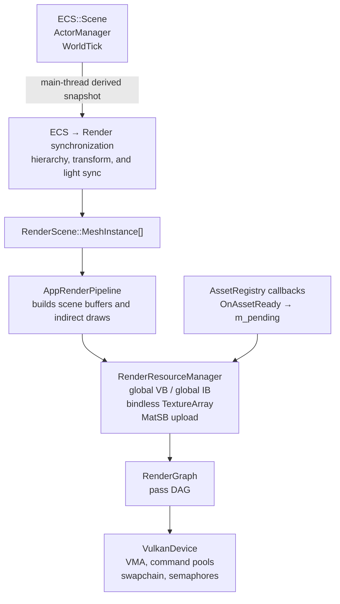
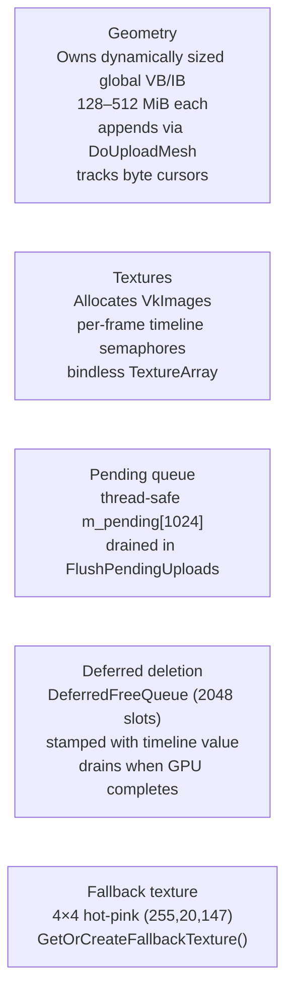
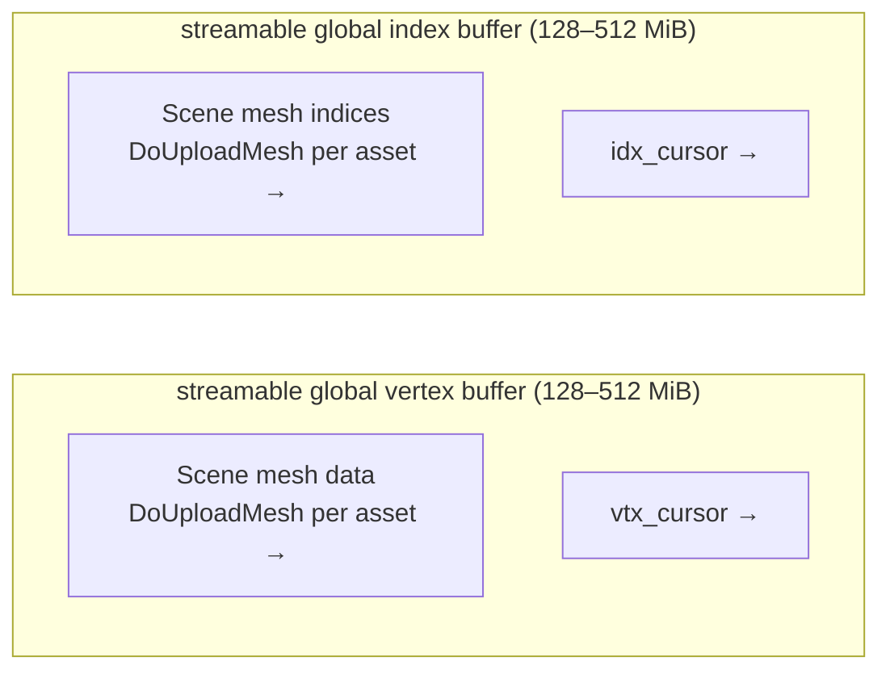
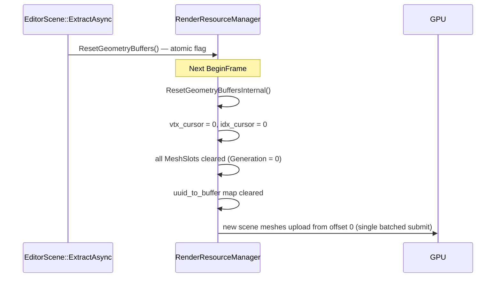
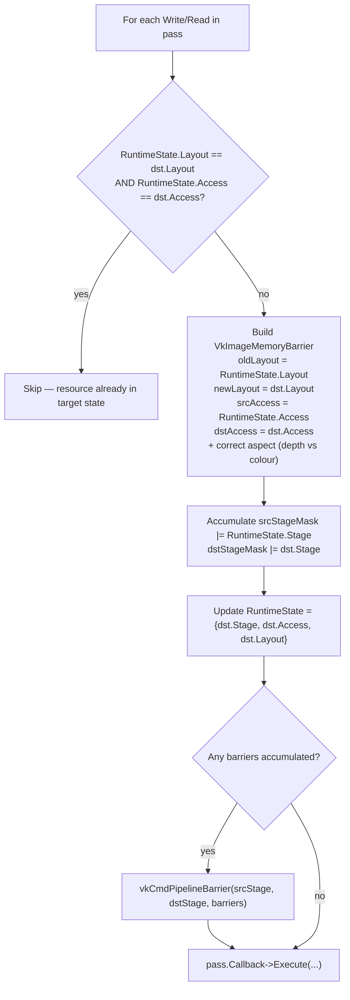
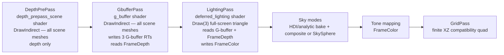
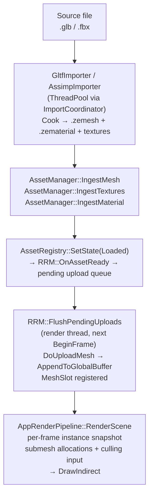
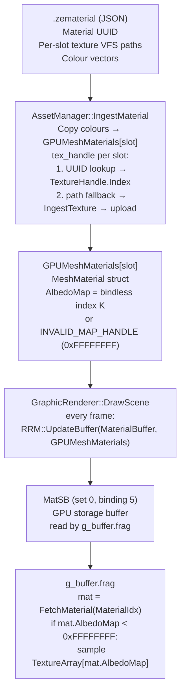
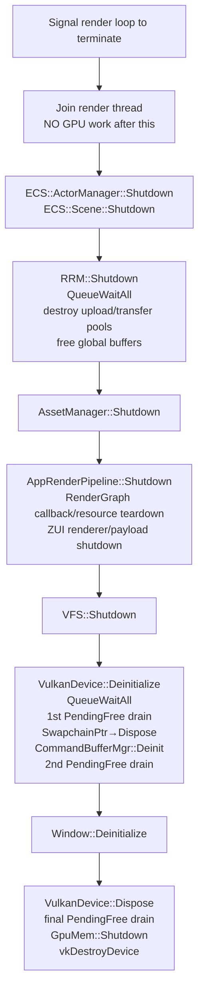

# Rendering Domain

Authoritative reference for the ZEngine rendering domain. Update it whenever a significant change lands in `develop`.

See also: [Engine Architecture](engine-architecture.md) · [Asset Manager](asset-manager.md) · [Memory Management](memory-management.md)

---

## Table of Contents

- [Architecture Overview](#architecture-overview)
- [Thread Model](#thread-model)
- [Per-Frame Flow](#per-frame-flow)
- [RenderResourceManager (RRM)](#renderresourcemanager-rrm)
- [Global Geometry Buffers](#global-geometry-buffers)
- [Render Graph and Passes](#render-graph-and-passes)
- [G-Buffer Layout](#g-buffer-layout)
- [LightingPass — Deferred PBR](#lightingpass-deferred-pbr)
- [Builtin Geometry](#builtin-geometry)
- [Scene Mesh Pipeline](#scene-mesh-pipeline)
- [Material and Texture Pipeline](#material-and-texture-pipeline)
- [Shutdown and Teardown](#shutdown-and-teardown)
- [Known Gaps and Open Issues](#known-gaps-and-open-issues)

---

## Architecture Overview



**Key design rule:** `RenderResourceManager` is the lifetime authority for Vulkan buffers and
images. Asset and ECS code may request/render-bind resources through established integration
points, but must not independently allocate, destroy, or retire Vulkan resources.

---

## Thread Model

| Thread | Responsibilities |
|---|---|
| Main thread | Fixed-timestep ECS simulation, prepares `RenderFrameState`, and publishes independent ZUI payloads |
| Render thread | `BeginFrame` → `FlushPendingUploads` → `RenderGraph::Execute` → present → `EndFrame` |
| Asset/import thread | `AssetManager::IngestMesh` / `IngestTextures` → pushes `PendingUpload` via `m_pending_mutex` |

`FlushPendingUploads` is the only point where GPU uploads happen. The asset thread never touches Vulkan directly.

---

## Per-Frame Flow

```mermaid
sequenceDiagram
    participant Main as Main Thread
    participant Render as Render Thread

    Main->>Main: WorldTick::Tick (ECS)
    Main->>Main: ActorManager::Tick
    Main->>Main: Scene::SnapshotTransforms
    Main->>Render: Publish newest RenderFrameState

    Render->>Render: Swapchain::AcquireNextImage
    Render->>Render: RRM::BeginFrame(frame_index)
    Note over Render: FlushPendingUploads
    Render->>Render: ResetGeometryBuffersInternal (if scene reload)
    Render->>Render: BeginBatchUpload
    Render->>Render: DoUploadMesh × N — ONE GPU submission
    Render->>Render: EndBatchUpload
    Render->>Render: DoUploadTexture × M (per-texture timeline)

    Render->>Render: AppRenderPipeline::RenderScene
    Note over Render: Snapshot instances; rebuild submesh + culling input
    Render->>Render: Upload TransformSB + DrawDataSB + CullingInputSB

    Render->>Render: RenderGraph::Execute
    Note over Render: Depth → G-buffer → Lighting → environment → editor overlays

    Render->>Render: ZUI Draw → swapchain
    Render->>Render: Swapchain::Present
    Render->>Render: RRM::EndFrame — finish deferred batch work
```

SkyEnvironment selects an HDRI environment-background pass, analytic SkySphere pass, or
atmosphere composition for each frame; its fallback remains valid while an update loads or fails.

---

## RenderResourceManager (RRM)

**File:** `ZEngine/ZEngine/Rendering/RenderResourceManager.h/.cpp`

Single authority over GPU buffer and image lifetime.

### Responsibilities



### Upload command buffer

RRM owns a dedicated upload command pool (`m_upload_pool`, `m_upload_cmd`, `m_upload_fence`) isolated from the swapchain timeline. In batch mode all `vkCmdCopyBuffer` calls are recorded into one command buffer and submitted in a single `vkQueueSubmit + vkWaitForFences`.

---

## Global Geometry Buffers

Streamable scene geometry lives in two device-local packed buffers. Each buffer's capacity is
derived from 15% of the largest device-local heap, split evenly between vertex and index data,
and clamped to 128–512 MiB; generated `project.json` may override the combined streaming budget.

| Buffer | Size | Usage flags |
|---|---|---|
| global vertex buffer | 128–512 MiB | `STORAGE_BUFFER \| VERTEX_BUFFER \| TRANSFER_DST` |
| global index buffer | 128–512 MiB | `STORAGE_BUFFER \| INDEX_BUFFER \| TRANSFER_DST` |



**DrawVertex format (32 bytes):**
```
offset  0 : float x, y, z      (position)
offset 12 : float nx, ny, nz   (normal)
offset 24 : float u, v          (UV)
```

The grid compatibility path only needs position, so it zeroes unused fields. All builtin geometry uses stride = 32 (`sizeof(float) * 8`).

### Compaction on scene reload



Sky and compatibility-grid geometry reside in dedicated 1 MiB built-in vertex/index buffers so
streaming reset, eviction, and compaction cannot invalidate their offsets. The production editor
grid remains an analytic overlay described in `ZEngine/docs/future-plan/editor-grid.md` and must
not rely on the finite compatibility mesh.

---

## Render Graph and Passes

**Files:** `ZEngine/ZEngine/Rendering/Renderers/RenderGraph.h/.cpp` and callback-pass headers

### Data model

The graph stores passes and resources in flat arrays indexed by typed handles:

- `Array<RGPass>` — one entry per registered pass
- `Array<RGResource>` — one entry per declared resource; indexed by `RGResourceHandle` (typed `uint32_t` index + version field)

String-keyed maps are eliminated. All lookups are O(1) array dereferences.

### Barrier derivation

`RGAccess` is an enum describing how a pass uses a resource. A compile-time `kAccessTable` maps every `RGAccess` value to `(VkPipelineStageFlags, VkAccessFlags, VkImageLayout)`. The graph derives every `vkCmdPipelineBarrier` call from this table — passes never emit barriers manually.

| `RGAccess` | Stage | Access | Layout |
|---|---|---|---|
| `None` | `TOP_OF_PIPE` | 0 | `UNDEFINED` |
| `ColorWrite` | `COLOR_ATTACHMENT_OUTPUT` | `COLOR_ATTACHMENT_WRITE` | `COLOR_ATTACHMENT_OPTIMAL` |
| `DepthWrite` | `EARLY_FRAGMENT_TESTS \| LATE_FRAGMENT_TESTS` | `DEPTH_STENCIL_WRITE \| READ` | `DEPTH_STENCIL_ATTACHMENT_OPTIMAL` |
| `DepthRead` | `EARLY_FRAGMENT_TESTS` | `DEPTH_STENCIL_READ` | `DEPTH_STENCIL_ATTACHMENT_OPTIMAL` |
| `ShaderRead` | `FRAGMENT_SHADER` | `SHADER_READ` | `SHADER_READ_ONLY_OPTIMAL` |
| `ShaderReadWrite` | `COMPUTE_SHADER` | `SHADER_READ \| WRITE` | `GENERAL` |
| `TransferRead` | `TRANSFER` | `TRANSFER_READ` | `TRANSFER_SRC_OPTIMAL` |
| `TransferWrite` | `TRANSFER` | `TRANSFER_WRITE` | `TRANSFER_DST_OPTIMAL` |
| `Present` | `BOTTOM_OF_PIPE` | 0 | `PRESENT_SRC_KHR` |

> `DepthRead` uses `DEPTH_STENCIL_ATTACHMENT_OPTIMAL` (not `READ_ONLY_OPTIMAL`) for MoltenVK compatibility. Read-only depth testing works correctly when `depthWriteEnable = VK_FALSE` in the pipeline.

**Barrier emission algorithm** (runs in `Execute()` per frame, before each pass):



**Example: FrameDepth across three consecutive passes**

```
Frame start: FrameDepth.RuntimeState = {TOP_OF_PIPE, 0, UNDEFINED}

DepthPrePass  (DepthWrite)  → barrier UNDEFINED → DEPTH_STENCIL_ATTACHMENT_OPTIMAL
                               RuntimeState = {EARLY|LATE, DEPTH_WRITE|READ, DEPTH_STENCIL_ATTACHMENT_OPTIMAL}

GbufferPass   (DepthRead)   → memory-only barrier (no layout change; only access mask differs)
                               RuntimeState = {EARLY_FRAGMENT, DEPTH_READ, DEPTH_STENCIL_ATTACHMENT_OPTIMAL}

LightingPass  (ShaderRead)  → barrier DEPTH_STENCIL_ATTACHMENT_OPTIMAL → SHADER_READ_ONLY_OPTIMAL
                               RuntimeState = {FRAGMENT_SHADER, SHADER_READ, SHADER_READ_ONLY_OPTIMAL}

EnvironmentBackgroundPass (DepthRead) → barrier SHADER_READ_ONLY_OPTIMAL → DEPTH_STENCIL_ATTACHMENT_OPTIMAL
                                        RuntimeState = {EARLY_FRAGMENT, DEPTH_READ, DEPTH_STENCIL_ATTACHMENT_OPTIMAL}

Frame N+1: RuntimeState carries across — no reset to UNDEFINED
```

### Layout tracking

Each resource carries two state fields:

| Field | Purpose | Initial value |
|---|---|---|
| `CurrentState` | Compile-time simulation — used by `BuildBarriers` to pre-compute static barriers | Reset to `UNDEFINED` at each `BuildLifetimes` call |
| `RuntimeState` | Per-frame tracking — drives the live barrier algorithm in `Execute()` | `UNDEFINED` at startup; preserved across frames; reset to `UNDEFINED` on resize |

`RuntimeState` starting at `UNDEFINED` ensures the very first barrier for each resource always performs a full layout + access transition, regardless of driver-internal state.

### Transient render targets

All render targets — including `FrameColor` and `FrameDepth` — are transient resources owned and allocated by the graph. No render target is an externally managed `Image2DBuffer` that passes hold a raw pointer to.

- `DepthPrePass::Setup` declares `FrameDepth` via `WriteDepthAttachment`.
- `LightingPass::Setup` declares `FrameColor` via `WriteColorAttachment`.
- `GbufferPass::Setup` declares the three G-buffer targets (`GBufferAlbedoAO`, `GBufferNormalRoughness`, `GBufferMetallicEmissive`) via `WriteColorAttachment` and reads `FrameDepth` via `ReadDepth`.

### Viewport resize

Resize uses a swap-and-reuse strategy to keep `TextureHandle` indices stable across frames:

1. Save the old `VkFramebuffer` and `VkImage` handles.
2. Allocate new `VkImage` / `VkImageView` at the new dimensions and write them into the existing `Image2DBuffer` slot in place — the `TextureHandle` index does not change.
3. Submit the old Vulkan objects to `DeferFree`; they are destroyed after the GPU timeline value covering the last frame that referenced them completes.

Descriptor sets that reference the bindless `TextureArray` remain valid across resize because the `TextureHandle` index is unchanged.

### Pass order



### Scene passes (DepthPrePass, GbufferPass)

Use `vkCmdDrawIndirect` with commands written by `FrustumCullingPass` into the
per-frame device-local culled-indirect buffer. `AppRenderPipeline::RenderScene()`
rebuilds transforms, submesh draw data, and culling input from an instance
snapshot every rendered frame; it clears `InstancesDirty` but does not use that
flag as a rebuild gate. The per-frame upload heap currently carries camera UBO
data; the scene storage buffers are updated through RRM.

### RenderGraph public API

| Method | Description |
|---|---|
| `GetPass(name)` | Returns `RGPass*` — O(1) typed-index lookup; for setup and configuration only |
| `SetPassEnabled(name, bool)` | Toggles a pass on or off at runtime without recompiling the graph |

### RenderGraphResourceBuilder (Register phase)

| Method | Effect |
|---|---|
| `WriteColorAttachment(name, spec)` | Declares a transient color render target owned by the graph |
| `WriteDepthAttachment(name, spec)` | Declares a transient depth render target owned by the graph |
| `ReadTexture(name, binding_key)` | Declares a sampled texture read; resource transitions to `ShaderRead` |
| `ReadDepth(name)` | Declares a depth read; resource stays in `DEPTH_STENCIL_ATTACHMENT_OPTIMAL` |
| `AttachRenderTarget(name, handle)` | Attaches an external `TextureHandle` not owned by the graph |

### RenderGraphResourceInspector

| Method | Description |
|---|---|
| `GetTextureHandle(RGResourceHandle)` | Returns `TextureHandle` — O(1) array dereference |
| `GetRenderTarget(name)` | Returns `TextureHandle` by name |
| `GetTexture(name)` | Returns `TextureHandle` by name |

### IRenderGraphCallbackPass interface

Persistent callback passes use the current graph lifecycle:

| Method | Phase | Purpose |
|---|---|---|
| `Register(device, name, frame_context, res_builder, res_inspector)` | Per-frame graph construction | Declare reads/writes and opt into this frame. |
| Pipeline description / compute shader query | Backend graph preparation | Supply static pipeline requirements; the graph owns attachment compatibility. |
| `Prepare(device, scene, inspector, pass)` | After graph compilation | Refresh frame-local descriptors and constants. |
| `Execute(...)` or `RecordDraw(...)` | Command recording | Record pass work outside or inside graph-managed rendering. |

---

## G-Buffer Layout

GbufferPass writes three transient color attachments plus the shared `FrameDepth` depth attachment from DepthPrePass. World-space position is not stored as a separate render target — it is reconstructed from depth in LightingPass.

| Attachment | Name | Format | Contents |
|---|---|---|---|
| RT0 | `GBufferAlbedoAO` | `R8G8B8A8_UNORM` | RGB: albedo. A: ambient occlusion (ORM texture R channel) |
| RT1 | `GBufferNormalRoughness` | `R16G16B16A16_SFLOAT` | RGB: world-space normal packed from ±1 to [0,1] via `n * 0.5 + 0.5`. A: roughness (ORM texture G channel) |
| RT2 | `GBufferMetallicEmissive` | `R8G8B8A8_UNORM` | R: metallic (ORM texture B channel). G: emissive intensity. BA: reserved |
| Depth | `FrameDepth` | device depth format | Shared from DepthPrePass via `ReadDepth`; not stored as a color channel |

ORM texture channel mapping: R = occlusion, G = roughness, B = metallic.

---

## LightingPass — Deferred PBR

LightingPass is a full-screen triangle pass that reads the three G-buffer targets and `FrameDepth` as `ShaderRead` inputs, plus a `LightBuffer` SSBO, and writes the final shaded result to `FrameColor`.

### Light data

`LightArrayUBO` is uploaded each frame:

```
DirectionalLights[4]
    Direction   vec4
    Color       vec4
    Intensity   float

PointLights[8]
    Position    vec4
    Color       vec4
    Intensity   float
    Radius      float

DirectionalCount  uint
PointCount        uint
```

### BRDF

Cook-Torrance specular BRDF:

- Distribution: GGX (Trowbridge-Reitz)
- Geometry: Smith (GGX correlated)
- Fresnel: Schlick approximation

### Position reconstruction

World-space position is reconstructed from the depth buffer using the inverse view-projection matrix. `Camera.InvViewProj` is added to `UBOCameraLayout` and exposed in `geometry_bindings.glsl`.

```
ndc.xy  = uv * 2.0 - 1.0
ndc.z   = sample(FrameDepth, uv)
world   = InvViewProj * vec4(ndc, 1.0)
world  /= world.w
```

### Tone mapping

`ToneMappingPass` converts linear HDR scene colour into the sampled `FrameColor`
target. The current `tone_mapping.frag` uses fitted ACES followed by a
`pow(color, 1.0 / 2.2)` display transform; it is a separate pass after lighting,
not Reinhard logic inside `LightingPass`.

---

## Builtin Geometry

The current grid mesh is temporary compatibility geometry, not the production grid renderer:

- **Grid compatibility path:** 4 vertices (flat quad) used only until the serialized arbitrary-plane analytic grid passes its visual and validation gates

---

## Scene Mesh Pipeline



### SubMeshAllocation

Each submesh of each mesh instance produces one draw command:

```cpp
struct SubMeshAllocation {
    uint32_t VertexOffset;    // first DrawVertex element in global VB
    uint32_t IndexOffset;     // first uint32 element in global IB
    uint32_t VertexCount;
    uint32_t IndexCount;
    uint32_t InstanceCount;
    uint32_t TransformId;     // index into TransformSB
    uint32_t MaterialId;      // index into GPUMeshMaterials / MatSB
};
```

---

## Material and Texture Pipeline



`.zematerial` files are JSON (nlohmann/json). Texture paths are inline in `.zematerial` — `.zetextures` files are eliminated.

`EditorScene::ExtractAsync` currently processes materials **before** meshes so
texture handles are available when mesh submeshes reference them. It is a
compatibility scene-extraction path, not the staged UUID-based scene-document
load contract described in `scene-serialization.md`.

---

## Shutdown and Teardown



### Arena-allocation rule for Vulkan objects

All rendering objects are arena-allocated. Arena release frees raw memory pages without calling C++ destructors — every subsystem must call destructors **explicitly**.

| Class | Strategy | Reason |
|---|---|---|
| `CommandPool` | Direct — `vkDestroyCommandPool` in `~CommandPool()` | Always freed at GPU-idle |
| `Semaphore` / `Fence` | Deferred — `Device->DeferFree()` in destructor | Can be signalled mid-frame |
| `FramebufferVNext` | Direct — `vkDestroyFramebuffer` in `Dispose()` | Called after `QueueWaitAll` |
| `GraphicPipeline` | Direct — `vkDestroyPipeline[Layout]` in `Dispose()` | Same |

See [Memory Management — Arena-Allocated Vulkan Objects](memory-management.md#arena-allocated-vulkan-objects) for the full rules.

---

## Known Gaps and Open Issues

| Issue | Area | Description |
|---|---|---|
| Authoring render bindings | Scene lifecycle | Transform/light synchronization is live for bound instances. Staged scene load, create/delete, and undo restoration still need to rebuild MeshComponent to RenderScene bindings before publication; see scene-serialization.md and editor-undo-redo.md. |
| [#753](https://github.com/JeanPhilippeKernel/RendererEngine/issues/753) | RRM tests | A headless *VulkanDevice* fixture is needed to unskip GPU-level texture/reload lifetime tests. |
| [#663](https://github.com/JeanPhilippeKernel/RendererEngine/issues/663) | Visibility | GPU frustum rejection exists; compacted `vkDrawIndirectCount` submission remains. The issue's CPU-only description is stale. |
| [#312](https://github.com/JeanPhilippeKernel/RendererEngine/issues/312) | Transient memory | Exact-match transient reuse exists. True overlapping-memory aliasing is a separate, measured-pressure optimization. |
| [#314](https://github.com/JeanPhilippeKernel/RendererEngine/issues/314) | Transparency | A production transparent submission pass is still absent. |
| [#318](https://github.com/JeanPhilippeKernel/RendererEngine/issues/318) | Shader validation | Runtime shader compilation needs automated behavioral coverage. |
| [#821](https://github.com/JeanPhilippeKernel/RendererEngine/issues/821) | Environment policy | Settings UI is open work, but RendererEngine must not directly persist the Hub-generated `project.json`. |

### Remaining work

- Production editor scene binding rebuild and immutable render snapshots
- Advanced visibility: compacted indirect-count, occlusion/Hi-Z, and material-sort policy
- Texture batching/streaming policy beyond the current upload and release paths

### Recently fixed

| PR | Area | What was fixed |
|---|---|---|
| [#641](https://github.com/JeanPhilippeKernel/RendererEngine/pull/641) | Rendering | Render graph redesign (typed indices, `RGAccess` barrier table), deferred PBR pipeline (3-RT G-buffer + LightingPass with Cook-Torrance BRDF), stable viewport resize via swap-and-reuse slot |
| [#634](https://github.com/JeanPhilippeKernel/RendererEngine/pull/634) | Material/texture | Material texture handles now bound to mesh submeshes at draw time; `IngestMaterial` self-heals missing texture handles via path fallback; `.zmesh` drag-drop loads associated `.zematerial` files |
| [#633](https://github.com/JeanPhilippeKernel/RendererEngine/pull/633) | Importer | GLB texture extraction fixed: `fastgltf::visitor` + `std::visit` dispatch failure replaced with explicit `std::get_if` chains; texture loop optimized (pre-resolved buffer ptrs, `fopen`/`fwrite`, no heap in hot path) |
| [#632](https://github.com/JeanPhilippeKernel/RendererEngine/pull/632) | Importer | Dangling path pointers in `AssetImporterUIComponent`; `.zematerial` routing to wrong directory; GltfImporter texture `dest_dir` dropped workspace; codec writes migrated to VFS atomic rename |
| [#612](https://github.com/JeanPhilippeKernel/RendererEngine/pull/612) | Vulkan shutdown | All `vkDestroyDevice` validation errors eliminated |
| [#611](https://github.com/JeanPhilippeKernel/RendererEngine/pull/611) | Rendering | Legacy builtin background/grid geometry migrated into RRM global buffers; mesh upload batching (N submissions → 1); geometry compaction on scene reload |
