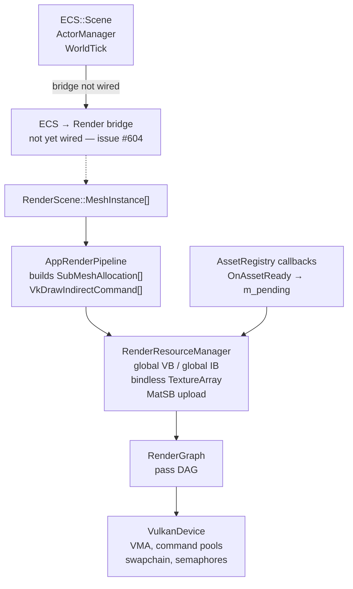
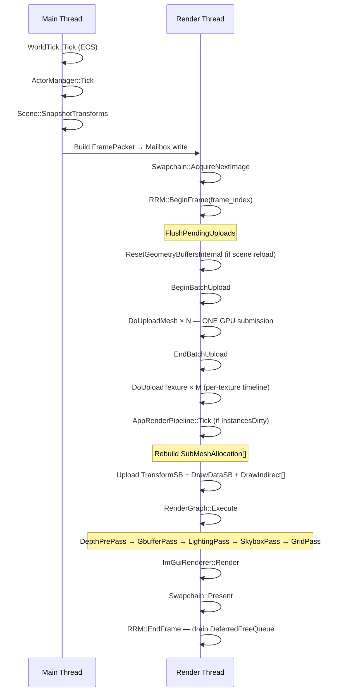
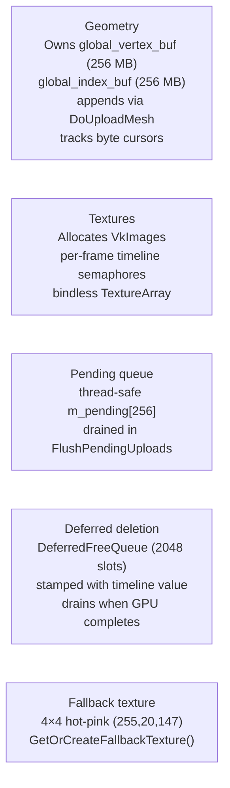
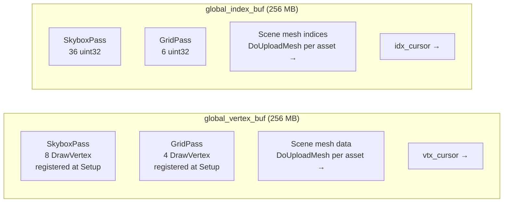
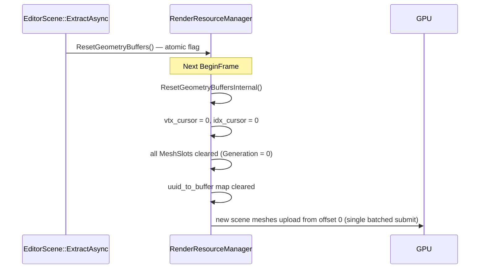
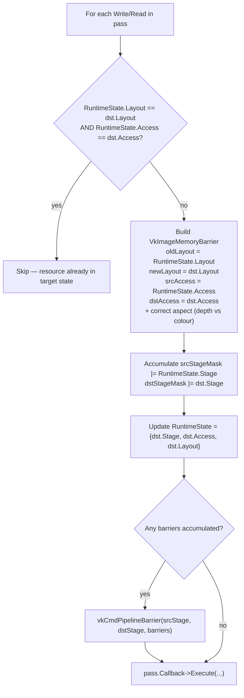
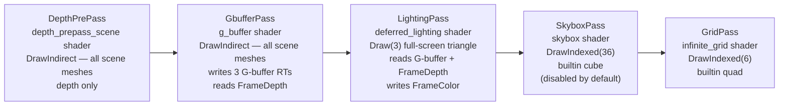
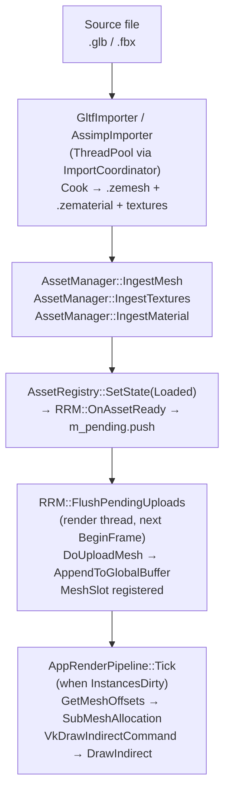
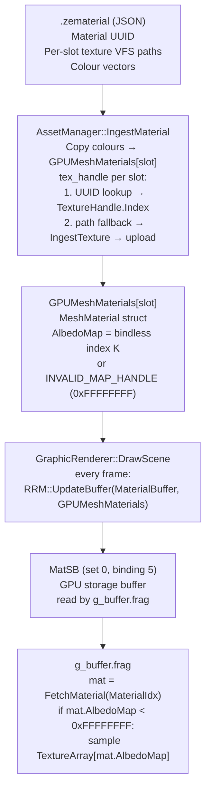
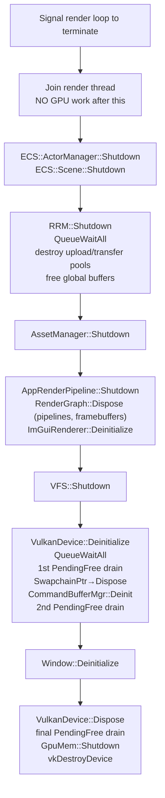

# Rendering Domain

Authoritative reference for the ZEngine rendering domain. Update it whenever a significant change lands in `develop`.

See also: [Engine Architecture](engine-architecture.md) · [Asset Manager](asset-manager.md) · [Memory Management](memory-management.md)

---

## Table of Contents

- [Architecture Overview](#architecture-overview)
- [Thread Model](#thread-model)
- [Per-Frame Flow](#per-frame-flow)
- [RenderResourceManager (RRM)](#renderresourcemanager-rrm)
- [Global Geometry Buffers](#global-geometry-buffers)
- [Render Graph and Passes](#render-graph-and-passes)
- [G-Buffer Layout](#g-buffer-layout)
- [LightingPass — Deferred PBR](#lightingpass-deferred-pbr)
- [Builtin Geometry](#builtin-geometry)
- [Scene Mesh Pipeline](#scene-mesh-pipeline)
- [Material and Texture Pipeline](#material-and-texture-pipeline)
- [Shutdown and Teardown](#shutdown-and-teardown)
- [Known Gaps and Open Issues](#known-gaps-and-open-issues)

---

## Architecture Overview



**Key design rule:** Neither `AssetManager` nor `ECS` know about GPU resources directly. All GPU lifetime flows through `RenderResourceManager`.

---

## Thread Model

| Thread | Responsibilities |
|---|---|
| Main thread | Fixed-timestep ECS simulation, builds FramePacket, posts to render thread |
| Render thread | `BeginFrame` → `FlushPendingUploads` → `RenderGraph::Execute` → present → `EndFrame` |
| Asset/import thread | `AssetManager::IngestMesh` / `IngestTextures` → pushes `PendingUpload` via `m_pending_mutex` |

`FlushPendingUploads` is the only point where GPU uploads happen. The asset thread never touches Vulkan directly.

---

## Per-Frame Flow



SkyboxPass is disabled by default and enabled when the sky configuration loads an HDRI.

---

## RenderResourceManager (RRM)

**File:** `ZEngine/ZEngine/Rendering/RenderResourceManager.h/.cpp`

Single authority over GPU buffer and image lifetime.

### Responsibilities



### Upload command buffer

RRM owns a dedicated upload command pool (`m_upload_pool`, `m_upload_cmd`, `m_upload_fence`) isolated from the swapchain timeline. In batch mode all `vkCmdCopyBuffer` calls are recorded into one command buffer and submitted in a single `vkQueueSubmit + vkWaitForFences`.

---

## Global Geometry Buffers

All scene geometry lives in two device-local packed buffers:

| Buffer | Size | Usage flags |
|---|---|---|
| `m_global_vertex_buf` | 256 MB | `STORAGE_BUFFER \| VERTEX_BUFFER \| TRANSFER_DST` |
| `m_global_index_buf` | 256 MB | `STORAGE_BUFFER \| INDEX_BUFFER \| TRANSFER_DST` |



**DrawVertex format (32 bytes):**
```
offset  0 : float x, y, z      (position)
offset 12 : float nx, ny, nz   (normal)
offset 24 : float u, v          (UV)
```

Passes that only need position (skybox, grid) zero out the unused fields. All passes use stride = 32 (`sizeof(float) * 8`).

### Compaction on scene reload



Builtin geometry (skybox, grid) is registered at pass `Setup()` before any scene loads — their offsets are stable and unaffected by compaction.

---

## Render Graph and Passes

**Files:** `ZEngine/ZEngine/Rendering/Renderers/RendererPasses.h/.cpp`

### Data model

The graph stores passes and resources in flat arrays indexed by typed handles:

- `Array<RGPass>` — one entry per registered pass
- `Array<RGResource>` — one entry per declared resource; indexed by `RGResourceHandle` (typed `uint32_t` index + version field)

String-keyed maps are eliminated. All lookups are O(1) array dereferences.

### Barrier derivation

`RGAccess` is an enum describing how a pass uses a resource. A compile-time `kAccessTable` maps every `RGAccess` value to `(VkPipelineStageFlags, VkAccessFlags, VkImageLayout)`. The graph derives every `vkCmdPipelineBarrier` call from this table — passes never emit barriers manually.

| `RGAccess` | Stage | Access | Layout |
|---|---|---|---|
| `None` | `TOP_OF_PIPE` | 0 | `UNDEFINED` |
| `ColorWrite` | `COLOR_ATTACHMENT_OUTPUT` | `COLOR_ATTACHMENT_WRITE` | `COLOR_ATTACHMENT_OPTIMAL` |
| `DepthWrite` | `EARLY_FRAGMENT_TESTS \| LATE_FRAGMENT_TESTS` | `DEPTH_STENCIL_WRITE \| READ` | `DEPTH_STENCIL_ATTACHMENT_OPTIMAL` |
| `DepthRead` | `EARLY_FRAGMENT_TESTS` | `DEPTH_STENCIL_READ` | `DEPTH_STENCIL_ATTACHMENT_OPTIMAL` |
| `ShaderRead` | `FRAGMENT_SHADER` | `SHADER_READ` | `SHADER_READ_ONLY_OPTIMAL` |
| `ShaderReadWrite` | `COMPUTE_SHADER` | `SHADER_READ \| WRITE` | `GENERAL` |
| `TransferRead` | `TRANSFER` | `TRANSFER_READ` | `TRANSFER_SRC_OPTIMAL` |
| `TransferWrite` | `TRANSFER` | `TRANSFER_WRITE` | `TRANSFER_DST_OPTIMAL` |
| `Present` | `BOTTOM_OF_PIPE` | 0 | `PRESENT_SRC_KHR` |

> `DepthRead` uses `DEPTH_STENCIL_ATTACHMENT_OPTIMAL` (not `READ_ONLY_OPTIMAL`) for MoltenVK compatibility. Read-only depth testing works correctly when `depthWriteEnable = VK_FALSE` in the pipeline.

**Barrier emission algorithm** (runs in `Execute()` per frame, before each pass):



**Example: FrameDepth across three consecutive passes**

```
Frame start: FrameDepth.RuntimeState = {TOP_OF_PIPE, 0, UNDEFINED}

DepthPrePass  (DepthWrite)  → barrier UNDEFINED → DEPTH_STENCIL_ATTACHMENT_OPTIMAL
                               RuntimeState = {EARLY|LATE, DEPTH_WRITE|READ, DEPTH_STENCIL_ATTACHMENT_OPTIMAL}

GbufferPass   (DepthRead)   → memory-only barrier (no layout change; only access mask differs)
                               RuntimeState = {EARLY_FRAGMENT, DEPTH_READ, DEPTH_STENCIL_ATTACHMENT_OPTIMAL}

LightingPass  (ShaderRead)  → barrier DEPTH_STENCIL_ATTACHMENT_OPTIMAL → SHADER_READ_ONLY_OPTIMAL
                               RuntimeState = {FRAGMENT_SHADER, SHADER_READ, SHADER_READ_ONLY_OPTIMAL}

SkyboxPass    (DepthRead)   → barrier SHADER_READ_ONLY_OPTIMAL → DEPTH_STENCIL_ATTACHMENT_OPTIMAL
                               RuntimeState = {EARLY_FRAGMENT, DEPTH_READ, DEPTH_STENCIL_ATTACHMENT_OPTIMAL}

Frame N+1: RuntimeState carries across — no reset to UNDEFINED
```

### Layout tracking

Each resource carries two state fields:

| Field | Purpose | Initial value |
|---|---|---|
| `CurrentState` | Compile-time simulation — used by `BuildBarriers` to pre-compute static barriers | Reset to `UNDEFINED` at each `BuildLifetimes` call |
| `RuntimeState` | Per-frame tracking — drives the live barrier algorithm in `Execute()` | `UNDEFINED` at startup; preserved across frames; reset to `UNDEFINED` on resize |

`RuntimeState` starting at `UNDEFINED` ensures the very first barrier for each resource always performs a full layout + access transition, regardless of driver-internal state.

### Transient render targets

All render targets — including `FrameColor` and `FrameDepth` — are transient resources owned and allocated by the graph. No render target is an externally managed `Image2DBuffer` that passes hold a raw pointer to.

- `DepthPrePass::Setup` declares `FrameDepth` via `WriteDepthAttachment`.
- `LightingPass::Setup` declares `FrameColor` via `WriteColorAttachment`.
- `GbufferPass::Setup` declares the three G-buffer targets (`GBufferAlbedoAO`, `GBufferNormalRoughness`, `GBufferMetallicEmissive`) via `WriteColorAttachment` and reads `FrameDepth` via `ReadDepth`.

### Viewport resize

Resize uses a swap-and-reuse strategy to keep `TextureHandle` indices stable across frames:

1. Save the old `VkFramebuffer` and `VkImage` handles.
2. Allocate new `VkImage` / `VkImageView` at the new dimensions and write them into the existing `Image2DBuffer` slot in place — the `TextureHandle` index does not change.
3. Submit the old Vulkan objects to `DeferFree`; they are destroyed after the GPU timeline value covering the last frame that referenced them completes.

Descriptor sets that reference the bindless `TextureArray` remain valid across resize because the `TextureHandle` index is unchanged.

### Pass order



### Scene passes (DepthPrePass, GbufferPass)

Use `vkCmdDrawIndirect` with a pre-built `VkDrawIndirectCommand[]` array uploaded into the per-frame `FrameHeap`. `AppRenderPipeline::Tick` rebuilds the array whenever `InstancesDirty` is set.

### RenderGraph public API

| Method | Description |
|---|---|
| `GetPass(name)` | Returns `RGPass*` — O(1) typed-index lookup; for setup and configuration only |
| `SetPassEnabled(name, bool)` | Toggles a pass on or off at runtime without recompiling the graph |

### RenderGraphResourceBuilder (Setup phase)

| Method | Effect |
|---|---|
| `WriteColorAttachment(name, spec)` | Declares a transient color render target owned by the graph |
| `WriteDepthAttachment(name, spec)` | Declares a transient depth render target owned by the graph |
| `ReadTexture(name, binding_key)` | Declares a sampled texture read; resource transitions to `ShaderRead` |
| `ReadDepth(name)` | Declares a depth read; resource stays in `DEPTH_STENCIL_ATTACHMENT_OPTIMAL` |
| `AttachRenderTarget(name, handle)` | Attaches an external `TextureHandle` not owned by the graph |

### RenderGraphResourceInspector

| Method | Description |
|---|---|
| `GetTextureHandle(RGResourceHandle)` | Returns `TextureHandle` — O(1) array dereference |
| `GetRenderTarget(name)` | Returns `TextureHandle` by name |
| `GetTexture(name)` | Returns `TextureHandle` by name |

### IRenderGraphCallbackPass interface

Existing passes compile without modification. The three virtual methods are unchanged:

| Method | Phase | Purpose |
|---|---|---|
| `Setup(device, name, res_builder, res_inspector)` | Compile | Declare reads and writes via `res_builder` |
| `Compile(device, scene, pass_builder, res_inspector, output_pass)` | Compile | Create Vulkan pipeline objects |
| `Execute(device, res_inspector, scene, pass, framebuffer, cb)` | Execute | Record `vkCmd*` calls into `cb` |

---

## G-Buffer Layout

GbufferPass writes three transient color attachments plus the shared `FrameDepth` depth attachment from DepthPrePass. World-space position is not stored as a separate render target — it is reconstructed from depth in LightingPass.

| Attachment | Name | Format | Contents |
|---|---|---|---|
| RT0 | `GBufferAlbedoAO` | `R8G8B8A8_UNORM` | RGB: albedo. A: ambient occlusion (ORM texture R channel) |
| RT1 | `GBufferNormalRoughness` | `R16G16B16A16_SFLOAT` | RGB: world-space normal packed from ±1 to [0,1] via `n * 0.5 + 0.5`. A: roughness (ORM texture G channel) |
| RT2 | `GBufferMetallicEmissive` | `R8G8B8A8_UNORM` | R: metallic (ORM texture B channel). G: emissive intensity. BA: reserved |
| Depth | `FrameDepth` | device depth format | Shared from DepthPrePass via `ReadDepth`; not stored as a color channel |

ORM texture channel mapping: R = occlusion, G = roughness, B = metallic.

---

## LightingPass — Deferred PBR

LightingPass is a full-screen triangle pass that reads the three G-buffer targets and `FrameDepth` as `ShaderRead` inputs, plus a `LightBuffer` SSBO, and writes the final shaded result to `FrameColor`.

### Light data

`LightArrayUBO` is uploaded each frame:

```
DirectionalLights[4]
    Direction   vec4
    Color       vec4
    Intensity   float

PointLights[8]
    Position    vec4
    Color       vec4
    Intensity   float
    Radius      float

DirectionalCount  uint
PointCount        uint
```

### BRDF

Cook-Torrance specular BRDF:

- Distribution: GGX (Trowbridge-Reitz)
- Geometry: Smith (GGX correlated)
- Fresnel: Schlick approximation

### Position reconstruction

World-space position is reconstructed from the depth buffer using the inverse view-projection matrix. `Camera.InvViewProj` is added to `UBOCameraLayout` and exposed in `geometry_bindings.glsl`.

```
ndc.xy  = uv * 2.0 - 1.0
ndc.z   = sample(FrameDepth, uv)
world   = InvViewProj * vec4(ndc, 1.0)
world  /= world.w
```

### Tone mapping

Reinhard tone mapping followed by gamma correction (`pow(color, 1.0/2.2)`) is applied at the end of the lighting shader before writing to `FrameColor`.

---

## Builtin Geometry

`SkyboxPass` and `GridPass` call `RRM::RegisterBuiltinGeometry` during `Setup()`, before any scene is loaded. Vertices are pre-padded to the 32-byte DrawVertex layout:

- **Skybox:** 8 vertices (unit cube), normals and UVs zeroed
- **Grid:** 4 vertices (flat quad ±1000 units at Y=0), up-normal (0,1,0), UVs mapped to XZ

---

## Scene Mesh Pipeline



### SubMeshAllocation

Each submesh of each mesh instance produces one draw command:

```cpp
struct SubMeshAllocation {
    uint32_t VertexOffset;    // first DrawVertex element in global VB
    uint32_t IndexOffset;     // first uint32 element in global IB
    uint32_t VertexCount;
    uint32_t IndexCount;
    uint32_t InstanceCount;
    uint32_t TransformId;     // index into TransformSB
    uint32_t MaterialId;      // index into GPUMeshMaterials / MatSB
};
```

---

## Material and Texture Pipeline



`.zematerial` files are JSON (nlohmann/json). Texture paths are inline in `.zematerial` — `.zetextures` files are eliminated.

On scene load, `EditorScene::ExtractAsync` processes materials **before** meshes so texture handles are available when mesh submeshes reference them.

---

## Shutdown and Teardown



### Arena-allocation rule for Vulkan objects

All rendering objects are arena-allocated. Arena release frees raw memory pages without calling C++ destructors — every subsystem must call destructors **explicitly**.

| Class | Strategy | Reason |
|---|---|---|
| `CommandPool` | Direct — `vkDestroyCommandPool` in `~CommandPool()` | Always freed at GPU-idle |
| `Semaphore` / `Fence` | Deferred — `Device->DeferFree()` in destructor | Can be signalled mid-frame |
| `FramebufferVNext` | Direct — `vkDestroyFramebuffer` in `Dispose()` | Called after `QueueWaitAll` |
| `GraphicPipeline` | Direct — `vkDestroyPipeline[Layout]` in `Dispose()` | Same |

See [Memory Management — Arena-Allocated Vulkan Objects](memory-management.md#arena-allocated-vulkan-objects) for the full rules.

---

## Known Gaps and Open Issues

| Issue | Area | Description |
|---|---|---|
| [#604](https://github.com/JeanPhilippeKernel/RendererEngine/issues/604) | ECS bridge | `ECS::Scene::FillRenderableTransforms` exists but is never called; ECS `TransformComponent` changes do not propagate to `TransformSB` or `MeshInstance::Transform` |
| [#599](https://github.com/JeanPhilippeKernel/RendererEngine/issues/599) | Importer | Import options (scale, axis, normals) in the importer panel are cosmetic — not passed to `ImportFile` |
| [#600](https://github.com/JeanPhilippeKernel/RendererEngine/issues/600) | Importer | `GltfImporter`: `sources::URI` embedded textures silently skipped |
| [#601](https://github.com/JeanPhilippeKernel/RendererEngine/issues/601) | Importer | `ImportProgressCallback` never called; progress bar stays at 0% |

### Planned but not started

- Draw call sorting by material (reduces descriptor set switches)
- GPU frustum culling via compute pre-pass (`draw-call-sorting.md`, `culling-system.md`)
- Hot-reload geometry swap (`RRM::ScheduleSwap` stub exists)
- Texture batching in `FlushPendingUploads` (mesh uploads batched; textures still per-upload)

### Recently fixed

| PR | Area | What was fixed |
|---|---|---|
| [#641](https://github.com/JeanPhilippeKernel/RendererEngine/pull/641) | Rendering | Render graph redesign (typed indices, `RGAccess` barrier table), deferred PBR pipeline (3-RT G-buffer + LightingPass with Cook-Torrance BRDF), stable viewport resize via swap-and-reuse slot |
| [#634](https://github.com/JeanPhilippeKernel/RendererEngine/pull/634) | Material/texture | Material texture handles now bound to mesh submeshes at draw time; `IngestMaterial` self-heals missing texture handles via path fallback; `.zmesh` drag-drop loads associated `.zematerial` files |
| [#633](https://github.com/JeanPhilippeKernel/RendererEngine/pull/633) | Importer | GLB texture extraction fixed: `fastgltf::visitor` + `std::visit` dispatch failure replaced with explicit `std::get_if` chains; texture loop optimized (pre-resolved buffer ptrs, `fopen`/`fwrite`, no heap in hot path) |
| [#632](https://github.com/JeanPhilippeKernel/RendererEngine/pull/632) | Importer | Dangling path pointers in `AssetImporterUIComponent`; `.zematerial` routing to wrong directory; GltfImporter texture `dest_dir` dropped workspace; codec writes migrated to VFS atomic rename |
| [#612](https://github.com/JeanPhilippeKernel/RendererEngine/pull/612) | Vulkan shutdown | All `vkDestroyDevice` validation errors eliminated |
| [#611](https://github.com/JeanPhilippeKernel/RendererEngine/pull/611) | Rendering | SkyboxPass/GridPass geometry migrated into RRM global buffers; mesh upload batching (N submissions → 1); geometry compaction on scene reload |
