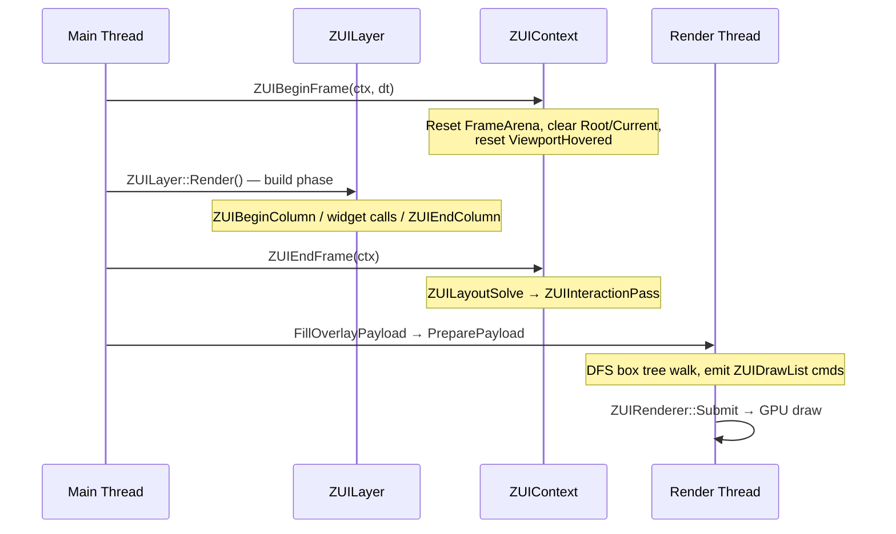

# ZUI System

The ZUI system is the engine's native retained-mode UI layer for editor panels and in-game HUD work. Every widget is the same struct (`ZUIBox`), no class hierarchy, no virtual dispatch.

See also: [Engine Architecture](engine-architecture.md) · [Rendering Domain](rendering-domain.md)

---

## Table of Contents

- [Philosophy](#philosophy)
- [Architecture Layers](#architecture-layers)
- [Per-Frame Lifecycle](#per-frame-lifecycle)
- [Box Model](#box-model)
- [Layout System](#layout-system)
- [Interaction System](#interaction-system)
- [Input Feed](#input-feed)
- [Font Atlas](#font-atlas)
- [Docking System](#docking-system)
- [Renderer](#renderer)
- [Inspiration](#inspiration)

---

## Philosophy

1. **One struct for everything.** `ZUIBox` is the only widget type. Flags, sizes, colors, text, and draw hints all live on the same struct. No subclassing.
2. **Retained, not immediate.** The box tree is rebuilt every frame, but persistent state (open/closed, scroll position, hot/active animation) is stored in a fixed-capacity hash table keyed by the box's FNV-1a hash. No allocation per-frame for persistent state.
3. **Layout is separate from interaction.** Build → Layout → Interact — three discrete phases per frame. Widget functions run during Build; the layout solver and hit-test run inside `ZUIEndFrame`.
4. **No heap in the hot path.** All per-frame allocations use `ZUIContext::FrameArena` (reset each frame). Persistent state and font data use `ZUIContext::PersistentArena`. Neither ever calls `malloc`.
5. **Engine-agnostic input.** The ZUI layer uses a feed model: `ZUIFeedMousePos`, `ZUIFeedKey`, etc. `ZUILayer` translates engine events to feed calls. No global input state.

---

## Architecture Layers

```
┌────────────────────────────────────────────────────────────┐
│                    Editor panels (Tetragrama)               │
│  ZUIPanelManagerComponent  ZUIDockspaceComponent           │
│  HierarchyPanel  InspectorPanel  ProjectViewPanel  ...     │
├────────────────────────────────────────────────────────────┤
│                     ZUI Widget Library                      │
│        ZUIWidgets.h — Button, Label, Table, TreeView …     │
├────────────────────────────────────────────────────────────┤
│                       ZUI Core                              │
│  ZUIContext   ZUIBox   ZUILayout   ZUIInteraction           │
│  ZUIFont      ZUIDrawList   ZUIInput   ZUIDockspace         │
├────────────────────────────────────────────────────────────┤
│                     ZUIRenderer (Vulkan)                    │
│       PreparePayload → ZUIDrawList → GPU vertex buffer      │
│       ZUIPass in AppRenderPipeline render graph            │
└────────────────────────────────────────────────────────────┘
```

---

## Per-Frame Lifecycle



Key invariant: **widget functions run during Build**; `ScreenMin/ScreenMax` are only valid after `ZUILayoutSolve`; `HotKey/ActiveKey` are only valid after `ZUIInteractionPass`.

---

## Box Model

**File:** `ZEngine/ZEngine/UI/ZUIBox.h`

`ZUIBox` fields:

| Group | Fields | Notes |
|---|---|---|
| Identity | `Key` (uint64), `Label` (ZUIStr) | FNV-1a hash; label is FrameArena slice |
| Tree | `Parent`, `FirstChild`, `LastChild`, `NextSib`, `PrevSib` | Arena pointers, valid one frame only |
| Build-time | `Flags`, `Size[2]`, `LayoutAxis`, `TextAlign`, `FontSize` | Set by widget functions |
| Colors | `Colors[4][4]`, `TextColor[4]`, `BorderColor[4]` | Per-corner RGBA |
| Radii | `CornerRadii[4]`, `EdgeSoftness` | SDF-based AA rounding |
| Layout output | `ComputedSize[2]`, `ScreenMin[2]`, `ScreenMax[2]` | Written by `ZUILayoutSolve` |

### Size kinds (`ZUISizeKind`)

| Kind | Behaviour |
|---|---|
| `Pixels` | Fixed logical-pixel size |
| `Text` | Size to rendered text extent |
| `ChildrenSum` | Intrinsic fit — sum (main axis) or max (cross axis) of children |
| `ParentPercent` | Fraction of parent's computed size |
| `Fill` | Expand to fill remaining space after fixed siblings |

### Box flags (`ZUIBoxFlags`)

| Flag | Effect |
|---|---|
| `ZUI_DrawBackground` | Filled rect with per-corner `Colors` |
| `ZUI_DrawBorder` | Stroked border with `BorderColor` |
| `ZUI_DrawText` | Text from `Label` |
| `ZUI_Clickable` | Participates in hit-test; generates `ZUISignal` |
| `ZUI_Scrollable` | Scroll wheel routing |
| `ZUI_ClipChildren` | Scissor children to box bounds |
| `ZUI_FloatX / FloatY` | Positioned by `FloatPos` not parent layout |
| `ZUI_DrawActorIcon` | Actor-type icon (gizmo / hierarchy) |
| `ZUI_DrawLine` | AA overlay line (used by gizmo overlays) |

---

## Layout System

**File:** `ZEngine/ZEngine/UI/ZUILayout.h/.cpp`

Two-pass constraint solver called inside `ZUIEndFrame`:

**Pass 1 — Post-order intrinsic sizes**
Walk children before parents. For `ChildrenSum` boxes, accumulate children's computed sizes. For `Pixels` / `Text` boxes, set size directly.

**Pass 2 — Pre-order extrinsic sizes and positions**
Walk parents before children. Distribute `Fill` space among siblings. Set `ScreenMin` / `ScreenMax` using the parent's computed position.

`Strictness` on `ZUISize` controls how much a `Fill` box yields under overflow: 1.0 = rigid, 0.0 = fully flexible.

---

## Interaction System

**File:** `ZEngine/ZEngine/UI/ZUIInteraction.h/.cpp`

`ZUIInteractionPass` runs after layout. It does a DFS hit-test over the box tree using `ctx->MousePos` and updates `ctx->HotKey` (the box under the cursor) and `ctx->ActiveKey` (the box being pressed).

`ZUISignalFromBox(ctx, box)` is called during the **Build phase** (before interaction runs). It reads the **previous frame's** `HotKey/ActiveKey` to return hover/press/click signals. This one-frame lag is imperceptible.

```cpp
struct ZUISignal {
    uint32_t Flags;         // ZUI_SignalHovered | ZUI_SignalHeld | ZUI_SignalClicked ...
    float    DragDelta[2];  // mouse delta px this frame when ZUI_SignalHeld
    float    ScrollDelta;
};
```

Popup / modal input-blocking: when a modal is active, only boxes inside the modal receive hover. When a popup stack is open, only popup-interior boxes receive hover.

---

## Input Feed

**File:** `ZEngine/ZEngine/UI/ZUIInput.h`

```cpp
void ZUIFeedBeginFrame(ZUIContext* ctx);
void ZUIFeedMousePos   (ZUIContext* ctx, float x, float y);
void ZUIFeedMouseButton(ZUIContext* ctx, int button, bool pressed);
void ZUIFeedScroll     (ZUIContext* ctx, float delta);
void ZUIFeedText       (ZUIContext* ctx, uint32_t codepoint);
void ZUIFeedKey        (ZUIContext* ctx, ZUIKey key, bool pressed, bool ctrl, bool shift, bool alt);
```

`ZUILayer` translates GLFW events to these calls. Scroll is handled via a chained GLFW scroll callback registered after `Engine::Initialize`. ZUI only sees what is explicitly fed to it — no global input state.

---

## Font Atlas

**File:** `ZEngine/ZEngine/UI/ZUIFont.h/.cpp`

`ZUIFontAtlasBake` bakes three font sizes (Small / Body / Header) into a single RGBA texture atlas using FreeType, packs glyph rectangles via `stb_rect_pack`, and uploads to GPU via `RRM::UploadFontAtlas`. The `ZUIContext` holds the atlas handle; `ZUIRenderer` binds it as a texture.

`ZUIMeasureText(font, str, len, out_size)` computes text extents for `ZUISizeKind::Text` layout.

---

## Docking System

**Files:** `ZUIPanel.h/.cpp`, `ZUIDockspace.h/.cpp`, `ZUIDockSerial.h/.cpp`

The docking system implements a VS Code-style split-tree model. Panels live in leaf nodes; split nodes divide space horizontally or vertically.

```
DockTree root
  ├── Hierarchy       (leaf, 14% width)
  ├── Center column
  │    ├── Viewport   (leaf, central node, 78% height)
  │    └── Bottom row
  │         ├── Console   (leaf, 40% width)
  │         └── Project   (leaf, 60% width)
  └── Inspector       (leaf, 18% width)
```

**`ZUIPanelManager`** owns the dock tree and all panels. `BuildUI` runs per frame:
1. `PreDetectCloseEvents` — detects tab close clicks before layout
2. Flush `PendingCloseKeys` — collapse dock nodes for closed panels
3. `ZUIDockLayout` — solve panel rects from the split tree
4. `BuildDockedPanel` for each visible panel
5. `BuildDividerHitZones` + `BuildDividerVisuals` — resize handles

**Layout persistence:** `ZUIDockSerial` saves/loads the full dock tree (v4 format) to `ZodiacEngine/Settings/zui_layout.ini` via `EngineAssetsBackend`. The file is written when `LayoutDirty` is set (panel close, divider drag, resize).

---

## Renderer

**File:** `ZEngine/ZEngine/Rendering/Renderers/ZUIRenderer.h/.cpp`

`ZUIRenderer::PreparePayload(ctx, out, arena)`:
1. Resets `ctx->DrawList`
2. DFS walk of the box tree — emits draw commands for backgrounds, borders, text glyphs, icons, images
3. Points `out->Vtx/Idx/Cmds` at the draw list (zero-copy view)

`ZUIRenderer::Submit(cmd, payload)`:
1. Uploads vertex + index data to per-frame GPU buffers
2. Opens `DrawPass` render pass targeting the swapchain
3. Per-command: set scissor → push `ZUIDrawPushConstant` (scale/translate/texIdx) → `DrawIndexed`

**Vertex format:** `ZUIDrawVtx` — 20 bytes: `pos.xy` (float), `uv.xy` (float), `col` (RGBA8 packed).

**Shaders:** `zui_draw.vert` / `zui_draw.frag` — screen-space transform via push constant; SDF-based AA corner rounding; bindless texture slot.

**GPU buffer limits:** 65 536 vertices · 131 072 indices per frame slot.

---

## Inspiration

ZUI draws on ideas from three sources:

- **[Dear ImGui](https://github.com/ocornut/imgui)** (Omar Cornut) — the immediate-mode model, draw list design (`ZUIDrawList` mirrors `ImDrawList`), and widget interaction pattern.
- **[RAD Debugger UI](https://github.com/EpicGames/raddebugger)** (Ryan Fleury) — the retained single-struct box model, per-corner color system, size-kind constraint layout, and the Build → Layout → Interact phase separation.
- **[VS Code](https://github.com/microsoft/vscode)** — the split-tree docking model: binary split nodes, leaf panel slots, tab bars, and the central-node viewport passthrough concept.
